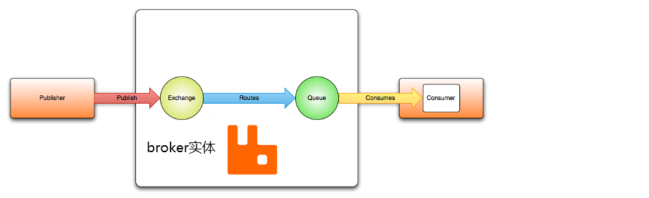
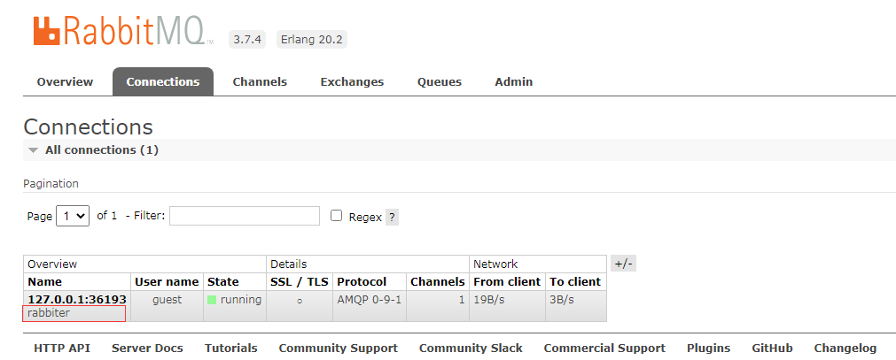
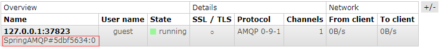
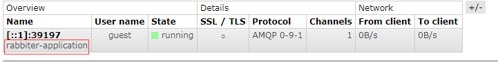

# 1 spring AMQP(2.3.6)

## springboot使用：

1 引入依赖：

```xml
<parent>
    <groupId>org.springframework.boot</groupId>
    <artifactId>spring-boot-starter-parent</artifactId>
    <version>2.4.4</version>
    <relativePath/>
</parent>

<dependencies>
        <dependency>
            <groupId>org.springframework.boot</groupId>
            <artifactId>spring-boot-starter-amqp</artifactId>
        </dependency>
        
        
        <!--############以下非必须###########-->
        <dependency>
            <groupId>org.projectlombok</groupId>
            <artifactId>lombok</artifactId>
        </dependency>
        <dependency>
            <groupId>org.springframework.boot</groupId>
            <artifactId>spring-boot-starter-test</artifactId>
            <scope>test</scope>
        </dependency>
    </dependencies>
```

此AMQP版本为 最新版2.3.6

## 1.1消息Message



如上图所示，AMQP 规范本身并没有定义message的规范（类或者接口），当执行类似 `basicPublish()`等发送消息的操作时，内容通过字节数组参数传递，其它属性作为单独的参数传递。Spring AMQP定义了`Message`类作为更通用的AMQP领域模型组成的一部分。  `message`将`body`和`properties` 作为两个属性构成自身，使得操作更加容易和易于理解，这也是典型的面向对象设计，下面是它的主要源码设计：

```java
public class Message implements Serializable {

	private static final long serialVersionUID = -7177590352110605597L;

	private static final String DEFAULT_ENCODING = Charset.defaultCharset().name();
	// 可允许序列化的路径名，2.2x版本之前是  whiteListPatterns ，3.3之后成为AllowedListPatterns，使用时注意
	private static final Set<String> ALLOWED_LIST_PATTERNS =
			new LinkedHashSet<>(Arrays.asList("java.util.*", "java.lang.*"));

	private static String bodyEncoding = DEFAULT_ENCODING;

	private final MessageProperties messageProperties;

	private final byte[] body;

	public Message(byte[] body, MessageProperties messageProperties) { //NOSONAR
		this.body = body; //NOSONAR
		this.messageProperties = messageProperties;
	}

	/**
	 * @since 1.5.7
	 */
	public static void addAllowedListPatterns(String... patterns) {
		Assert.notNull(patterns, "'patterns' cannot be null");
		ALLOWED_LIST_PATTERNS.addAll(Arrays.asList(patterns));
	}

	/**
	 * @since 2.2.4
	 */
	public static void setDefaultEncoding(String encoding) {
		Assert.notNull(encoding, "'encoding' cannot be null");
		bodyEncoding = encoding;
	}

	public byte[] getBody() {
		return this.body; //NOSONAR
	}

	public MessageProperties getMessageProperties() {
		return this.messageProperties;
	}


}
```

### 1.1.1body

属性作为 消息 content。

### 1.1.2messageProperties

作为消息的附加属性，里面包括 timestamp、messageId、correlationId、deliveryMode、expiration等等，同时提供了`private final Map<String, Object> headers` 属性，可以让用户添加自定义属性 `setHeader(String key, Object value)`。

### 1.1.3whiteListPatterns

注意，细心的读者可能发现了一个奇怪的东西：AllowedListPatterns。官方文档有这样的重要提醒：

从版本开始  `1.5.7`,  `1.6.11`,  `1.7.4`， 和  `2.0.0`，如果消息正文是序列化的  `Serializable` Java对象，执行时不再反序列化（默认）  `toString()`操作（例如在日志消息中）。  这是为了防止不安全的反序列化。  默认情况下，仅  `java.util` 和  `java.lang`类反序列化。  要恢复以前的行为，可以通过调用添加允许的类/包模式  `Message.addAllowedListPatterns(…)`。  一个简单的  `` **例如，支持通配符  `com.something.`**`, *.MyClass。  无法反序列化的实体由  `byte[<size>]` 在日志消息中。 

说得很明显了：

我们自定义消息对象默认是不会被序列化的，如果没有在 AllowedListPatterns 名单中配置。下面是例子：
1我们自定义一个对象：

```java
// 注解是lombok的注解，极力推荐，此示例最重要的是@Data中的@tostring
@Data
@AllArgsConstructor
@NoArgsConstructor
public class NoMessage implements Serializable {
    private String content;
}
```

2 测试不同：

> 注意`spring-boot-starter-test`2.4.4之后，省去了`@RunWith(SpringRunner.class)`，直接在测试方法上添加@org.junit.jupiter.api.Test即可。

```java
@org.junit.jupiter.api.Test
public void test() {
    NoMessage hello = new NoMessage("hello");
    SimpleMessageConverter simpleMessageConverter = new SimpleMessageConverter();
    Message message = simpleMessageConverter.toMessage(hello, new MessageProperties());
    log.info("添加白名单之前---{}",message);
    Message.addAllowedListPatterns(NoMessage.class.getName());
    log.info("NoMessage 全限定名：{}",NoMessage.class.getName());
    log.info("添加白名单之后---{}",message);
}

输出：
添加白名单之前---(Body:'[B@6fc3e1a4(byte[89])' MessageProperties
NoMessage 全限定名：com.rabbit.producer.NoMessage
添加白名单之后---(Body:'NoMessage(content=hello)'
```

注意的是，我们自定义的要作为消息object发送的类一定要实现Serializable接口，否则将收到`IllegalArgumentException:`  SimpleMessageConverter only supports String, byte[] and Serializable payloads。

另外在领域驱动设计中，我们会设计实体和值对象，值对象通常构成实体的某个属性，比如下面的`Goods`定义

```java
@Data
@AllArgsConstructor
@NoArgsConstructor
@Builder
public class Goods implements Serializable {
    private String name;
    private Price price;
}

@Data
@AllArgsConstructor
@NoArgsConstructor
public final class Price implements Serializable{
    private Integer num;
    private String unit;
}

//测试：
@org.junit.jupiter.api.Test
    public void test() {
        Goods goods = Goods.builder()
                .name("2233联名手办")
                .price(new Price(99, "人民币"))
                .build();
        SimpleMessageConverter simpleMessageConverter = new SimpleMessageConverter();
        Message message = simpleMessageConverter.toMessage(goods, new MessageProperties());
        log.info("添加白名单之前---{}",message);
        Message.addAllowedListPatterns(Goods.class.getName(),Price.class.getName());
        log.info("Goods 全限定名：{}，Price 全限定名：{}",Price.class.getName());
        log.info("添加白名单之后---{}",message);

}
// 输出：
添加白名单之前---(Body:'[B@22bb5646(byte[302])' MessageProperties
Goods 全限定名：com.rabbit.producer.Goods，Price 全限定名：com.rabbit.producer.Price
添加白名单之后---(Body:'Goods(name=2233联名手办, price=Price(num=99, unit=人民币))' MessageProperties
```

这里表明的是实体类中引用的值对象也需要实现`Serializable` 接口，并且被引用的值对象的限定名或者包名也需要添加 `AllowedListPatterns`。

## 1.2 交换机Exchange

`Exchange`接口对应了AMQP模型中的 `Exchange`，消息生产者将会把消息发送给它。broker中的virtual host（此概念再下文会有详细解释，读者可以将其当做一台机器的一个目录，此一级目录下的文件名不能重复，当然它没有子目录）下的每个`Exchange`都有唯一的名称和一些其它属性。下面是`Exchange`的构成：

```java
public interface Exchange extends Declarable {

	/**
	 * 交换机的name
	 */
	String getName();

	/**
	 * 交换机的type
	 */
	String getType();

	/**
	 *消息是否持久化
	 */
	boolean isDurable();

	/**
	 * 当不再使用的时候是否自动删除
	 */
	boolean isAutoDelete();

	/**
	 * 用于声明交换机属性的参数map，由broker保存。
	 */
	Map<String, Object> getArguments();

	/**
	 * 是否延迟消息交换，目前需要额外的broker插件
	 * @since 1.6
	 */
	boolean isDelayed();

	/**
	 * 是否只用于broker内部，如果为true，client不能向其进行publish操作。
	 * @since 1.6
	 */
	boolean isInternal();

}
```

name就是简单的交换机名称，此外就是Type，Type的选项定义由`ExchangeTypes`类提供，包括：direct、topic、fanout、headers、system，不同的类型将有不同的行为。此外也直接提供了不同类型的对应的实现：`DirectExchange`、`TopicExchange`、`FanoutExchange`等。

direct 类型通常实现准确的一对一绑定，topic在特殊情况下也可以实现一对一，但更多情况下，它通过匹配规则用来灵活地实现绑定，fanout 会直接将消息进行广播，忽略绑定关键字，header exchange(头交换机)和主题交换机有点相似，但是不同于主题交换机的路由是基于路由键，头交换机的路由值基于消息的header数据，主题交换机路由键只有是字符串,而头交换机可以是整型和哈希值 。

> AMQP 规范要求broker提供一个默认的direct交换机，此交换机没有名字，所有声明的队列都会默认绑定到此交换机上（如果这是声明队列，没有给此队列绑定其它交换机），队列的名字就是路由键发送消息的时候指定routingKey和消息即可发送到队列。


## 1.3队列Queue

`Queue`是message消费者获取message的组件，像`Exchange`一样，它实现了AMQP模型中的 queue。下面是它的类结构：

```java
public class Queue extends AbstractDeclarable implements Cloneable {

	public static final String X_QUEUE_MASTER_LOCATOR = "x-queue-master-locator";

	private final String name;
	// 是否持久化
	private final boolean durable;
	// 是否独占（是否应仅将消息发送到声明者的connection。）
	private final boolean exclusive;
	// 不再使用时是否自动删除
	private final boolean autoDelete;
	// 如果队列name不为isNotBlack,将设置为name,否则将设置为Base64UrlNamingStrategy.DEFAULT.generateName() + "_awaiting_declaration"
	private volatile String actualName;
	// arguments继承于AbstractDeclarable
	// ……

}
public abstract class AbstractDeclarable implements Declarable {

	private boolean shouldDeclare = true;

	private Collection<Object> declaringAdmins = new ArrayList<Object>();

	private boolean ignoreDeclarationExceptions;

	private final Map<String, Object> arguments;

}
```

`Queue`的构造函数可以只接受一个queue name，durable 默认true，exclusive和autoDelete 默认false。另外 `RabbitAdmin`可以直接declareQueue()，它可以为生成的queue设置唯一的队列名，这样做往往是我们需要一个临时队列，因此它的`exclusive`和`autoDelete` 都是true。


## 1.4 绑定规则Binding

在AMQP模型中，生产者发送消息给exchange，消费者从queue中获取消息，那么连接exchange和queue的规则就是`Binding`，因此Binding至关重要。springAMQP 定义了 `Binding`类来代表这些连接规则。

------

你可以使用定的routing key 将队列绑定到一个`DirectExchange`上面：

```java
new Binding(someQueue, someDirectExchange, "foo.bar");
```

------

你也可以使用 字符串匹配 的方式将队列绑定到`TopicExchange`上：

```java
new Binding(someQueue, someTopicExchange, "foo.*");
```

------

你也可以将队列和`FanoutExchange`绑定，由于是广播，你无需设置routing key：

```java
new Binding(someQueue, someFanoutExchange);
```

------

另外，还提供了建造者风格的`BindingBuilder`带来更加语义化的开发体验：

```java
Binding b = BindingBuilder.bind(someQueue).to(someTopicExchange).with("foo.*");
```

当然，官方建议将`BindingBuilder`静态导入实现更好的开发体验。

------

如上所见，其实一个 `Binding`类实例只是保存了关于exchange和queue的连接规则数据，它并不是一个活动的组件（按照领域驱动的方法论，这里的“活动的组件”可以理解为实体，实体具有唯一标识和动态变化性。`Binding`不是一个实体，仅仅是一个保存信息的值对象，值对象不可变，没有唯一标识）。


# 2 连接和资源管理Connection/Resource Management

这里已经到了具体的实现，目前在AMQP模型中，broker的角色只有RabbitMQ，这是唯一的模型实现，因此我们在讨论的时候，broker专门指spring-rabbit。

我们的操作管理连接到RabbitMQ的主要组件是`ConnectionFactory`接口，此接口的作用是提供一个`org.springframework.amqp.rabbit.connection.Connection`实例，而这个实例是底层`com.rabbitmq.client.Connection`的一个包装。


## 2.1springAMQP连接工厂

主要有一下三个：

- `PooledChannelConnectionFactory`
- `ThreadChannelConnectionFactory`
- `CachingConnectionFactory`

前两个在2.3版本被添加。

对于大多数情况，推荐使用`PooledChannelConnectionFactory`。

如果你需要确保严格的消息排序则可以使用`ThreadChannelConnectionFactory`。

如果你想使用 correlated publisher confirmations，或者你想通过`CachingConnectionFactory.CacheMode`的设置打开多个connection，可以使用`CachingConnectionFactory`。

这三种工厂都支持 Simple publisher confirmations。

当你配置`RabbitTemplate`使用单独的connection的时候，可以从2.3.2版本开始。将默认的publishing connection factory替换为不同的类型。默认情况下，publishing factory 都是相同的类型，并且在main factory上的任何属性设置都会传播到publishing factory。


### PooledChannelConnectionFactory

这个工厂基于Apache Pool2实现，管理着单个 connection 和两个 channel 池，两个channel 池 其中一个用于事务通道，另一个用于非事务通道，这些池都有默认的配置`GenericObjectPool`（这是`commons-pool2`中的类）；同时提供了一个 回调函数配置池。

springAMQP 默认并没有引入`commons-pool2`，如果你确实用到这个工厂，你需要引入相关依赖。

```xml
<dependency>
    <groupId>org.apache.commons</groupId>
    <artifactId>commons-pool2</artifactId>
</dependency>
```

容器添加 PooledChannelConnectionFactory：

```java
@Bean
    PooledChannelConnectionFactory pcf() {
        ConnectionFactory rabbitConnectionFactory = new ConnectionFactory();
        rabbitConnectionFactory.setHost("localhost");
        PooledChannelConnectionFactory pcf = new PooledChannelConnectionFactory(rabbitConnectionFactory);
        pcf.setPoolConfigurer((pool, tx) -> {
            if(tx) {
                // 配置事务pool
            }
            else {
                // 配置非事务pool
            }
        });
        return pcf;
    }
```

注意：代码中的`ConnectionFactory`是 `com.rabbitmq.client.ConnectionFactory`，而不是`org.springframework.amqp.rabbit.connection.ConnectionFactory`，即原生的ConnectionFactory，`PooledChannelConnectionFactory`并没有自己重复实现一个broker ConnectionFactory，而是利用装饰者模式在原有基础进行了自己的定制化。


### ThreadChannelConnectionFactory

这个工厂管理单个connection 和两个 ThreadLocal，两个 ThreadLocal 其中一个用于事务channel，另一个用于非事务channel。由于维护了ThreadLocal，他能保证同一个的线程上的操作都是用相同的`channel`，这就保证了消息的顺序性。由于引进了ThreadLocal，为了避免发生内存泄漏，如果应用程序使用了大量short-lived 线程，那么必须要调用该工厂的 `closeThreadChannel()` 方法释放 channel 资源。

它同样需要接收一个原生的 `com.rabbitmq.client.ConnectionFactory`用于建立和broker的连接。

> 关于ThreadLocal内存泄漏：
>
> 内存泄漏：通俗的说，不再会被使用的对象或者变量占用的内存不能被回收，就是内存泄露。
>
> ThreadLocal为每一个线程分配一个ThreadLocalMap变量，由于ThreadLocalMap的生命周期跟Thread一样长，如果没有手动删除对应key就会导致内存泄漏。大量short-lived 线程表名程序频繁创建线程和ThreadLocalMap，因此不手动清除，容易造成 内存泄漏。


### CachingConnectionFactory

默认情况下，它建立一个可以被应用程序共享的连接代理，它能够做到共享，因为AMQP的工作单元是一个channel（管道）（类似于JMS中连接和会话的关系），连接实例提供 createChannel 的方法，CachingConnectionFactory实现了能够支持缓存这些channel，并且会根据这些channel是否是事务性channel去维护特定的缓存。在创建 CachingConnectionFactory 实例的时候，可以通过构造函数指定它的 hostname，同时还应该设置 username 和 password 属性。你还可以通过调用 `setChannelCacheSize()` 方法设置channel 缓存的大小（默认是 25）。

```java
CachingConnectionFactory cachingConnectionFactory = new CachingConnectionFactory("localhost");
cachingConnectionFactory.setUsername("guest");
cachingConnectionFactory.setPassword("guest");
cachingConnectionFactory.setChannelCacheSize(20);

// 创建连接
Connection connection = cachingConnectionFactory.createConnection();
// 参数 true/false：是否为事务性channel
Channel channel = connection.createChannel(false);
```


**缓存模式**：`CacheMode`


**CHANNEL**：单一（single）Connection缓存channel

当一个ConnectionFactory 实例的`CacheMode`为 CHANNEL（这是默认的缓存模式） 的时候，所有的 createConnection() 调用都会返回相同的 Connection，然后缓存该Connection中的 channel 。并且忽略 `com.rabbitmq.client.Connection#close()` 的调用和 `com.rabbitmq.client.Channel`的缓存。默认情况下，只缓存一个channel ，并在此基础上来创建和释放更多请求的通道请求。如果在高并发环境中可以加大 `channelCacheSize` 的值。


**CONNECTION**：缓存Connection和每个Connection创建的channel

从1.3版本，可以将其设置为CONNECTION，当`CacheMode`为 CONNECTION 的时候，每次`createConnection()` 都会使用一个新的或者缓存的（如果有缓存）Connection，Connection会根据 `connectionCacheSize` 的值被进行缓存，调用`Channel#close()`方法会向缓存中返回channel（如果缓存还有空间）。在这种模式下，Connection 和 在Connection 上创建的channel都会被缓存。

> 在某些场景下使用单独的Connection 可能是很好的。比如使用HA集群结合负载均衡器，连接不同的集群成员或者其它。

总之，如果你要缓存 Connection ，请设置`CacheMode`为 CONNECTION 类型。


从1.5.5开始，CachingConnectionFactory 提供了一个 `connectionLimit`的属性。该属性可以用来设置允许的连接 总数（默认为Integer.MAX_VALUE）。然后可以调用 setChannelCheckoutTimeout() 设置等待连接空闲的超时时间，当设置之后如果达到了限制数量，会进行等待，如果超时，会抛出 AmqpTimeoutException。

- [x] 注意：

> 当`CacheMode`设置为 CONNECTION，不支持队列和其它类型的 自动声明。
>
> 且目前的amqp-client库默认会为每个connection创建一个固定大小的线程池（大小为：Runtime.getRuntime().availableProcessors() * 2），当我们的程序需要使用大量的connection的时候，应该 CachingConnectionFactory 自定义单独创建一个  Executor以提高性能。


我们需要理解的是，缓存大小并不是一个限制概念，它仅仅代表可以缓存的通道的数量。也就是说，即使缓存大小为10，事实上我们仍然可以使用任意多数量的channel。如果使用了10个以上的通道，那么最终会有10个通道能返回缓存，超出的通道使用完毕将被物理关闭。

从版本1.6开始，默认通道缓存大小已从1增加到25，在高容量、多线程环境中，小数量的缓存意味着通道会频繁、高速创建和关闭（超出缓存容量大小的通道使用完毕将被物理关闭），因此增加默认缓存大小可以避免这种开销。使用过程中我们可以通过RabbitMQ管理UI监视正在使用的 `channel`，如果看到许多通道正在被创建和关闭，则可以考虑进一步增加缓存大小。缓存仅按需增长（以适应应用程序的并发性要求），因此这样的更改不会影响现有的低容量应用程序。

从版本 1.4.2 开始，`CachingConnectionFactory`提供了一个`channelCheckoutTimeout`属性（请不要混淆`connectionLimit`）。当此属性大于零时，`channelCacheSize` 将对连接上创建的通道数进行限制。如果达到限制量，调用线程将阻塞，直到通道可用或达到此超时，如果超时，将抛出AmqpTimeoutException。

> 框架中使用channel（例如RabbitTemplate），框架能够保证 channel 会被可靠地返回到缓存。如果在框架之外创建通道（例如，通过直接访问连接并调用createChannel（）），则必须可靠地（通过关闭）返回它们（可能在finally块中），以避免通道耗尽。


## 2.2 AddressResolver

从版本2.1.15开始，可以使用`AddressResover`解析连接地址，这将覆盖address和host/port属性的任何设置。

```java
// 其中一个实现类
ListAddressResolver addressResolver = new ListAddressResolver(Arrays.asList(new Address("127.0.0.1")));
// 注意这里构造函数传入的host是不存在的
CachingConnectionFactory cachingConnectionFactory = new CachingConnectionFactory("127.23.23.3");
cachingConnectionFactory.setUsername("guest");
cachingConnectionFactory.setPassword("guest");
// 设置addressResolver
cachingConnectionFactory.setAddressResolver(addressResolver);
rabbitTemplate.setConnectionFactory(cachingConnectionFactory);
rabbitTemplate.convertAndSend("a.queue","hello");

// 最终可以发送成功。可见addressResolver的值覆盖了CachingConnectionFactory("127.23.23.3")的host。
```


## 2.3 命名连接

从版本1.7开始，一个`ConnectionNameStrategy`被提供并且注入到`AbstractionConnectionFactory`。生成的name用于 应用程序 识别RabbitMQ的连接。如果RabbitMQ服务器支持连接名，则该连接名将显示在管理UI中。此值不必是唯一的，并且不能用作连接标识符 ，例如，在HTTP API请求中。这个值应该是可读的，并且是connection\u name键下ClientProperties的一部分。可以使用简单的 Lambda，如下所示：

代码示例：

```java
CachingConnectionFactory cachingConnectionFactory = new CachingConnectionFactory("127.0.0.1");
cachingConnectionFactory.setUsername("guest");
cachingConnectionFactory.setPassword("guest");
// 设置 ConnectionNameStrategy  
cachingConnectionFactory.setConnectionNameStrategy(strategy -> "rabbiter");
rabbitTemplate.setConnectionFactory(cachingConnectionFactory);
rabbitTemplate.convertAndSend("a.queue","hello");
```




我们可以看到本地的conne 被命名为 rabbiter（兔女郎？？）。


ConnectionFactory参数可以用于通过某种逻辑来区分目标连接名称，默认情况下，`AbstractConnectionFactory`的`beanName`表示为对象的十六进制字符串和内部计数器用于生成连接名。

比如这样：



也可以使用一个`ConnectionNameStrategy`的实现类：SimplePropertyValueConnectionNameStrategy将连接名称设置为应用程序属性。我们可以将其声明为@Bean并将其注入连接工厂：

```java
@Bean
public SimplePropertyValueConnectionNameStrategy cns() {
    return new SimplePropertyValueConnectionNameStrategy("rabbiter-application");
}

// 如果完全使用springboot自动装配ConnectionFactory，此处可以省略
@Bean
public ConnectionFactory rabbitConnectionFactory(ConnectionNameStrategy cns) {
    CachingConnectionFactory connectionFactory = new CachingConnectionFactory();
    connectionFactory.setConnectionNameStrategy(cns);
    return connectionFactory;
}

```

然后再使用的地方注入ConnectionFactory即可：



> 此外，当我们使用springboot自动配置 ConnectionFactory 的时候，只需要在容器声明ConnectionNameStrategy` `@Bean即可，springboot虎自动检测到`ConnectionNameStrategy`并将其设置到 ConnectionFactory 。


## 2.4 连接阻塞和资源限制

有时候连接可能被阻塞。从版本2.0开始，`org.springframework.amqp.rabbit.connection.Connection`可提供`com.rabbitmq.client.BlockedListener`实例，他可以收到连接 blocked 或 unblocked 的事件通知。另外，`AbstractConnectionFactory`通过其内部的`BlockedListener`实现分别发出`ConnectionBlockedEvent`和`ConnectionUnblockedEvent`事件。这将允许我们提供应用程序逻辑，以便对broker上的问题做出适当的反应，并（例如）采取一些纠正措施。

> 注意：
>
> 当应用程序设置单例的CachingConnectionFactory时（默认情况下也就是使用Spring Boot 自动配置的时候），当连接被broker 阻塞的时候，应用程序将停止工作。当CachingConnectionFactory被broker阻塞的时侯，它的所有 clients 都会停止工作。如果我们在同一个应用程序中有多个生产者和消费者时，当生产者正在阻塞连接（因为代理上不再有资源），而消费者无法释放它们（因为连接被阻塞）时，我们可能会以死锁告终。为了缓解这个问题，我们建议多创建一个单独的CachingConnectionFactory镜像实例：两个CachingConnectionFactory实例，一个用于生产者，一个用于消费者。单独的CachingConnectionFactory，事务生产者不可能在消费者线程上执行，因为它们应该重用与消费者事务关联的通道。


从版本2.0.2开始，RabbitTemplate有一个配置选项，除非你正在使用事务，否则可以自动使用第二个ConnectionFactory。

从版本1.7.7开始，提供了一个`AmqpResourceNotAvailableException`，当`SimpleConnection.createChannel（）`无法创建channel时（例如，因为已达到channelMax限制，并且缓存中没有可用通道）会抛出此异常。我们可以在`RetryPolicy`中注册此异常，以便在某些回退之后执行一些恢复操作。


## 2.5配置底层客户端 Connection Factory

上面稍微提及，`CachingConnectionFactory` 并没有重复造轮子，而是在底层包装了 `com.rabbitmq.client`的 `ConnectionFactory`，因此当在`CachingConnectionFactory`中设置同样的参数的时候，会传递许多配置属性：host, port, userName, password, requestedHeartBeat（心跳检测）, 和 connectionTimeout（连接超时）等。假如要设置其他属性（比如`clientProperties`）的时候，你可以定义一个rabbit factory实例，然后用`CachingConnectionFactory` 的适当的构造函数传递它的引用。在使用namespace的时候，我们需要在 `connection-factory`属性中提供被配置的factory的引用。为了方便起见，提供了一个factory bean 来帮助在 spring 应用上下文中配置连接工厂，下一节会有相关介绍。

```xml
<rabbit:connection-factory
      id="connectionFactory" connection-factory="rabbitConnectionFactory"/>
```

> 提示：rabbit 4.0.x 的client默认会启用自动恢复功能，spring AMQP尽管和这个特性兼容，但spring AMQP拥有自己的恢复机制，通常是不需要用到client的恢复特性的。同时也建议禁用 `amqp-client`的自动恢复特性，以避免在 broker 可用，但 connection 尚未恢复的时候得到 `AutoRecoverConnectionNotCurrentlyOpenException`异常。可能你注意到了这个异常，比如你在 `RabbitTemplate`中设置了 `RetryTemplate`，即使故障已经转移到集群中的另一个broker中，还是会收到这个异常。同时，自动恢复是在一个timer上恢复的，相比较而言，使用spring AMQP 的恢复机制能够有更高的效率。因此，从1.7.1版本开始，spring AMQP 禁用了`amqp-client`的自动恢复特性，除非你显示地创建了 rabbit connection，并设置到了 `CachingConnectionFactory`中。RabbitMQ `ConnectionFactory`实例创建的 `RabbitConnectionFactoryBean`默认也拥有禁用的选项。


## 2.6`RabbitConnectionFactoryBean` 和 配置 SSL 

从1.4版本开始，提供了一个 方便的`RabbitConnectionFactoryBean`，通过依赖注入可以方便地配置底层客户端连接工厂上的 SSL 属性，其它的配置委托给底层工厂，以前我们只能通过硬编码的方式配置SSL，现在可以看到如下的示例：

```xml
<rabbit:connection-factory id="rabbitConnectionFactory"
    connection-factory="clientConnectionFactory"
    host="${host}"
    port="${port}"
    virtual-host="${vhost}"
    username="${username}" password="${password}" />

<bean id="clientConnectionFactory"
        class="org.springframework.amqp.rabbit.connection.RabbitConnectionFactoryBean">
    <property name="useSSL" value="true" />
    <property name="sslPropertiesLocation" value="file:/secrets/rabbitSSL.properties"/>
</bean>
```

关于SSL的配置，请参见RabbitMQ文档。在不进行证书验证的情况下，忽略通过SSL连接的密钥存储库和信任存储库配置。下—个示例展示如何提供密钥和信任存储配置。

`sslPropertiesLocation`配置属性是一个指向包含以下键值的Spring `Resource` 。

```tex
keyStore=file:/secret/keycert.p12
trustStore=file:/secret/trustStore
keyStore.passPhrase=secret
trustStore.passPhrase=secret
```

密钥存储库和信任存储库是指向存储库的Spring资源。通常，这个属性文件由具有读访问权限的应用程序的操作系统保护。从Spring AMQP 1.5版开始，可以直接在factory bean上设置这些属性。如果同时提供了离散属性和 `sslPropertiesLocation`，则后者中的属性将覆盖离散值。

> 重要：从2.0版本开始，默认情况下验证服务器证书，因为它更安全。如果由于某些原因希望跳过此验证，则将工厂bean的skipServerCertificateValidation属性设置为true。从2.1版本开始，`RabbitConnectionFactoryBean`现在默认调用`enableHostnameVerification()`。要恢复到以前的行为,将`enableHostnameVerification`属性设置为false。


> 重要：从2.2.5版本开始，默认情况下，factory bean将始终使用TLSv1.2;以前，它在某些情况下使用v1.1，在其他情况下使用v1.2(取决于其他厘性)。如果我们由于某些原因需要使用v1.1，则可以这样设置`sslAlgorithm`属性: setSslAlgorithm("TLSv1.1")。


## 2.7 集群连接

要连接集群，可以配置 `CachingConnectionFactory`的 `addresses`属性。

```java
@Bean
public CachingConnectionFactory ccf() {
    CachingConnectionFactory ccf = new CachingConnectionFactory();
    // 集群连接
    ccf.setAddresses("host1:5672,host2:5672,host3:5672");
    return ccf;
}
```

每当建立新的connection的时候，底层connection factory 将依次尝试连接到每个host。从2.1.8版本开始，通过将 `addressShuffleMode`属性设置为 RANDOM，可以将连接顺序改为随机。从2.6版本开始，又添加了 INORDER 模式，这意味着在创建了一个connection后，第一个address将被移动到末尾。如果希望从所有节点上的所有分片中消费数据，我们可以将此模式与带有CacheMode.CONNECTION 模式 的RabbitMQ分片插件和适当的并发一起使用。

```java
@Bean
public CachingConnectionFactory ccf() {
    CachingConnectionFactory ccf = new CachingConnectionFactory();
    ccf.setAddresses("host1:5672,host2:5672,host3:5672");
    ccf.setAddressShuffleMode(AddressShuffleMode.RANDOM);
    return ccf;
}
```


## 2.8 Routing Connection Factory

从1.3版开始，引入了`AbstractRoutingConnectionFactory`， 该工厂提供了一种机制，可以为多个`ConnectionFactory`配置映射，并在运行时通过一些`lookupKey`确定目标`ConnectionFactory`，通常，这样的实现会检查线程绑定的上下文。  为了方便，Spring  AMQP提供了`SimpleRoutingConnectionFactory`，该工厂从`SimpleResourceHolder`获取当前线程绑定的`lookupKey`。  以下示例显示了如何同时在XML和Java中配置`SimpleRoutingConnectionFactory`：

```xml
<bean id="connectionFactory"
      class="org.springframework.amqp.rabbit.connection.SimpleRoutingConnectionFactory">
    <property name="targetConnectionFactories">
        <map>
            <entry key="#{connectionFactory1.virtualHost}" ref="connectionFactory1"/>
            <entry key="#{connectionFactory2.virtualHost}" ref="connectionFactory2"/>
        </map>
    </property>
</bean>

<rabbit:template id="template" connection-factory="connectionFactory" />
```

```java
public class MyService {

    @Autowired
    private RabbitTemplate rabbitTemplate;

    public void service(String vHost, String payload) {
        SimpleResourceHolder.bind(rabbitTemplate.getConnectionFactory(), vHost);
        rabbitTemplate.convertAndSend(payload);
        // 使用后解除绑定资源很重要。
        SimpleResourceHolder.unbind(rabbitTemplate.getConnectionFactory());
    }

}
```

从1.4版开始，RabbitTemplate支持SpEL 风格，提供了：`sendConnectionFactorySelectorExpression`和`receiveConnectionFactorySelectorExpression`属性，这些属性在每个AMQP协议交互操作（`send`，`sendAndReceive`，`receive`或`receiveAndReply`）上进行评估，并解析为`lookupKey`提供给`AbstractRoutingConnectionFactory`。我们可以在表达式中使用bean引用，例如@ vHostResolver.getVHost（#root）。对于`send`操作，要发送的消息是根评估的对象。对于`receive`操作，`queueName`是根评估的对象。

具体的路由算法如下：

如果选择器表达式为null或被评估为null或提供的`ConnectionFactory`不是`AbstractRoutingConnectionFactory`的实例，则所有操作都像之前一样，依赖于提供的`ConnectionFactory`实现。

如果评估结果不为null，但是没有适用于该`lookupKey`的目标`ConnectionFactory`，并且使用了`lenientFallback = true`来配置`AbstractRoutingConnectionFactory`，则与前面相同。在使用`AbstractRoutingConnectionFactory`的情况下，它会回退到基于`defineCurrentLookupKey（）`的路由实现。但是，如果`lenientFallback = false`，则抛出`IllegalStateException`。

另外，从1.4版开始，可以在 listener container中配置一个 routing connection factory。在这种情况下，the list of queue names (这里还是看英文比较容易理解，着实不好翻译)将用作 `lookupKey`。 例如，如果使用`setQueueNames（“thing1”,“thing2”）`配置容器，则`lookupKey`为[thing1,thing2]“（请注意，键中没有空格）。

从1.6.9版开始，可以通过在listener container上使用`setLookupKeyQualifier`将 qualifier 添加到`lookupKey`。这样可以监听具有相同名称但在不同虚拟主机中的队列（每个虚拟主机中都有一个连接工厂）。例如，在`lookupKey`的qualifier 是`thing1`、一个容器监听队列`thing2`的情况下，向其注册目标连接工厂的`lookupKey`可以是thing1 [thing2]。

> 注意 目标（默认情况下，如果提供的话）连接工厂必须具有相同的设置，以供发布者conform和returns。


## 2.9 Queue Affinity(亲和力) 和`LocalizedQueueConnectionFactory`

在集群中使用HA队列时，为了获得最佳性能，你可能需要连接到主队列所在的物理代理。此时可以使用多个broker address配置`CachingConnectionFactory`。  这是为了进行客户端尝试按顺序连接时的故障转移。`LocalizedQueueConnectionFactory`使用管理插件提供的REST API来确定在哪个节点上掌握队列。 然后，它会创建（或从缓存检索）仅连接到该节点的`CachingConnectionFactory`。 如果连接失败，那么将确定新的主节点，并且使用者将连接到该新的主节点。 如果无法确定队列的物理位置，则使用默认的connection factory 配置`LocalizedQueueConnectionFactory`，在这种情况下，它将照常连接到群集。

`LocalizedQueueConnectionFactory`是一个`RoutingConnectionFactory`，SimpleMessageListenerContainer会使用队列名称作为`lookupKey`。

> 笔记： 由于使用队列名称进行查找，只有在将container 配置为监听一个单例队列时，才可以使用`LocalizedQueueConnectionFactory`。
>
> 必须在每个节点上启用RabbitMQ管理插件。

> 警告： `LocalizedQueueConnectionFactory`用于长期连接，例如`SimpleMessageListenerContainer`使用的连接。它不适合用于短连接，例如与`RabbitTemplate`一起使用，因为在建立连接之前调用REST API会产生开销。 同样，对于 publish 操作，队列是未知的，并且无论如何该消息都会发布给所有集群成员，因此查找节点的逻辑几乎没有价值。

以下示例配置显示了如何配置工厂：

```java
@Autowired
private ConfigurationProperties props;

@Bean
public CachingConnectionFactory defaultConnectionFactory() {
    CachingConnectionFactory cf = new CachingConnectionFactory();
    cf.setAddresses(this.props.getAddresses());
    cf.setUsername(this.props.getUsername());
    cf.setPassword(this.props.getPassword());
    cf.setVirtualHost(this.props.getVirtualHost());
    return cf;
}

@Bean
public LocalizedQueueConnectionFactory queueAffinityCF(
        @Qualifier("defaultConnectionFactory") ConnectionFactory defaultCF) {
    return new LocalizedQueueConnectionFactory(defaultCF,
            StringUtils.commaDelimitedListToStringArray(this.props.getAddresses()),
            StringUtils.commaDelimitedListToStringArray(this.props.getAdminUris()),
            StringUtils.commaDelimitedListToStringArray(this.props.getNodes()),
            this.props.getVirtualHost(), this.props.getUsername(), this.props.getPassword(),
            false, null);
}
```

注意，`addresses`，`adminUris`和`nodes`是数组。这些是适当的，因为当容器尝试连接到队列时，它使用admin API来确定该队列在哪个节点上被掌握，并连接到与该节点位于相同阵列位置的地址。

## 2.10 发布者 Confirms and Returns

通过将`CachingConnectionFactory`属性`PublisherConfirmType`设置为`ConfirmType.CORRELATED`并将`PublisherReturns`属性设置为'true'，可以支持broker 已确认（具有相关性）的消息和返回的消息。

设置这些选项后，由工厂创建的Channel实例将包装在`PublisherCallbackChannel`中，这将促进回调。当获得这样的channel时，客户端可以向该channel注册PublisherCallbackChannel.Listener。 `PublisherCallbackChannel`的实现可以将confirm或returns返回到适当的监听器。 这些功能将在以下各节中进一步说明。


## 2.11 Connection and Channel Listeners

连接工厂支持注册ConnectionListener和ChannelListener实现。  我们可以接收有关连接和通道相关事件的通知。

下面是`ConnectionListener`的定义：

```java
@FunctionalInterface
public interface ConnectionListener {

   /**
    * 建立新连接时调用。
    */
   void onCreate(Connection connection);

   /**
    *当连接关闭时调用。
    *#onShutDown(ShutdownSignalException)
    */
   default void onClose(Connection connection) {
   }

   /**
    * 强制关闭连接时调用。
    * @since 2.0
    */
   default void onShutDown(ShutdownSignalException signal) {
   }

}
```

从2.0版开始，`org.springframework.amqp.rabbit.connection.Connection`对象可以随`com.rabbitmq.client.BlockedListener`实例一起提供，以针对连接被blocked和unblocked的事件进行通知。下面的示例显示ChannelListener接口定义：

```java
@FunctionalInterface
public interface ChannelListener {

   /**
    *新的channel被创建是调用
    * @param channel 
    * @param transactional 是否是事务channel
    */
   void onCreate(Channel channel, boolean transactional);

   /**
    *当底层RabbitMQ通道由于任何原因而关闭时调用。
    * @param signal the shut down signal.
    */
   default void onShutDown(ShutdownSignalException signal) {
   }

}
```


## 2.12 Channel Close Events 日志

1.5版引入了一种机制，使用户可以控制日志记录级别。

CachingConnectionFactory使用默认策略来记录通道关闭，如下所示：

- 正常channel关闭（200 OK）不会被记录。
- 如果channel由于被动队列声明失败而关闭，这将在debug级别被记录。
- 如果由于consumer exclusive（独占）模式 拒绝了basic.consume而关闭了channel，则日志将在 info 级别被记录。
- 其他所有日志均在 error 级别被记录。

若要修改此行为，可以在`CachingConnectionFactory`的`closeExceptionLogger`属性中注入自定义的`ConditionalExceptionLogger`。


## 2.13 Runtime Cache Properties

从1.6版开始，CachingConnectionFactory通过`getCacheProperties（）`方法提供缓存统计信息。这些统计信息可用于调整缓存以在生产中对其进行优化。例如，高水位标记可用于确定是否应增加缓存大小。如果它等于缓存大小，则可能要考虑进一步增加。

CacheMode.CHANNEL 属性：

| Property                     | Meaning                                                      |
| ---------------------------- | ------------------------------------------------------------ |
| `connectionName`             | `ConnectionNameStrategy`生成的 connection name。             |
| `channelCacheSize`           | 当前配置的允许空闲的最大channel数。                          |
| `localPort`                  | 连接的本地端口（如果有）。这可用于与RabbitMQ Admin UI上的connection和channel关联。 |
| `idleChannelsTx`             | 当前空闲（缓存）的事务channel的数量。                        |
| `idleChannelsNotTx`          | 当前空闲（缓存）的非事务channel的数量。                      |
| `idleChannelsTxHighWater`    | 同时空闲（缓存）的最大事务channel数。                        |
| `idleChannelsNotTxHighWater` | 同时空闲（缓存）的最大非事务channel数。                      |

CacheMode.CONNECTION 属性：

| Property                                 | Meaning                                                      |
| ---------------------------------------- | ------------------------------------------------------------ |
| `connectionName:<localPort>`             | `ConnectionNameStrategy`生成的 connection name。             |
| `openConnections`                        | 代理连接的连接对象的数量                                     |
| `channelCacheSize`                       | 当前配置的允许空闲的最大channel数。                          |
| `connectionCacheSize`                    | 当前配置的允许空闲的最大连接数。                             |
| `idleConnections`                        | 当前空闲的连接数。                                           |
| `idleConnectionsHighWater`               | 并发空闲的最大连接数。                                       |
| `idleChannelsTx:<localPort>`             | 该连接当前空闲（缓存）的事务channel的数量。可以使用属性名称的localPort部分与RabbitMQ Admin UI上的connection和channel关联。 |
| `idleChannelsNotTx:<localPort>`          | 该连接当前空闲（缓存）的非事务channel的数量。可以使用属性名称的localPort部分与RabbitMQ Admin UI上的connection和channel关联。 |
| `idleChannelsTxHighWater:<localPort>`    | 同时空闲（缓存）的最大事务channel数。属性名称的localPort部分可用于与RabbitMQ Admin UI上的connection和channel关联。 |
| `idleChannelsNotTxHighWater:<localPort>` | 同时空闲（缓存）的最大非事务channel数。属性名称的localPort部分可用于与RabbitMQ Admin UI上的connection和channel关联。 |


## 2.14 RabbitMQ自动 连接/拓扑 恢复

这个前面有过介绍了，从Spring AMQP的第一个版本开始，在代理发生故障的情况下，该框架提供了自己的连接和通道恢复。 同样，如配置代理中所述，当重新建立连接时，RabbitAdmin会重新声明所有底层代码Bean（队列和其他）。 因此，它不依赖于amqp-client库现在提供的自动恢复。Spring  AMQP现在使用`amqp-client`的4.0.x版本，默认情况下启用了自动恢复。如果需要，Spring  AMQP仍可以使用其自己的恢复机制，在客户端将其禁用（通过将底层RabbitMQ  connectionFactory的automaticRecoveryEnabled属性设置为false）。 但是，该框架与启用的自动恢复完全兼容。因此我们在代码中创建的所有使用者（可能通过RabbitTemplate.execute（））都可以自动恢复。

> 警告：连接失败后，仅定义为Bean的元素（queues, exchanges, bindings）将被重新声明。 直接从用户代码调用`RabbitAdmin.declare  *（）`声明的元素对于框架是未知的，因此无法恢复。如果需要可变数量的声明，请考虑定义一个或多个类型为`Declarables`的bean。


# 3  添加自定义客户端连接属性

现在，通过CachingConnectionFactory，可以访问底层connection factory，以允许例如设置自定义客户端属性。 以下示例显示了如何执行此操作：

```java
connectionFactory.getRabbitConnectionFactory().getClientProperties().put("thing1", "thing2");
```

查看连接时，这些属性将可以显示在RabbitMQ管理员UI中。


# 4 `AmqpTemplate`

与Spring框架和相关项目提供的许多其他高级抽象一样，Spring AMQP提供了一个“模板”，该模板起着核心作用。 定义主要操作的接口称为AmqpTemplate。  这些操作涵盖了发送和接收消息的一般行为。换句话说，它们并不是任何实现所独有的，因此名称中就是“ AMQP”。 另一方面，该接口的实现与AMQP协议的实现绑定在一起。与JMS（本身是接口级API）不同，AMQP是线级协议。 该协议的实现提供了自己的客户端库，因此模板接口的每种实现都取决于特定的客户端库。 当前，只有一个实现（Rabbit）：RabbitTemplate。 在下面的示例中，我们经常使用AmqpTemplate。 但是事实上查看它的内部实现的时候都是`RabbitTemplate`实现类。


## 4.1 添加重试（Retry）功能

从1.3版开始，你现在可以为RabbitTemplate配置RetryTemplate来帮助处理broker连接性问题。

下面使用指数`ExponentialBackOffPolicy`和默认`SimpleRetryPolicy`的示例，该示例在将异常抛出给调用方之前进行了三次尝试：

```java
@Bean
public RabbitTemplate rabbitTemplate() {
    RabbitTemplate template = new RabbitTemplate(connectionFactory());
    
    RetryTemplate retryTemplate = new RetryTemplate();
    
    ExponentialBackOffPolicy backOffPolicy = new ExponentialBackOffPolicy();
    backOffPolicy.setInitialInterval(500);
    backOffPolicy.setMultiplier(10.0);
    backOffPolicy.setMaxInterval(10000);
    retryTemplate.setBackOffPolicy(backOffPolicy);
    
    template.setRetryTemplate(retryTemplate);
    return template;
}
```

从1.4版开始，除了retryTemplate属性外，RabbitTemplate还支持`recoveryCallback`选项。它用作

`RetryTemplate.execute（RetryCallback <T，E>  retryCallback，RecoveryCallback <T> recoveryCallback）`的第二个参数。

> 笔记：
>
> RecoveryCallback在某种程度上受到限制，因为重试上下文仅包含lastThrowable字段。 对于复杂的用例，应使用外部RetryTemplate，以便可以通过上下文的属性将其他信息传达给RecoveryCallback。以下示例显示了如何执行此操作：
>
> ```java
> retryTemplate.execute(
>     new RetryCallback<Object, Exception>() {
> 
>         @Override
>         public Object doWithRetry(RetryContext context) throws Exception {
>             context.setAttribute("message", message);
>             return rabbitTemplate.convertAndSend(exchange, routingKey, message);
>         }
> 
>     }, new RecoveryCallback<Object>() {
> 
>         @Override
>         public Object recover(RetryContext context) throws Exception {
>             Object message = context.getAttribute("message");
>             Throwable t = context.getLastThrowable();
>             // Do something with message
>             return null;
>         }
>     });
> }
> ```
>
> 在这样 的使用下，就不需要为RabbitTemplate 设置RetryTemplate。


## 4.2 检测 Publish 成功或者失败

Publishing messages 是一种异步机制，默认情况下，RabbitMQ会删除无法路由的消息。为了成功Publish，我们可以通过收到异步确认.考虑两种故障情况：

- 消息发送到了exchange，但是却没有匹配的queue接收。
- 消息发送到了一个不存在的exchange。

第一种情况可以由 returns 返回，此时的conforms ack 是true。

对于第二种情况，该消息将被丢弃，并且不会生成 returns，conforms ack 为false 底层channel被关闭，但有异常。 默认情况下，会记录此异常，但是我们可以在`CachingConnectionFactory`中注册`ChannelListener`以获得此类事件的通知。  以下示例显示如何添加`ChannelListener`：

```java
cachingConnectionFactory.addChannelListener(new ChannelListener() {

    @Override
    public void onCreate(Channel channel, boolean transactional) {

    }

    @Override
    public void onShutDown(ShutdownSignalException signal) {
        // 我们可以通过signal.getReason() 查看原因
        log.info("强制被关闭，原因：{}",signal.getReason());
    }
});
```

要检测 send 线程上的异常，可以在RabbitTemplate上设置`ChannelTransacted（true）`，然后在`txCommit（）`上检测到异常。但是，事务会严重影响性能，请仔细考虑这一点。


## 4.3 Correlated 发布者 Confirms and Returns

AmqpTemplate的实现RabbitTemplate支持发布者Confirms and Returns。

对于发布者 returns ，必须将 RabbitTemplate的`mandatory`属性设置为`true`，或者对于特定消息，必须将`expired-expression`评估为true同时还要将`CachingConnectionFactory`的`PublisherReturns`属性设置为`true`。`RabbitTemplate`通过调用setReturnsCallback（ReturnsCallback回调）注册RabbitTemplate.`ReturnsCallback`（setReturnCallback 已经在新版本弃用），将返回值（发送到交换机没有队列接受的消息）发送到客户端。

```java
rabbitTemplate.setReturnsCallback((returnedMessage -> {
    log.info("返回的消息:{}",new String(returnedMessage.getMessage().getBody()));
}));
```

`ReturnedMessage`具有以下属性：

1. message-返回的消息本身   
2. replyCode-指示返回原因的代码   
3. replyText-返回的文字原因-例如NO_ROUTE   
4. exchange-消息发送到的交换机  
5. routingKey-使用的路由key

每个RabbitTemplate仅支持一个`ReturnsCallback`。

对于发布者 conforms（也称为发布者确认），需要将`CachingConnectionFactory`的`PublisherConfirm`属性设置为`ConfirmType.CORRELATED`。通过调用`setConfirmCallback`（ConfirmCallback回调）注册`RabbitTemplate.ConfirmCallback`，将conform发送到客户端。

```java
rabbitTemplate.setConfirmCallback((correlationData, ack, cause ) -> {
    log.info("akc : {}",ack);
});
```

**correlationData**是客户端在发送原始消息时提供的对象。

**ack** 是一个布尔值，true表示broker 收到了消息，对于ack 为 false的实例，如果生成nack时原因可用，则原因可能包含nack的原因。例如，将消息发送到不存在的交换机时，在这种情况下为nack，broker将关闭channel。

**cause**：nack 的原因，包括了关闭的原因。原因已在1.4版中添加。

同样的，RabbitTemplate仅支持一个ConfirmCallback。

> 笔记：RabbitTemplate发送操作完成后，channel将关闭。当connection factory 高速缓存已满时，将阻止接收conforms或retures（当高速缓存中有空间时，channel不会物理关闭，并且conforms和retures正常进行）。当高速缓存已满时，框架会将关闭延迟最多五秒钟，以便有时间接收conforms和retures。  使用conforms时，在接收到最后一个conform时，channel将关闭。
>
> 当仅使用retures时，channel将保持打开状态整整五秒钟。我们通常建议将connection factory的`channelCacheSize`设置为足够大的值，以便将发布消息的channel返回到缓存，而不是将其close。我们可以使用RabbitMQ管理插件监视channel的使用情况。如果看到通道快速open和close，则应考虑增加缓存大小以减少服务器的开销。

> 警告：在版本2.1之前，为发布者确认启用的channel会在收到确认之前返回到缓存。然而其他一些过程可能会检出该channel并执行一些导致该channel关闭的操作，例如将消息发布到不存在的交换机。这可能会导致confrom丢失。在confroms未完成的情况下，版本2.1及更高版本不再将通道返回到缓存。每次操作后，RabbitTemplate会在channel上执行`close（）`。 通常，这意味着一次在一个通道上只可能有一个confrom未完成。


> 笔记：从2.2版本开始，回调会在connection factory 的 `executor`线程池中的某一个线程上执行。如果我们从回调中执行Rabbit的操作，这可以避免潜在的死锁。  在以前的版本中，回调是在`amqp-client`connection 的I / O线程上直接调用的； 如果执行某些RPC操作（如打开新channel），则会死锁，因为I / O线程阻塞了等待结果，但结果需要由I / O线程本身处理。对于那些版本，有必要将工作（例如发送消息）移交给回调中的另一个线程。由于框架现在已经将回调调用移交给了执行程序，现在已经不用再担心它了。

> 警告：只要returns回调在60秒或更短时间内执行，就可以保证在ack之前仍能接收到返回的消息。comform会计划性地在returns回调退出后或60秒后（以先到者为准）进行传递.

从2.1版开始，`CorrelationData`对象具有一个`ListenableFuture`，可用来获取结果，而不是在模板上使用`ConfirmCallback`。  以下示例显示如何配置CorrelationData实例：

```java
CorrelationData cd = new CorrelationData();
this.templateWithConfirmsEnabled.convertAndSend("exchange", queue.getName(), "foo", cd);
assertTrue(cd.getFuture().get(10, TimeUnit.SECONDS).isAck());
```

> 注意：虽然使用了CorrelationData，单本质上来说和回调conform是一回事，因此也需要设置`CachingConnectionFactory`的PublisherConfirmType为`ConfirmType.CORRELATED`（这一点官方没有明显提及），否则回一直阻塞，直到超时。

由于它是ListenableFuture <Confirm>，因此可以在准备就绪时`get()`结果`Confirm`，也可以为异步回调添加监听。

`Confirm`对象是一个简单的bean，具有2个属性：`ack` 和 `reason`。

另外，当同时启用confrom和returns时，只要`CorrelationData`具有唯一的ID，就会使用返回的消息填充CorrelationData. 从版本2.3开始，默认情况下总是如此。那可以确保 `Future`设置ack之前 ，返回的消息被设置。


## 4.5 范围操作（Scoped Operations）

通常，在使用模板时，会从缓存中检出（或创建）channel，然后将其用于操作，然后返回到缓存以进行重用。但是在多线程环境中，并不能保证下一个操作使用相同的channel。但是，有时我们可能希望更好地控制通道的使用，并确保在同一channel上执行一批操作。

从2.0版开始，提供了一个名为`invoke`的新方法，以及一个`OperationsCallback`。任何在回调范围内以及提供的RabbitOperations参数上执行的操作都会使用相同的专用Channel，该channel最后将会关闭（而不返回到缓存）。如果通道是PublisherCallbackChannel，则在收到所有conforms后将其返回到缓存。

有时我们可能需要这样做的：如果希望在底层Channel上使用`waitForConfirms（）`方法。如前所述，Spring API以前未公开此方法，因为通常会对channel进行缓存和共享。RabbitTemplate现在提供了`waitForConfirms（long timeout）`和`waitForConfirmsOrDie（long timeout）`，它们委托给在`OperationsCallback`范围内使用的专用通道。出于明显的原因，不能在该范围之外使用这些方法。

请注意，其他地方提供了将conform与requests 相关联的更高级抽象（请参阅Correlated 发布者 Confirms and Returns）。  如果你只想等待broker confrom投递，则可以使用以下示例中的方式：

```java
Collection<?> messages = getMessagesToSend();

Boolean result = this.template.invoke(t -> {
    messages.forEach(m -> t.convertAndSend(ROUTE, m));
    // 批量确认
    t.waitForConfirmsOrDie(10_000);
    return true;
});
```

> 笔者通常不建议批量确认

如果希望在OperationsCallback范围内的同一通道上调用RabbitAdmin操作，admin 必须使用与invoke操作相同的RabbitTemplate进行构造。

> 笔记：如果在现有事务的范围内已经执行了template操作，例如，当 在事务处理的listener container线程上运行并在事务处理的template上执行操作时，前面的讨论就没有什么意义了。在这种情况下，操作将在该channel上执行，并在线程返回到容器时提交。在这种情况下，不必使用invoke。

当以这种方式使用conform时（invoke），实际上并不需要建立用于将conform与requests 相关联的许多基础设施（除非还启用了returns功能）。从2.2版开始，连接工厂支持一个名为PublisherConfirmType的新属性。当将其设置为`ConfirmType.SIMPLE`时，可以避免基础设施，并且可以更加有效地进行确认处理。

此外，RabbitTemplate在发送消息的`MessageProperties`中设置`PublisherSequenceNumber`属性。如果希望检查（或记录或以其他方式使用）特定confroms，则可以使用重载的`invoke`方法来进行检查，如以下示例所示：

```java
public <T> T invoke(OperationsCallback<T> action, com.rabbitmq.client.ConfirmCallback acks,
        com.rabbitmq.client.ConfirmCallback nacks);
```

> 笔记：这些ConfirmCallback对象（用于ack和nack实例）由Rabbit客户端回调，而不是template进行回调。

以下示例记录了ack和nack实例：

```java
Collection<?> messages = getMessagesToSend();
Boolean result = this.template.invoke(t -> {
        messages.forEach(m -> t.convertAndSend(ROUTE, m));
        t.waitForConfirmsOrDie(10_000);
        return true;
	}, 
   		(tag, multiple) -> {
        log.info("Ack: " + tag + ":" + multiple);
	}, 
   		(tag, multiple) -> {
        log.info("Nack: " + tag + ":" + multiple);
	}
  );
```


## 4.6 Messag 整合

从1.4版开始，RabbitMessagingTemplate（基于RabbitTemplate构建）提供了与Spring  Framework消息传递抽象的集成，即`org.springframework.messaging.Message`。 这使我们可以通过使用`spring-messaging Message <？>`抽象来发送和接收消息。其他Spring项目使用了这种抽象，例如Spring Integration和Spring的STOMP支持。主要涉及两个消息转换器：一个在`spring-messaging Message <？>`和Spring AMQP的Message  abstract之间进行转换，另一个在Spring AMQP的Message抽象与底层RabbitMQ客户端库所需的格式之间进行转换。默认情况下，消息的payload由提供的RabbitTemplate实例的消息转换器转换。或者，也可以自定义`MessagingMessageConverter`与其他一些payload转换器一起注入，如以下示例所示：

```java
MessagingMessageConverter amqpMessageConverter = new MessagingMessageConverter();
amqpMessageConverter.setPayloadConverter(myPayloadConverter);
rabbitMessagingTemplate.setAmqpMessageConverter(amqpMessageConverter);
```


## 4.7 验证User Id

从1.6版开始，template开始支持user-id-expression属性（使用Java配置时为`userIdExpression`）。  如果发送了一条消息，则在评估此表达式之后，将设置用户id属性（如果尚未设置）。  评估的根对象是要发送的消息。

以下示例显示如何使用user-id-expression属性：

```xml
<rabbit:template ... user-id-expression="'guest'" />

<rabbit:template ... user-id-expression="@myConnectionFactory.username" />
```

第一个示例是文字表达式。  第二个从应用程序上下文中的连接工厂Bean获取username属性。


## 4.8 使用单独的connection

从2.0.2版开始，可以将`usePublisherConnection`属性设置为true，以在可能的情况下使用与listener containers所使用的connection不同的连接。这是为了避免由于任何原因导致生产者被阻塞时，消费者也被阻塞。为此，连接工厂保留了第二个内部连接工厂。 默认情况下，它与主工厂类型相同，但是如果要使用其他工厂类型进行发布，则可以显式设置。 如果Rabbittemplate在listener containers启动的事务中运行，则无论该设置如何，都将使用container的channel。

> 警告：通常，不应该将RabbitAdmin与`usePublisherConnection`设置为true的template一起使用。使用采用连接工厂的RabbitAdmin构造函数。 如果使用采用模板的其他构造函数，请确保模板的`usePublisherConnection`属性为false。这是因为通常使用Admin来声明listener containers的队列。 使用`usePublisherConnection`属性设置为true的template意味着将在与listener containers使用的连接不同的连接上声明互斥队列（例如`AnonymousQueue`）。在这种情况下，容器无法使用队列。


# 5 发送message

发送消息时，可以使用以下任何一种方法：

```java
void send(Message message) throws AmqpException;

void send(String routingKey, Message message) throws AmqpException;

void send(String exchange, String routingKey, Message message) throws AmqpException;

void send(String exchange, String routingKey, Message message, CorrelationData correlationData) throws AmqpException;
```

可以这样使用：

```java
amqpTemplate.send("marketData.topic",
                  "quotes.nasdaq.THING1",
                  new Message("12.34".getBytes(), someProperties)
                 );
```

也可以统一设置exchange：

```java
amqpTemplate.setExchange("marketData.topic");
amqpTemplate.send("quotes.nasdaq.FOO", 
                  new Message("12.34".getBytes(), someProperties)
                 );
```

当然也能这样使用：

```java
amqpTemplate.setExchange("marketData.topic");
amqpTemplate.setRoutingKey("quotes.nasdaq.FOO");
amqpTemplate.send(new Message("12.34".getBytes(), someProperties));
```

注意，显式方法参数始终会覆盖template的默认值 实际上，即使没有在template上显式设置这些属性，也始终会存在默认值。 在这两种情况下，默认值都是一个空字符串，但这实际上是一个明智的默认值。就RoutingKey而言，并不是一开始就总是必要的（例如，对于`Fanout` exchange）。 此外，队列可以绑定到具有空字符串的Exchange。这些都是依靠template的RoutingKey属性的默认空String值的合法方案。  

 就exchange 名称而言，通常使用空字符串，因为AMQP规范将“default exchange”定义为没有名称。 因为所有队列都使用其名称（也就是空字符）作为绑定值，自动绑定到该default exchange（而且这个默认的交换机是 direct 类型），所以前面清单中的第二种方法可用于通过默认方式简单地进行点对点消息传递到任何队列交换。 我们可以通过在运行时提供方法参数来将队列名称设置为routingKey。  以下示例显示了如何执行此操作：

```java
RabbitTemplate template = new RabbitTemplate(); // using default no-name Exchange
template.send("queue.helloWorld", new Message("Hello World".getBytes(), someProperties));
```

或者，可以创建一个template，该template可用于主要发布或专门发布到单个Queue。 以下示例显示了如何执行此操作：

```java
RabbitTemplate template = new RabbitTemplate(); // using default no-name Exchange
template.setRoutingKey("queue.helloWorld"); // but we'll always send to this Queue
template.send(new Message("Hello World".getBytes(), someProperties));
```


## 5.1 Message Builder API

从1.3版开始，MessageBuilder和MessagePropertiesBuilder提供了一个消息生成器API。  这些方法提供了创建消息或消息属性的便捷“流式”方法。  以下示例显示了有效的API：

```java
Message message = MessageBuilder.withBody("foo".getBytes())
    .setContentType(MessageProperties.CONTENT_TYPE_TEXT_PLAIN)
    .setMessageId("123")
    .setHeader("bar", "baz")
    .build();
```

```java
MessageProperties props = MessagePropertiesBuilder.newInstance()
    .setContentType(MessageProperties.CONTENT_TYPE_TEXT_PLAIN)
    .setMessageId("123")
    .setHeader("bar", "baz")
    .build();
Message message = MessageBuilder.withBody("foo".getBytes())
    .andProperties(props)
    .build();
```

MessageProperties上定义的每个属性都可以被设置。其他方法包括`setHeader(String key, String value)`, `removeHeader(String key)`, `removeHeaders()`, 和 `copyProperties(MessageProperties properties)`.每个属性设置方法都有一个`set * IfAbsent（）`变体。 存在默认初始值的情况下，该方法名为`set * IfAbsentOrDefault（）`。


提供了五个静态方法来创建初始消息构建器：

```java
1 public static MessageBuilder withBody(byte[] body) 

2 public static MessageBuilder withClonedBody(byte[] body) 

3 public static MessageBuilder withBody(byte[] body, int from, int to) 

4 public static MessageBuilder fromMessage(Message message) 

5 public static MessageBuilder fromClonedMessage(Message message) 
```

> 1. 由构建器创建的消息具有一个body，该body是对参数的直接引用。
> 2. 由构建器创建的消息具有一个body，该body是一个新对象，该对象在参数中包含body的副本。
> 3. 由构建器创建的消息具有一个body，该body是一个新对象，其中包含来自参数的body范围部分（from-to）。有关更多详细信息，请参见`Arrays.copyOfRange（）`。
> 4. 由构建器创建的消息具有一个body，该body是对参数body的直接引用。 参数的属性将复制到新的`MessageProperties`对象。
> 5. 由构建器创建的消息具有一个body，该主体是一个新对象，其中包含参数body的副本。参数的属性将复制到新的`MessageProperties`对象。


提供了三种静态方法来创建MessagePropertiesBuilder实例：

```java
1 public static MessagePropertiesBuilder newInstance() 

2 public static MessagePropertiesBuilder fromProperties(MessageProperties properties) 

3 public static MessagePropertiesBuilder fromClonedProperties(MessageProperties properties) 
```

> 1. 使用默认值初始化一个新的MessageProperties对象。
> 2. 构建器将使用提供的属性对象进行初始化，并且最终调用`build（）`返回。
> 3. 参数的属性将复制到新的`MessageProperties`对象。

使用AmqpTemplate的`RabbitTemplate`实现，每个`send（）`方法都有一个重载版本，该版本需要一个额外的`CorrelationData`对象。当发布启用 confrom 时，`CorrelationData`将在AmqpTemplate中描述的回调中返回。 这使发送者将确认（确认或不确认）与已发送的消息相关联。

从1.6.7版开始，引入了`CorrelationAwareMessagePostProcessor`接口，该接口允许在转换消息后修改 correlation 。  以下示例显示了如何使用它：

```java
Message postProcessMessage(Message message, Correlation correlation);
```

不过在2.0版中，已经不推荐使用此接口。该方法已使用默认实现移至`MessagePostProcessor`，该默认实现委派给

`postProcessMessage（Message message）`。

同样从版本1.6.7开始，提供了一个名为`CorrelationDataPostProcessor`的新回调接口。 在所有`MessagePostProcessor`实例（在send（）方法以及setBeforePublishPostProcessors（）中提供的实例）中调用此方法之后，`CorrelationDataPostProcessor`接口的实现类可以更新或替换send（）方法（如果有）中提供的correlation data。以下示例显示如何使用postProcess方法：

```java
CorrelationData postProcess(Message message, CorrelationData correlationData);
```


## 5.2 发布者Returns

当template的`mandatory`属性为`true`时，`AmqpTemplate`中描述的回调参数将提供返回的消息。

从1.4版本开始，RabbitTemplate支持SpEL特性的 `mandatoryExpression` 属性，该属性针对作为根评估对象的每个请求消息进行评估，解析为boolean。表达式中可以使用诸如`@myBean.isMandatory(#root)`之类的Bean引用。

RabbitTemplate还可以在发送和接收操作中使用发布者的returns。


## 5.3 批处理/Batching

1.4.2版引入了BatchingRabbitTemplate。 这是RabbitTemplate的子类，具有重写的send方法，该方法根据`BatchingStrategy`批处理消息。只有当批处理完成时，消息才会发送到RabbitMQ。以下清单显示了BatchingStrategy接口定义：

```java
public interface BatchingStrategy {

   /**
    * 向批处理中添加一条消息，并有选择地释放该批处理。
    */
   MessageBatch addToBatch(String exchange, String routingKey, Message message);

   /**
    * @return 下一个计划释放应该运行的日期；如果没有要释放的数据，则为null。
    */
   Date nextRelease();

   /**
    * 可能由于超时而释放批次。
    */
   Collection<MessageBatch> releaseBatches();

   /**
    * 如果此策略可以解码来自消息正文的一批消息，则返回true。
    * 返回true意味着必须重写 deBatch（Message，Consumer）。
    * @since 2.2
    */
   default boolean canDebatch(MessageProperties properties) {
      return false;
   }

   /**
    * 将消息解码为片段。
    * @since 2.2
    */
   default void deBatch(Message message, Consumer<Message> fragmentConsumer) {
      throw new UnsupportedOperationException("Cannot debatch this message");
   }

}
```

> 警告：批处理的数据保存在内存中。  如果发生系统故障，未发送的消息可能会丢失。

有一个`SimpleBatchingStrategy`。它支持将消息发送到单个exchange或routing key。它具有以下属性：

- batchSize：批处理中发送之前的消息数。
- bufferLimit：批处理message的最大大小。如果超过该值，它将抢占batchSize并开始发送部分批处理。
- timeout：在没有向批处理中添加新message之前发送部分批处理的时间。

SimpleBatchingStrategy通过在每个嵌入的消息之前加上四字节的二进制长度来格式化批处理。通过将`springBatchFormat`消息属性设置为`lengthHeader4`，将其传达给接收系统。

> 警告：默认情况下，listener containers会自动分批处理批处理的消息（使用springBatchFormat消息头）。拒绝批次中的任何一条消息都会导致整个批次被拒绝。


# 6 接收 message

消息接收总是比发送要复杂一些。有两种接收消息的方法。 比较简单的选项是一次使用轮询调用来接收一条消息。

更复杂但更常见的方法是注册一个listener ，该listener 以异步方式按需接收消息。在接下来的两个小节中，我们将考虑每种方法的示例。


## 6.1 轮训消费

AmqpTemplate本身可以用于轮询的消息接收。默认情况下，如果没有可用消息，则立即返回null，没有阻塞。 从1.5版开始，可以设置一个以毫秒为单位的`receiveTimeout`，并且`receive`方法将阻塞这么长的时间等待一条消息。 小于零的值表示无限期阻塞（或至少直到与代理的连接丢失为止）。1.6版引入了`receive`方法的变体，这些超时方法允许在每次调用中传递超时。

> 警告：由于receive操作会为每个message创建一个新的QueueingConsumer，因此轮训消费技术实际上不适用于大容量环境。 对于大容量环境，请考虑使用异步使用者或receiveTimeout为零。

有四种简单的接收方法可用。与发送方的Exchange一样，有一种方法要求直接在template本身上设置默认队列属性，并且有一种方法在运行时接受队列参数。   1.6版引入了接受`timeoutMillis`的变体，以在每个请求的基础上覆盖`receiveTimeout`。下面的清单显示了四种方法的定义：

```java
Message receive() throws AmqpException;

Message receive(String queueName) throws AmqpException;

Message receive(long timeoutMillis) throws AmqpException;

Message receive(String queueName, long timeoutMillis) throws AmqpException;
```

与发送消息一样，AmqpTemplate具有一些方便的方法来接收POJO替代Message实例，并且实现提供了一种自定义用于创建返回的Object的MessageConverter的方法：以下清单显示了这些方法：

```java
Object receiveAndConvert() throws AmqpException;

Object receiveAndConvert(String queueName) throws AmqpException;

Object receiveAndConvert(long timeoutMillis) throws AmqpException;

Object receiveAndConvert(String queueName, long timeoutMillis) throws AmqpException;
```

从2.0版开始，这些方法有多种变体，它们需要附加的ParameterizedTypeReference参数来转换复杂类型。template必须配置有`SmartMessageConverter`。 

与sendAndReceive方法类似，从1.3版开始，AmqpTemplate具有多个便捷的`receiveAndReply`方法，用于同步接收，处理和回复消息。下面的清单显示了这些方法定义：

```java
<R, S> boolean receiveAndReply(ReceiveAndReplyCallback<R, S> callback)
       throws AmqpException;

<R, S> boolean receiveAndReply(String queueName, ReceiveAndReplyCallback<R, S> callback)
     throws AmqpException;

<R, S> boolean receiveAndReply(ReceiveAndReplyCallback<R, S> callback,
    String replyExchange, String replyRoutingKey) throws AmqpException;

<R, S> boolean receiveAndReply(String queueName, ReceiveAndReplyCallback<R, S> callback,
    String replyExchange, String replyRoutingKey) throws AmqpException;

<R, S> boolean receiveAndReply(ReceiveAndReplyCallback<R, S> callback,
     ReplyToAddressCallback<S> replyToAddressCallback) throws AmqpException;

<R, S> boolean receiveAndReply(String queueName, ReceiveAndReplyCallback<R, S> callback,
            ReplyToAddressCallback<S> replyToAddressCallback) throws AmqpException;
```

AmqpTemplate实现负责接收和答复阶段， 在大多数情况下，仅应提供`ReceiveAndReplyCallback`的实现，以对接收到的消息执行一些业务逻辑，并在需要时构建 reply object 或message。 请注意，`ReceiveAndReplyCallback`可能返回null。在这种情况下，不会发送任何reply ，并且receiveAndReply的工作方式类似于receive方法。这样就可以将同一队列用于混合消息，其中一些消息可能不需要回复。

只有当提供的回调不是`ReceiveAndReplyMessageCallback`（提供原始消息交换协定）的实例时，才应用自动消息(request and reply) 转换。

对于需要自定义逻辑来在运行时针对接收到的消息并从ReceiveAndReplyCallback确定reply的地址的情况下，ReplyToAddressCallback很有用。  默认情况下，请求消息中的replyTo信息用于路由reply。

以下清单显示了基于POJO的receive 和reply的示例：

```java
boolean received =
        this.template.receiveAndReply(ROUTE, new ReceiveAndReplyCallback<Order, Invoice>() {
                public Invoice handle(Order order) {
                        return processOrder(order);
                }
        });
if (received) {
        log.info("We received an order!");
}
```


## 6.2 异步 Consumer

### 6.2.1 `prefetch`

> 警告：Spring AMQP提供@RabbitListener注释来支持带注释的listener端点，并提供了开放的基础设施来以编程方式注册端点。到目前为止，这（@RabbitListener）是设置异步Consumer的最方便的方法。

`prefetch`：通常情况下，RabbitMQ服务器投递一个消息到consumer, consumer处理该消息并确认, RabbitMQ接收到确认后, 移除该消息, 并继续投递下一个消息.在`consumer`的实现中, 我们可以稍微改变这种默认的流程, 可以让RabbitMQ一次投递多个消息到consumer, 实现消息的预取： prefetch。

> 警告：`prefetch`值默认值以前为1，这可能导致有效使用者的利用率不足。从版本2.0开始，默认的`prefetch`值为250，这将使使用者在最通常的情况下也能忙碌，从而提高吞吐量。但是，在某些情况下，预取值应该设低：
>
> - 对于大消息。尤其是在处理速度较慢的情况下（消息可能会在客户端进程中增加大量内存）
>
> - 当需要严格的消息排序时（在这种情况下，`prefetch`值应设置为1）
>
> - 其他特殊情况。
>
>   另外，对于低容量消息传递和多个使用者（包括单个listener container 实例内的并发性），我们可能希望减少预取，以在使用者之间更均匀地分配消息。 我们还建议在MANUAL ack模式下使用 prefetch = 1。 basicAck是一个异步操作，如果在Broker上发生了某些错误（例如，对同一 delivery tag进行了两次确认），我们最终将处理未处理的后续批处理消息，这些消息在Broker上未被确认，其他使用者可能会看到他们。
>
>   


### 6.2.2 Message Listener

对于异步消息接收，涉及专用组件（不是AmqpTemplate）。该组件是消息消耗型回调的容器。我们将在本节的后面部分讨论容器及其属性。但是，首先，我们应该查看回调，因为这是应用程序代码与消息传递系统集成的地方。 从MessageListener接口的实现开始，回调有几个选项，下面的清单显示了这些接口：

```java
public interface MessageListener {
    void onMessage(Message message);
}
```

如果回调逻辑由于任何原因依赖于AMQP Channel实例，则可以改用`ChannelAwareMessageListener`。它看起来很相似，但是有一个额外的参数。  以下清单显示了`ChannelAwareMessageListener`接口定义：

```java
public interface ChannelAwareMessageListener {
    void onMessage(Message message, Channel channel) throws Exception;
}
```

> 警告：在版本2.1中，此接口（ChannelAwareMessageListener）从osamqp.rabbit.core移至osamqp.rabbit.listener.api。

#### MessageListenerAdapter

如果希望在应用程序逻辑和消息传递API之间保持更严格的分隔，则可以依靠框架提供的适配器实现。  这通常称为“消息驱动的POJO”支持。

> 1.5版引入了一种用于POJO消息传递的更灵活的机制@RabbitListener注释。

使用适配器时，仅需要提供对适配器本身应调用的实例的引用。  以下示例显示了如何执行此操作：

```java
MessageListenerAdapter listener = new MessageListenerAdapter(somePojo);
listener.setDefaultListenerMethod("myMethod");
```

你可以继承适配器的子类，并提供getListenerMethodName（）的实现，以根据消息动态选择不同的方法。此方法有两个参数，`originalMessage`和`extractedMessage`，后者是转换的结果。默认情况下，配置了SimpleMessageConverter。

从1.4.2版开始，`originalMessage`具有`consumerQueue`和`consumerTag`属性，可用于确定从中接收消息的队列。

从1.5版开始，你可以配置消费者队列或标记方法名称的映射，以动态选择要调用的方法。如果映射中没有entry，我们将使用默认的listener 方法。默认的侦听器方法（如果未设置）是handleMessage。

从2.0版开始，提供了一个方便的FunctionalInterface。  以下清单显示了FunctionalInterface的定义：

```java
@FunctionalInterface
public interface ReplyingMessageListener<T, R> {

    R handleMessage(T t);

}
```

该接口可通过使用Java 8 lambda方便地配置适配器，如以下示例所示：

```java
new MessageListenerAdapter((ReplyingMessageListener<String, String>)data -> {
    ...
    return result;
});
```

从2.2版开始，不推荐使用`buildListenerArguments（Object）`，而是引入了一个新的`buildListenerArguments（Object，Channel，Message）`。 新方法可帮助 listener 获取Channel和Message参数以执行更多操作，例如在手动确认模式下调用`channel.basicReject（long，boolean）`。 以下清单显示了最基本的示例：

```java
public class ExtendedListenerAdapter extends MessageListenerAdapter {

    @Override
    protected Object[] buildListenerArguments(Object extractedMessage, Channel channel, Message message) {
        return new Object[]{extractedMessage, channel, message};
    }

}
```

现在，如果需要接收“channel”和“message”，则可以配置ExtendedListenerAdapter就像MessageListenerAdapter一样：listener的参数应设置为`buildBuilderArguments（Object，Channel，Message）`返回，如以下示例所示：

```java
public void handleMessage(Object object, Channel channel, Message message) throws IOException {
    ...
}
```

#### container

既然已经看到了Message-listening回调的各种选项，我们就可以将注意力转向容器。基本上，容器处理“主动”职责，以便listener回调可以保持被动状态。container是“生命周期”组件的一个示例，它提供了启动和停止的方法。配置container时，实际上是在AMQP队列和MessageListener实例之间架起了桥梁。必须提供对`ConnectionFactory`的引用以及该listener应从中使用消息的Queue名称或Queue实例。

在2.0版之前，只有一个侦听器容器`SimpleMessageListenerContainer`。现在有第二个容器：`DirectMessageListenerContainer`（关于不同容器的选择，下文将会有说明）。

下面的清单显示了最基本的示例，该示例可以通过使用SimpleMessageListenerContainer来工作：

```java
SimpleMessageListenerContainer container = new SimpleMessageListenerContainer();
container.setConnectionFactory(rabbitConnectionFactory);
container.setQueueNames("some.queue");
container.setMessageListener(new MessageListenerAdapter(somePojo));
```

当然，我们也可以将其声明为spring容器中的bean，然后直接注入使用：

```java
@Configuration
public class ExampleAmqpConfiguration {

    @Bean
    public SimpleMessageListenerContainer messageListenerContainer() {
        SimpleMessageListenerContainer container = new SimpleMessageListenerContainer();
        container.setConnectionFactory(rabbitConnectionFactory());
        container.setQueueName("some.queue");
        container.setMessageListener(exampleListener());
        return container;
    }

    @Bean
    public CachingConnectionFactory rabbitConnectionFactory() {
        CachingConnectionFactory connectionFactory =
            new CachingConnectionFactory("localhost");
        connectionFactory.setUsername("guest");
        connectionFactory.setPassword("guest");
        return connectionFactory;
    }

    @Bean
    public MessageListener exampleListener() {
        return new MessageListener() {
            public void onMessage(Message message) {
                System.out.println("received: " + message);
            }
        };
    }
}
```

#### 消费者优先级（Consumer Priority）

从RabbitMQ版本3.2开始，broker支持消费者优先级。通过在consumer上设置`x-priority`参数可以启用此功能。`SimpleMessageListenerContainer`现在支持设置consumer参数，如以下示例所示：

```java
container.setConsumerArguments(Collections.
<String, Object> singletonMap("x-priority", Integer.valueOf(10)));
```


####  auto-delete Queues

如果将容器配置为listener自动删除队列，该队列具有`x-expires`选项或在broker上配置了生存时间策略，则当容器停止时，broker会将该队列删除（即当最后一个消费者被取消时）。 在1.3版之前，自动删除队列之后由于缺少队列，会无法重新启动容器。

RabbitAdmin仅在connection关闭或打开时自动重新声明队列，以此类推，而在container停止和启动时不会自动重新声明队列。

从1.3版开始，容器在启动过程中会使用RabbitAdmin重新声明所有丢失（自动删除）的队列。

还可以将条件声明与auto-startup =“ false”的admin一起使用，以将队列声明推迟到容器启动之前。  以下示例显示了如何执行此操作：

```xml
<rabbit:queue id="otherAnon" declared-by="containerAdmin" />

<rabbit:direct-exchange name="otherExchange" auto-delete="true" declared-by="containerAdmin">
    <rabbit:bindings>
        <rabbit:binding queue="otherAnon" key="otherAnon" />
    </rabbit:bindings>
</rabbit:direct-exchange>

<rabbit:listener-container id="container2" auto-startup="false">
    <rabbit:listener id="listener2" ref="foo" queues="otherAnon" admin="containerAdmin" />
</rabbit:listener-container>

<rabbit:admin id="containerAdmin" connection-factory="rabbitConnectionFactory"
    auto-startup="false" />
```

在这种情况下，queue和exchange由containerAdmin声明，该容器具有auto-startup =“  false”配置，因此在上下文初始化期间不会声明元素。  同样，由于相同的原因，容器没有启动。稍后启动容器时，它使用对containerAdmin的引用来声明元素。


### 6.2.3 Batched Messages

上文提到，这里重申：批处理的消息（由producer创建）由listener container 自动分批处理（使用springBatchFormat消息头）。拒绝批次中的任何消息都会导致整个批次被拒绝。

从2.2版开始，可以使用SimpleMessageListenerContainer在consumer方上创建批处理。

设置容器属性`consumerBatchEnabled`以启用此功能。 `deBatchingEnabled`也必须为true，以便容器负责处理这两种类型的批次。当consumerBatchEnabled为true时，会实现BatchMessageListener或ChannelAwareBatchMessageListener。从版本2.2.7开始，`SimpleMessageListenerContainer`和`DirectMessageListenerContainer`都可以将生产者创建的批处理作为`List <Message>`进行批处理。


### 6.2.4 Consumer Events

每当listener（consumer）遇到某种类型的故障时，container就会发布应用程序事件。事件：`ListenerContainerConsumerFailedEvent`具有以下属性：

- container：使用者遇到问题的listener container。
- reason：失败的文字原因。
- fatal：布尔值：指示失败是否是致命的。对于非致命异常，container将根据`recoveryInterval`或`recoveryBackoff`（当容器是SimpleMessageListenerContainer）或monitorInterval（当容器是DirectMessageListenerContainer）尝试重新启动使用者。
- throwable：被捕获的Throwable。

通过实现`ApplicationListener <ListenerContainerConsumerFailedEvent>`可以消费这些事件。

> 笔记：当`concurrentConsumers`大于1时，所有consumer都会发布System级别的事件（例如，连接失败）。

如果consumer由于默认情况下（如果专门使用其队列）或者由于发布事件而失败，那么将发出WARN日志。若要更改此日志记录行为，请在`SimpleMessageListenerContainer`实例的`ExclusiveConsumerExceptionLogger`属性中提供一个自定义的`ConditionalExceptionLogger`。

致命错误始终记录在ERROR级别。  这是不可修改的。   

在容器生命周期的各个阶段还发布了其他一些事件：

- AsyncConsumerStartedEvent：consumer启动时。
- AsyncConsumerRestartedEvent：consumer在发生故障后重新启动时-仅SimpleMessageListenerContainer。
- AsyncConsumerTerminatedEvent：consumer正常停止时。
- AsyncConsumerStoppedEvent：consumer停止时-仅SimpleMessageListenerContainer。
- ConsumeOkEvent：当从broker接收到一个`consumerOk`时，包含队列名称和consumerTag
- ListenerContainerIdleEvent：请参阅 Detecting Idle Asynchronous Consumers。
- MissingQueueEvent：检测到丢失的队列时。

###  6.2.5 Consumer Tags

你可以提供一种生成消费者标签的策略。默认情况下，消费者标签是由broker生成的， 以下清单显示了ConsumerTagStrategy接口定义：

```java
public interface ConsumerTagStrategy {

    String createConsumerTag(String queue);

}
```

添加tags是为了使队列可用，以便可以（可选）在tag中使用该队列。

### 6.2.6 Annotation-driven Listener Endpoints

异步接收消息的最简单方法是使用带注释的listener端点基础设施。简而言之，它使你可以用托管bean的方法公开为Rabbitlistener端点。以下示例显示了如何使用@RabbitListener：

```java
@Component
public class MyService {

    @RabbitListener(queues = "myQueue")
    public void processOrder(String data) {
        ...
    }

}
```

上面的代码作用是：只要消息在名为myQueue的队列上可用，就会相应地调用processOrder方法（在这种情况下，使用消息的payload）。

带注释的Endpoints通过`RabbitListenerContainerFactory`在幕后为每个带注释的方法创建一个消息listener container。

在前面的示例中，`myQueue`必须已经存在并绑定到某些exchange上。只要应用程序上下文中存在RabbitAdmin，就可以使用RabbitAdmin自动声明和绑定队列。

可以为注释属性（队列等）指定属性占位符（$ {some.property}）或SpEL表达式（＃{someExpression}）。 有关为什么可能可能使用SpEL代替属性占位符的示例，请参见 Listening to Multiple Queues。 以下清单显示了三个如何声明Rabbitlistener的示例：

```java
@Component
public class MyService {

  @RabbitListener(bindings = @QueueBinding(
        value = @Queue(value = "myQueue", durable = "true"),
        exchange = @Exchange(value = "auto.exch", ignoreDeclarationExceptions = "true"),
        key = "orderRoutingKey")
  )
  public void processOrder(Order order) {
    ...
  }

  @RabbitListener(bindings = @QueueBinding(
        value = @Queue,
        exchange = @Exchange(value = "auto.exch"),
        key = "invoiceRoutingKey")
  )
  public void processInvoice(Invoice invoice) {
    ...
  }

  @RabbitListener(queuesToDeclare = @Queue(name = "${my.queue}", durable = "true"))
  public String handleWithSimpleDeclare(String data) {
      ...
  }

}
```

从2.0版开始，`@Exchange`支持所有exchange类型，包括自定义。

需要更高级的配置时，可以使用普通的@Bean定义。

在第一个示例中，请注意exchange上的`ignoreDeclarationExceptions`。 例子中表名，这允许绑定到可能具有不同设置（例如内部设置）的现有交换机。 默认情况下，现有exchange的属性必须匹配。

从2.0版开始，可以将队列绑定到具有多个routing key的交换机，如以下示例所示：

```java
...
    key = { "red", "yellow" }
...
```

还可以在`@QueueBinding`中为队列，交换和绑定指定参数，如以下示例所示：

```java
@RabbitListener(bindings = @QueueBinding(
        value = @Queue(value = "auto.headers", autoDelete = "true",
                        arguments = @Argument(name = "x-message-ttl", value = "10000",
                                                type = "java.lang.Integer")),
        exchange = @Exchange(value = "auto.headers", type = ExchangeTypes.HEADERS, autoDelete = "true"),
        arguments = {
                @Argument(name = "x-match", value = "all"),
                @Argument(name = "thing1", value = "somevalue"),
                @Argument(name = "thing2")
        })
)
public String handleWithHeadersExchange(String foo) {
    ...
}
```

请注意，队列的x-message-ttl参数设置为10秒。由于参数类型不是String，因此我们必须指定其类型-在这种情况下为Integer。与所有此类声明一样，如果队列已经存在，则参数必须与队列上的参数匹配。对于header exchange，我们将绑定参数设置为：必须匹配将 `thing1` header设置为`somevalue`的消息，并且`thing2`header必须存在值。 第一个：`x-match`参数表示必须同时满足两个条件。

argument name，value和type可以是属性占位符（$ {…}）或 SpEL表达式（＃{…}）。name必须解析为字符串。 用于type的表达式必须解析为Class或Class的全限定名。 该值必须解析为可以由DefaultConversionService转换为定义的类型的值（例如，上例中的`x-message-ttl`）。

如果name解析为null或空字符串，则该`@Argument`将被忽略。

### 6.2.7 元注解

有时你可能想对多个 listener 使用相同的配置。  为了减少样板配置，可以使用元注解来创建自己的listener注释。  以下示例显示了如何执行此操作：

```java
@Target({ElementType.TYPE, ElementType.METHOD, ElementType.ANNOTATION_TYPE})
@Retention(RetentionPolicy.RUNTIME)
@RabbitListener(bindings = @QueueBinding(
        value = @Queue,
        exchange = @Exchange(value = "metaFanout", type = ExchangeTypes.FANOUT)))
public @interface MyAnonFanoutListener {
}
//  使用
public class MetaListener {

    @MyAnonFanoutListener
    public void handle1(String foo) {
        ...
    }

    @MyAnonFanoutListener
    public void handle2(String foo) {
        ...
    }

}
```


从2.2.3版本开始，支持@AliasFor以允许在元注解的注解上覆盖属性。而且，用户注解现在可以是@Repeatable的，从而允许为一个方法创建多个容器。

```java
@Component
static class MetaAnnotationTestBean {

    @MyListener("queue1")
    @MyListener("queue2")
    public void handleIt(String body) {
    }

}

// @Repeatable：被它声明的注解可以再类上多次声明

@RabbitListener
@Target(ElementType.METHOD)
@Retention(RetentionPolicy.RUNTIME)
@Repeatable(MyListeners.class)
static @interface MyListener {

    @AliasFor(annotation = RabbitListener.class, attribute = "queues")
    String[] value() default {};

}

@Target(ElementType.METHOD)
@Retention(RetentionPolicy.RUNTIME)
static @interface MyListeners {

    MyListener[] value();

}
```


### 6.2.8 开启Listener Endpoint 注解

要启用对`@RabbitListener`注解的支持，可以将@EnableRabbit添加到`@Configuration`类。  以下示例显示了如何执行此操作：

```java
@Configuration
@EnableRabbit
public class AppConfig {

    @Bean
    public SimpleRabbitListenerContainerFactory rabbitListenerContainerFactory() {
        SimpleRabbitListenerContainerFactory factory = new SimpleRabbitListenerContainerFactory();
        factory.setConnectionFactory(connectionFactory());
        factory.setConcurrentConsumers(3);
        factory.setMaxConcurrentConsumers(10);
        factory.setContainerCustomizer(container -> /* customize the container */);
        return factory;
    }
}
```

从2.0版开始，`DirectMessageListenerContainerFactory`也可用。它创建`DirectMessageListenerContainer`实例。

从2.2.2版开始，我们可以创建ContainerCustomizer的实现类。在创建和配置container之后，可以使用它来进一步配置容器。  例如，可以使用它来设置容器工厂未公开的属性。

默认情况下，底层代码将查找名为`RabbitListenerContainerFactory`的`bean`作为工厂的source，以用于创建消息listener container。在这种情况下，忽略了RabbitMQ底层代码设置，会使用core poll size 为3和 max pool size 为10 的container来调用`processOrder`方法。

你为每个注解创建定制的listener container 工厂，也可以通过实现`RabbitListenerConfigurer`接口来配置显式默认值。仅当至少一个endpoint在没有特定容器工厂的情况下注册时，才需要使用默认值。

container factory 提供了添加`MessagePostProcessor`实例的方法，这些实例在接收消息之后（调用listener之前）和发送答复之前被应用。

从2.0.6版开始，可以将`RetryTemplate`和`RecoveryCallback`添加到listener container factory。用于发送回复。 重试用尽时将调用`RecoveryCallback`。  我们可以使用`SendRetryContextAccessor`从上下文中获取信息。 以下示例显示了如何执行此操作：

```java
factory.setRetryTemplate(retryTemplate);
factory.setReplyRecoveryCallback(ctx -> {
    Message failed = SendRetryContextAccessor.getMessage(ctx);
    Address replyTo = SendRetryContextAccessor.getAddress(ctx);
    Throwable t = ctx.getLastThrowable();
    ...
    return null;
});
```

从2.0版开始，@RabbitListener注解具有`concurrency`属性。它支持SpEL表达式（＃{…}）和属性占位符（$ {…}）。其具体含义和允许的值取决于容器类型，如下所示：

- 对于`DirectMessageListenerContainer`，该值必须是单个整数值，该值设置容器上的consumersPerQueue属性。
- 对于SimpleRabbitListenerContainer，该值可以是单个整数值，该整数值设置容器上的parallelConsumers属性，也可以是`m-n`的形式，其中，m是`parallelConsumers`属性，n是`maxConcurrentConsumers`属性。

无论哪种情况，此设置都将覆盖factory设置。以前，如果你有需要不同并发性的listener，则必须定义不同的container factory。

注解还允许通过`autoStartup`和`taskExecutor`（自2.2起）属性覆盖工厂的`autoStartup`和`taskExecutor`属性。使用单独不同的executor 有助于在日志和线程转储中标识与每个listener关联的线程。

2.2版还添加了`ackMode`属性，该属性允许覆盖container factory的`acknowledgeMode`属性。

```java
@RabbitListener(id = "manual.acks.1", queues = "manual.acks.1", ackMode = "MANUAL")
public void manual1(String in, 
                    Channel channel,
                    @Header(AmqpHeaders.DELIVERY_TAG) long tag)
    throws IOException {
    ...
    channel.basicAck(tag, false);
}
```


#### 注解方式的消息转化

调用侦听器之前，管道中有两个转换步骤。第一步使用MessageConverter将传入的Spring AMQP`message`转换为Spring-messaging `Message`。调用目标方法时，如有必要，message的payload将转换为方法参数类型。

第一步的默认的MessageConverter是Spring AMQP  `SimpleMessageConverter`，它处理到String和java.io.Serializable对象的转换。其他所有字节保留为一个byte []。  在下面的讨论中，我们称其为“消息转换器”（message convertor）。

第二步的默认转换器是GenericMessageConverter，它委派给转换服务（DefaultFormattingConversionService的实例）。  在下面的讨论中，我们将其称为“方法参数转换器”（method argument converter）。

要更改消息转换器，可以将其作为属性添加到container factory bean。  以下示例显示了如何执行此操作：

```java
@Bean
public SimpleRabbitListenerContainerFactory rabbitListenerContainerFactory() {
    SimpleRabbitListenerContainerFactory factory = new SimpleRabbitListenerContainerFactory();
    ...
    factory.setMessageConverter(new Jackson2JsonMessageConverter());
    ...
    return factory;
}
```

这将配置一个Jackson2转换器，该转换器期望出现header信息来指导转换。

还可以使用ContentTypeDelegatingMessageConverter，它可以处理不同内容类型的转换。

从2.3版开始，可以通过在messageConverter属性中指定Bean名称来覆盖factory转换器。

```java
@Bean
public Jackson2JsonMessageConverter jsonConverter() {
    return new Jackson2JsonMessageConverter();
}

@RabbitListener(..., messageConverter = "jsonConverter")
public void listen(String in) {
    ...
}
```

这样可以避免为了更改转换器而不得不声明其他container factory的情况。

在大多数情况下，不必自定义方法参数转换器。除非有特殊情况，例如要使用自定义的ConversionService。

在1.6之前的版本中，必须在message header中提供用于转换JSON的类型信息，或者需要自定义ClassMapper。从版本1.6开始，如果没有类型信息header，则可以从目标方法参数中推断类型。

> 笔记：此类型推断仅适用于方法级别的@RabbitListener。

如果希望自定义方法参数转换器，则可以执行以下操作：

```java
@Configuration
@EnableRabbit
public class AppConfig implements RabbitListenerConfigurer {

    ...

    @Bean
    public DefaultMessageHandlerMethodFactory myHandlerMethodFactory() {
        DefaultMessageHandlerMethodFactory factory = new DefaultMessageHandlerMethodFactory();
        factory.setMessageConverter(new GenericMessageConverter(myConversionService()));
        return factory;
    }

    @Bean
    public DefaultConversionService myConversionService() {
        DefaultConversionService conv = new DefaultConversionService();
        conv.addConverter(mySpecialConverter());
        return conv;
    }

    @Override
    public void configureRabbitListeners(RabbitListenerEndpointRegistrar registrar) {
        registrar.setMessageHandlerMethodFactory(myHandlerMethodFactory());
    }

    ...

}
```

> 警告：对于多方法listener，方法选择基于消息转换后消息的payload。仅在选择方法之后才调用方法参数转换器。


#### 编码方式的Endpoint注册

`RabbitListenerEndpoint`提供了Rabbit Endpoint 的模型，并负责为该模型配置容器。除了`RabbitListener`注解检测Endpoint 之外，底层代码还允许以编程方式配置Endpoint 。  以下示例显示了如何执行此操作：

```java
@Configuration
@EnableRabbit
public class AppConfig implements RabbitListenerConfigurer {

    @Override
    public void configureRabbitListeners(RabbitListenerEndpointRegistrar registrar) {
        SimpleRabbitListenerEndpoint endpoint = new SimpleRabbitListenerEndpoint();
        endpoint.setQueueNames("anotherQueue");
        endpoint.setMessageListener(message -> {
            // processing
        });
        registrar.registerEndpoint(endpoint);
    }
}
```

在前面的示例中，我们使用了`SimpleRabbitListenerEndpoint`，它提供了`MessageListener`具体的实现来调用，但是你也可以构建自己的Endpoint 变体来描述自定义调用机制。

应该注意的是，也可以完全跳过`@RabbitListener`的使用，并通过`RabbitListenerConfigurer`以编程方式注册Endpoint 。

#### 带注释的Endpoint 方法签名

到目前为止，我们已经在Endpoint 中注入了一个简单的String，但实际上它可以具有非常灵活的方法签名。下面的示例重写它，以使用自定义标头注入Order：

```java
@Component
public class MyService {

    @RabbitListener(queues = "myQueue")
    public void processOrder(Order order, @Header("order_type") String orderType) {
        ...
    }
}
```

以下列表显示了可以在listener Endpoint 中注入的主要元素：

- 原始的`org.springframework.amqp.core.Message`。
- 接收消息的`com.rabbitmq.client.Channel`。
- 代表传入的AMQP消息的`org.springframework.messaging.Message`。请注意，此消息同时包含自定义header和标准标header（由AmqpHeaders定义）。（从版本1.6开始，可以在header为`AmqpHeaders.RECEIVED_DELIVERY_MODE`而不是`AmqpHeaders.DELIVERY_MODE`的header中使用`deliveryMode`header 。）
- `@Header`注解的方法参数可提取特定的header值，包括标准AMQP header。
- `@Headers`注解的参数，必须将其分配给`java.util.Map`，以访问所有header。

任何不被支持的类型（Message 和 Channel）上的没有注解的元素被视为payload。可以通过使用@Payload标识参数来使其明确。 还可以通过添加额外的@Valid来启用验证。

注入Spring消息抽象的能力特别有用，他的厉害之处在于可以存储特定传输的消息中的所有信息，而无需依赖于特定于传输的API。  以下示例显示了如何执行此操作：

```java
@RabbitListener(queues = "myQueue")
public void processOrder(Message<Order> order) { ...
}
```

方法参数的处理由`DefaultMessageHandlerMethodFactory`提供，你可以进一步对其进行自定义以支持其他方法参数。转换和验证支持也可以在此处进行自定义。

例如，如果我们想在处理order之前确保其有效，则可以使用@Valid注解payload并配置必要的验证器，如下所示：

```java
@Configuration
@EnableRabbit
public class AppConfig implements RabbitListenerConfigurer {

    @Override
    public void configureRabbitListeners(RabbitListenerEndpointRegistrar registrar) {
        registrar.setMessageHandlerMethodFactory(myHandlerMethodFactory());
    }

    @Bean
    public DefaultMessageHandlerMethodFactory myHandlerMethodFactory() {
        DefaultMessageHandlerMethodFactory factory = new DefaultMessageHandlerMethodFactory();
        factory.setValidator(myValidator());
        return factory;
    }
}
```


#### 监听多个队列

使用queues属性时，可以指定关联的container监听多个queue。可以使用@Header使接收到的消息的队列名称用于POJO方法。  以下示例显示了如何执行此操作：

```java
@Component
public class MyService {

    @RabbitListener(queues = { "queue1", "queue2" } )
    public void processOrder(String data, @Header(AmqpHeaders.CONSUMER_QUEUE) String queue) {
        ...
    }

}
```

从版本1.5开始，可以使用属性占位符和SpEL来将队列名称定义在任意外部。  以下示例显示了如何执行此操作：

```java
@Component
public class MyService {

    @RabbitListener(queues = "#{'${property.with.comma.delimited.queue.names}'.split(',')}" )
    public void processOrder(String data, @Header(AmqpHeaders.CONSUMER_QUEUE) String queue) {
        ...
    }

}
```

在1.5版之前，这种方式只能指定一个队列，每个队列都需要一个单独的属性。

#### Reply Management

`MessageListenerAdapter`中的现有支持已经使你的方法能够有非空返回类型。在这种情况下，调用的结果将封装在一条message中，该message发送到原始消息的`ReplyToAddress`header中指定的address或listener上配置的默认address。你可以使用抽象消息的@SendTo注解来设置该默认address。

假设我们的processOrder方法现在应该返回一个OrderStatus，我们可以如下编写它以自动发送回复：

```java
@RabbitListener(destination = "myQueue")
@SendTo("status")
public OrderStatus processOrder(Order order) {
    // order processing
    return status;
}
```

如果需要以与传输无关的方式设置其他header，则可以返回一条Message，如下所示：

```java
@RabbitListener(destination = "myQueue")
@SendTo("status")
public Message<OrderStatus> processOrder(Order order) {
    // order processing
    return MessageBuilder
        .withPayload(status)
        .setHeader("code", 1234)
        .build();
}
```

或者，可以在`beforeSendReplyMessagePostProcessors`容器工厂属性中使用`MessagePostProcessor`添加更多header。  从版本2.2.3开始，在回复消息中可以使用被调用的bean/method，可以在message post processor中使用它来将信息传递回调用方：

```java
factory.setBeforeSendReplyPostProcessors(msg -> {
    msg.getMessageProperties().setHeader("calledBean",
            msg.getMessageProperties().getTargetBean().getClass().getSimpleName());
    msg.getMessageProperties().setHeader("calledMethod",
            msg.getMessageProperties().getTargetMethod().getName());
    return m;
});
```

从版本2.2.5开始，你可以配置ReplyPostProcessor在发送回复消息之前对其进行修改；在为相关请求设置了relatedId header之后，将调用此方法。

```java
@RabbitListener(queues = "test.header", group = "testGroup", replyPostProcessor = "echoCustomHeader")
public String capitalizeWithHeader(String in) {
    return in.toUpperCase();
}

@Bean
public ReplyPostProcessor echoCustomHeader() {
    return (req, resp) -> {
        resp.getMessageProperties().setHeader("myHeader", req.getMessageProperties().getHeader("myHeader"));
        return resp;
    };
}
```

@SendTo值被假定为exchange和routingKey的一个回复，并且遵循 exchange / routingKey 模式（注意顺序也是重要的exchange 在前，routingKey 在后）。  有效值如下：

- `thing1/thing2`:  回复 `exchange` 和 `routingKey`.
- `thing1 /`：回复`exchange` 和默认的（空）routingKey。、
- `thing2`或`/ thing2`：回复 routingKey和默认（空）exchange。
- `/`或`empty`：回复默认exchange和默认routingKey。

另外，可以使用不带值属性的@SendTo。 这种情况下等于一个空的sendTo模式。  仅当入站message没有`ReplyToAddress`属性时才使用@SendTo。

从版本1.5开始，@SendTo值可以是bean初始化SpEL表达式，如以下示例所示：

```java
@RabbitListener(queues = "test.sendTo.spel")
@SendTo("#{spelReplyTo}")
public String capitalizeWithSendToSpel(String foo) {
    return foo.toUpperCase();
}
...
@Bean
public String spelReplyTo() {
    return "test.sendTo.reply.spel";
}
```

该表达式必须计算为字符串，该字符串可以是简单的队列名称（发送到默认交换），也可以采用前面示例中讨论的形式exchange / routingKey。

对于动态回复路由，消息发送者应包括`reply_to`消息属性或使用备用运行时SpEL表达式（在下一个示例之后介绍）。

从版本1.6开始，@SendTo可以是SpEL表达式，可以在运行时针对请求和答复进行计算，如以下示例所示：

```java
@RabbitListener(queues = "test.sendTo.spel")
@SendTo("!{'some.reply.queue.with.' + result.queueName}")
public Bar capitalizeWithSendToSpel(Foo foo) {
    return processTheFooAndReturnABar(foo);
}
```

SpEL表达式的运行时性质由！{…}分隔符指示。  表达式的评估上下文#root对象具有三个属性：

- request：o.s.amqp.core.Message 请求对象。
- source：转换后的o.s.messaging.Message <？>。
- result: 方法结果。

上下文具有一个map属性访问器，一个标准类型转换器和一个bean解析器，该解析器允许引用上下文中的其他bean（例如 `@someBeanName.determineReplyQ(request, result)`）。

总而言之，＃{...}在初始化期间被评估一次，其中#root对象是应用程序上下文。 Bean由其名称引用。！{…}在运行时针对每条消息进行评估，其根对象具有前面列出的属性。 Bean的名称以@开头。

从2.1版开始，还支持简单的属性占位符（例如$ {some.reply.to}）。 对于早期版本，可以将以下内容用作替代方法，如以下示例所示：

```java
@RabbitListener(queues = "foo")
@SendTo("#{environment['my.send.to']}")
public String listen(Message in) {
    ...
    return ...
}
```


#### 答复的内容类型：ReplyContentType

如果使用的是复杂的消息转换器，例如ContentTypeDelegatingMessageConverter，则可以通过在listener上设置`replyContentType`属性来控制答复的内容类型。这使转换器可以选择适当的委托转换器进行答复。

```java
@RabbitListener(queues = "q1", messageConverter = "delegating",
        replyContentType = "application/json")
public Thing2 listen(Thing1 in) {
    ...
}
```

默认情况下，为了向后兼容，转换后，转换器设置的任何内容类型属性都将被转换后的值覆盖。诸如SimpleMessageConverter之类的转换器使用回复类型而不是内容类型来确定所需的转换，并在回复消息中适当地设置内容类型。如果这不是我们想要的操作行为，可以通过将`converterWinsContentType`属性设置为false来覆盖它。 例如，如果返回包含JSON的String，则SimpleMessageConverter将在对`text / plain`的答复中设置内容类型。即使使用了`SimpleMessageConverter`，以下配置也可以确保正确设置内容类型。

```java
@RabbitListener(queues = "q1", replyContentType = "application/json",
        converterWinsContentType = "false")
public String listen(Thing in) {
    ...
    return someJsonString;
}
```

当返回类型是Spring AMQP message或`Spring Messaging Message  <？>`时，这些属性（replyContentType和converterWinsContentType）不适用。 在第一种情况下，不涉及转换，只需设置contentType消息属性。 在第二种情况下，要使用message header控制：

```java
@RabbitListener(queues = "q1", messageConverter = "delegating")
@SendTo("q2")
public Message<String> listen(String in) {
    ...
    return MessageBuilder.withPayload(in.toUpperCase())
            .setHeader(MessageHeaders.CONTENT_TYPE, "application/xml")
            .build();
}
```

同样的，此内容类型将在MessageProperties中传递给转换器。默认情况下，为了向后兼容，转换后，转换器设置的任何内容类型属性都将被该值覆盖。 如果要覆盖该行为，请将`AmqpHeaders.CONTENT_TYPE_CONVERTER_WINS`设置为true，则转换器将保留所有设置的值。


#### 多方法监听器

从1.5.0版开始，你可以在类上指定@RabbitListener。与新的`@RabbitHandler`注解一起配合，这使单个listener可以根据传入消息的payload类型来调用不同的方法。 ：

```java
@RabbitListener(id="multi", queues = "someQueue")
@SendTo("my.reply.queue")
public class MultiListenerBean {

    @RabbitHandler
    public String thing2(Thing2 thing2) {
        ...
    }

    @RabbitHandler
    public String cat(Cat cat) {
        ...
    }

    @RabbitHandler
    public String hat(@Header("amqp_receivedRoutingKey") String rk, @Payload Hat hat) {
        ...
    }

    // isDefault = true 默认监听处理器
    @RabbitHandler(isDefault = true)
    public String defaultMethod(Object object) {
        ...
    }

}
```

在这种情况下，如果转换后的有效负载是Thing2，Cat或Hat，则将调用对应的各个@RabbitHandler方法，前提是系统必须能够根据payload类型识别唯一方法。这决定了检查类型是否可分配给没有注解或使用@Payload注解的单个参数。

从版本2.0.3开始，可以使用@RabbitHandler指定默认方法`isDefault = true`，如果其他方法不匹配，则将调用该默认方法，最多只能指定一种方法。

> 警告：@RabbitHandler仅用于转换后的消息payload，如果希望接收未转换的原始`Message`对象，则必须在方法上使用@RabbitListener，而不是类上。

从版本1.6开始，@RabbitListener标记为@Repeatable。这意味着@RabbitListener可以多次出现在相同的元素（方法或类）上。在这种情况下，将为每个注解创建一个单独的listener container，每个注解容器都调用相同的listener@Bean。可重复的注解可与Java 8或更高版本一起使用。


#### `@RabbitListener`和泛型

如果要代理你的服务（例如，对于@Transactional），且在接口具有通用参数时，应牢记一些注意事项。  考虑以下示例：

```java
interface TxService<P> {

   String handle(P payload, String header);

}

static class TxServiceImpl implements TxService<Foo> {

    @Override
    @RabbitListener(...)
    public String handle(Foo foo, String rk) {
         ...
    }

}
```

使用通用接口和特定实现，你必须切换到CGLIB目标类代理，因为接口`handle`方法的实现是一个桥接方法。 在事务管理的情况下，通过使用注解选项来配置CGLIB的使用：`@EnableTransactionManagement（proxyTargetClass = true）`。 在这种情况下，必须在实现中的目标方法上声明所有注解，如以下示例所示：

```java
static class TxServiceImpl implements TxService<Foo> {

    @Override
    @Transactional
    @RabbitListener(...)
    public String handle(@Payload Foo foo, @Header("amqp_receivedRoutingKey") String rk) {
        ...
    }

}
```


#### 处理异常

默认情况下，如果注解listener方法引发异常，则异常将其引发到container中，然后根据container和broker配置，将消息重新排队并重新传递，丢弃或路由到死信exchange。不会返回任何东西给发送者。

从2.0版开始，@RabbitListener具有两个新属性：`errorHandler`和`returnExceptions`。这些默认情况下未配置。

可以使用`errorHandler`提供的名为`RabbitListenerErrorHandler`的逻辑实现。此功能接口有一种方法，如下所示：

```java
@FunctionalInterface
public interface RabbitListenerErrorHandler {

    Object handleError(Message amqpMessage, org.springframework.messaging.Message<?> message,
              ListenerExecutionFailedException exception) throws Exception;

}
```

你可以访问从容器接收的原始消息、消息转换器生成的spring-messaging Message  <？>对象以及listener引发的异常（包装在`ListenerExecutionFailedException`中）。 处理错误的程序可以返回某些结果（作为答复发送），也可以引发原始异常或新异常（根据returnExceptions设置，将其抛出到容器中或返回给发送者）。

returnExceptions属性为true时，会将异常返回给发送方。异常包装在RemoteInvocationResult对象中。在发送方，有一个可用的`RemoteInvocationAwareMessageConverterAdapter`，如果将其配置到RabbitTemplate中，则会重新引发服务器端异常，并包装在`AmqpRemoteException`中。 服务器异常的堆栈跟踪是通过合并服务器和客户端堆栈跟踪来综合的。

> 警告：此机制（returnExceptions）通常仅与使用了Java序列化的默认SimpleMessageConverter一起使用。异常通常不是“ Jackson-friendly”，并且不能序列化为JSON。如果使用JSON，请考虑在引发异常时使用errorHandler返回其他一些Jackson友好的Error对象。

从版本2.1.7开始，通道在massage header 中可用。 这使你可以在使用`AcknowledgeMode.MANUAL`时确认或拒绝失败的消息：

```java
public Object handleError(Message amqpMessage, org.springframework.messaging.Message<?> message,
          ListenerExecutionFailedException exception) {
              ...
              message.getHeaders()
                  .get(AmqpHeaders.CHANNEL, Channel.class)
                  .basicReject(message.getHeaders().get(AmqpHeaders.DELIVERY_TAG, Long.class),true);
}
```


#### container 管理

为注释创建的container没有在应用程序上下文中注册。你可以通过调用`RabbitListenerEndpointRegistry` 上的`getListenerContainers（）`获得所有container的集合。然后，可以遍历此集合，例如，停止或启动所有container或在注册表本身上调用Lifecycle方法，这将在每个容器上调用操作。

还可以通过使用单个容器的ID，以及使用getListenerContainer（String id）来获得对单个容器的引用，例如，由上面的代码片段创建的容器的`Registry.getListenerContainer（“ multi”）`。

从1.5.2版开始，可以使用`getListenerContainerIds（）`获得已注册容器的ID值。

从1.5版开始，可以将`group`分配给RabbitListener端点上的container。这提供了一种获取对容器子集的引用的机制。 添加`group`属性会导致将`Collection <MessageListenerContainer>`类型的Bean注册到具有`group`name的上下文中。


### 6.2.8 批处理的@RabbitListener

当接收到一批消息时，通常由container执行分批处理，并且一次仅用一条消息来调用listener。  从2.2版开始，可以将listener container factory 和listener 配置为在一个调用中接收整个批次，只需设置工厂的`batchListener`属性，并将方法payload参数设置为List：

```java
@Bean
public SimpleRabbitListenerContainerFactory rabbitListenerContainerFactory() {
    SimpleRabbitListenerContainerFactory factory = new SimpleRabbitListenerContainerFactory();
    factory.setConnectionFactory(connectionFactory());
    factory.setBatchListener(true);
    return factory;
}

@RabbitListener(queues = "batch.1")
public void listen1(List<Thing> in) {
    ...
}

// or

@RabbitListener(queues = "batch.2")
public void listen2(List<Message<Thing>> in) {
    ...
}
```

将batchListener属性设置为true会自动关闭factory创建的container中的`deBatchingEnabled`属性（除非ConsumerBatchEnabled为true，请参见下文）。  实际上，分批处理已从container移动到listener适配器，并且适配器创建了传递到listener的列表。

启用批处理的工厂不能与multi-method listener一起使用。

同样从2.2版开始。一次接收一批消息时，最后一条消息包含设置为true的布尔header。可以通过在侦听器方法中添加`@Header（AmqpHeaders.LAST_IN_BATCH）`参数来获取此header。header是从`MessageProperties.isLastInBatch（）`映射的。 此外，`AmqpHeaders.BATCH_SIZE`填充有每个消息片段中的批处理大小。

此外，新属性`consumerBatchEnabled`已添加到`SimpleMessageListenerContainer`。如果为true，则容器将创建一批消息，最大为`batchSize`；如果`receiveTimeout`内没有新消息到达，则将分批投递。如果收到生产者创建的批次消息，则将其分批并添加到consumer端批次；因此，实际传递的消息数可能超过batchSize，该大小代表从broker接收到的消息数。当ConsumerBatchEnabled为true时，deBatchingEnabled必须为true，container factory 强制此要求。

```java
@Bean
public SimpleRabbitListenerContainerFactory consumerBatchContainerFactory() {
    SimpleRabbitListenerContainerFactory factory = new SimpleRabbitListenerContainerFactory();
    factory.setConnectionFactory(rabbitConnectionFactory());
    factory.setConsumerTagStrategy(consumerTagStrategy());
    factory.setBatchListener(true); // configures a BatchMessageListenerAdapter
    factory.setBatchSize(2);
    factory.setConsumerBatchEnabled(true);
    return factory;
}
```

consumerBatchEnabled与@RabbitListener一起使用：

```java
@RabbitListener(queues = "batch.1", containerFactory = "consumerBatchContainerFactory")
public void consumerBatch1(List<Message> amqpMessages) {
    this.amqpMessagesReceived = amqpMessages;
    this.batch1Latch.countDown();
}

@RabbitListener(queues = "batch.2", containerFactory = "consumerBatchContainerFactory")
public void consumerBatch2(List<org.springframework.messaging.Message<Invoice>> messages) {
    this.messagingMessagesReceived = messages;
    this.batch2Latch.countDown();
}

@RabbitListener(queues = "batch.3", containerFactory = "consumerBatchContainerFactory")
public void consumerBatch3(List<Invoice> strings) {
    this.batch3Strings = strings;
    this.batch3Latch.countDown();
}
```

你还可以添加一个`channel`参数，该参数通常在使用手动确认模式时使用。这对于第三个示例不是很有用，因为你无权访问`delivery_tag`属性。


### 6.2.9 使用 Container Factories

从2.1版开始，Container Factories可以用于创建任何listener container，甚至可以创建没有listener 的container（例如在Spring Integration中使用的容器）。  当然，必须在启动容器之前添加listener。

有两种创建此类容器的方法：

- 使用 SimpleRabbitListenerEndpoint
- 创建container后添加listener

以下示例显示如何使用SimpleRabbitListenerEndpoint创建listener container：

```java
@Bean
public SimpleMessageListenerContainer factoryCreatedContainerSimpleListener(
        SimpleRabbitListenerContainerFactory rabbitListenerContainerFactory) {
    SimpleRabbitListenerEndpoint endpoint = new SimpleRabbitListenerEndpoint();
    endpoint.setQueueNames("queue.1");
    endpoint.setMessageListener(message -> {
        ...
    });
    return rabbitListenerContainerFactory.createListenerContainer(endpoint);
}
```

以下示例显示了创建后如何添加listener

```java
@Bean
public SimpleMessageListenerContainer factoryCreatedContainerNoListener(
        SimpleRabbitListenerContainerFactory rabbitListenerContainerFactory) {
    SimpleMessageListenerContainer container = rabbitListenerContainerFactory.createListenerContainer();
    container.setMessageListener(message -> {
        ...
    });
    container.setQueueNames("test.no.listener.yet");
    return container;
}
```

无论哪种情况，listener 也可以是`ChannelAwareMessageListener`，因为它现在是MessageListener的子接口。

如果希望创建多个具有相似属性的容器或使用预先配置的容器工厂（例如，Spring Boot自动配置提供的容器或同时使用两者），则这些技术很有用。

> 警告：用这种方法创建的容器是普通的@Bean实例，并且未在RabbitListenerEndpointRegistry中注册。


### 6.2.10 @RabbitListener异步返回类型

从2.1版本开始，可以使用异步返回类型`ListenableFuture <？>`和`Mono <？>`指定@RabbitListener（和@RabbitHandler）方法，从而使回复以异步方式发送。

> 警告：必须使用`AcknowledgeMode.MANUAL`配置listener container factory，以便consumer线程不会自动确认该消息。相反，异步操作将在异步操作完成时确认或拒绝消息。当异步结果有错误完成时，是否重新排队消息取决于抛出的异常类型、容器配置和容器错误处理程序。默认情况下，将重新排队该消息，除非容器的defaultRequeueRejected属性设置为false（默认情况下为true）。 如果异步结果以`AmqpRejectAndDontRequeueException`结束，则不会重新排队该消息。如果容器的`defaultRequeueRejected`属性为false，则可以通过将`Future`的异常设置为`InstantRequeueException`来覆盖该值，然后将消息重新排队。如果listener方法中发生某些异常，从而阻止了异步结果对象的创建，则你必须捕获该异常并返回适当的返回对象，该对象将决定消息被确认或重新排队。


### 6.2.11 线程和异步consumer

异步consumer涉及许多不同的线程。

当RabbitMQ Client传递新消息时，使用SimpleMessageListenerContainer中配置的TaskExecutor的线程来调用MessageListener。如果未配置，则使用SimpleAsyncTaskExecutor。如果使用池executor，则需要确保池大小足以处理配置的并发。使用DirectMessageListenerContainer，可以直接在RabbitMQ客户端线程上调用MessageListener。在这种情况下，taskExecutor用于监视consumer的任务。

> 笔记：使用默认的SimpleAsyncTaskExecutor调用listener的线程，在threadNamePrefix中回使用listener container 的 `beanName`。这对于日志分析很有用。我们通常建议始终在日志记录附加程序配置中包括线程名称。通过容器上的taskExecutor属性专门创建爱你TaskExecutor时，将按原样使用它，而无需进行修改。建议你使用类似的技术来命名由自定义TaskExecutor bean定义创建的线程，以帮助在日志消息中标识线程。

创建连接时，在CachingConnectionFactory中配置的Executor将传递到RabbitMQ客户端，并且其线程用于将新消息传递到listener container。  如果未配置此选项，则客户端将使用内部线程池执行程序，该执行程序的池大小为5。

> 警告：使用DirectMessageListenerContainer，需要确保连接工厂配置有任务执行程序，并且该任务执行程序具有足够的线程来支持使用该工厂的所有listener container 之间的所需并发。默认池大小只有五个。

RabbitMQ客户端使用ThreadFactory创建用于低级I / O（套接字）操作的线程。  要修改此工厂，需要配置基础RabbitMQ ConnectionFactory。


### 6.2.12 选择一个Container

2.0版引入了DirectMessageListenerContainer (DMLC)。以前，只有SimpleMessageListenerContainer（SMLC）可用。

SMLC为每个consumer使用一个内部队列和一个专用线程。如果将一个容器配置为监听多个队列，则使用相同的consumer线程来处理所有队列。并发性由`concurrentConsumers`和其他属性控制。当消息从RabbitMQ客户端到达时，客户端线程将消息通过队列传递给consumer线程。之所以需要这种架构，是因为在RabbitMQ客户端的早期版本中，无法同时进行多个投递。较新版本的客户端具有经过修订的线程模型，现在可以支持并发。这就允许引入DMLC，可以在RabbitMQ客户端线程上直接调用listener。因此，它的体系结构实际上比SMLC“简单”。但是，此方法存在一些局限性，并且DMLC无法使用SMLC的某些功能。同样，并发也由`consumersPerQueue`（和客户端库的线程池）控制。parallelConsumers和相关属性不适用于此容器。

以下功能可已用于SMLC，但不适用于DMLC

- batchSize：使用SMLC，你可以将其设置为控制在一个事务中传递多少消息或减少确认的数量，但是在失败后可能导致重复传递的数量增加。（DMLC确实具有messagesPerAck，可与batchSize和SMLC一样使用messagePerAck来减少错误，但不能与事务一起使用-每条消息都在单独的事务中传递和确认）。
- ConsumerBatchEnabled：启用在consumer中批量处理离散消息；
- maxConcurrentConsumers：和使用者缩放间隔或触发器— DMLC中没有自动缩放。但是，它确实允许你以编程方式更改consumersPerQueue属性，并相应地调整了consumers。

但是，与SMLC相比，DMLC具有以下优点：

- 在运行时添加和删除队列更加有效。使用SMLC，将重新启动整个使用者线程（取消并重新创建所有使用者）。使用DMLC，不会取消未受影响的消费者。
- 避免在RabbitMQ客户端线程和使用者线程之间进行上下文切换。
- 线程在consumer之间共享，而不是在SMLC中为每个consumer使用专用线程。


### 6.2.13 检测空闲的异步消费者

尽管效率很高，但异步使用者的一个问题是检测它们何时处于空闲状态—如果一段时间内没有消息到达，则用户可能希望采取某些措施。

从版本1.6开始，现在可以将侦听器容器配置为在一段时间没有消息传递的情况下发布ListenerContainerIdleEvent 事件。当容器处于空闲状态时，将在每个`idleEventInterval`毫秒中发布一个事件。

要配置此功能，请在容器上设置idleEventInterval。   以下示例显示了如何使用Java（对于SimpleMessageListenerContainer和SimpleRabbitListenerContainerFactory）执行此操作：

```java
@Bean
public SimpleMessageListenerContainer(ConnectionFactory connectionFactory) {
    SimpleMessageListenerContainer container = new SimpleMessageListenerContainer(connectionFactory);
    ...
    container.setIdleEventInterval(60000L);
    ...
    return container;
}
```

```java
@Bean
public SimpleRabbitListenerContainerFactory rabbitListenerContainerFactory() {
    SimpleRabbitListenerContainerFactory factory = new SimpleRabbitListenerContainerFactory();
    factory.setConnectionFactory(rabbitConnectionFactory());
    factory.setIdleEventInterval(60000L);
    ...
    return factory;
}
```

在以上每种情况下，容器闲置时每分钟发布一次事件。

#### 事件消费

可以通过实现ApplicationListener来捕获空闲事件-可以是常规侦听器，也可以是仅侦听仅接收此特定事件的监听器。还可以使用Spring Framework 4.2中引入的@EventListener。

以下示例将@RabbitListener和@EventListener组合到一个类中。应用程序listener会获取所有容器的事件，因此，如果你要基于特定容器中处于空闲状态来采取特定的操作，则可能需要检查listenerID。 也可以为此使用@EventListener `condition`。

事件具有四个属性：

- source：listener container 实例
- id：listener ID（或容器bean名称）
- idleTime：事件发布时container处于空闲状态的时间
- queueNames：container监听的队列的名称

下面的示例演示如何使用@RabbitListener和@EventListener创建监听器：

```Java
public class Listener {

    @RabbitListener(id="someId", queues="#{queue.name}")
    public String listen(String foo) {
        return foo.toUpperCase();
    }

    @EventListener(condition = "event.listenerId == 'someId'")
    public void onApplicationEvent(ListenerContainerIdleEvent event) {
        ...
    }

}
```

> 注意：事件listener回查看所有容器的事件。因此，在前面的示例中，我们根据listenerID缩小了接收到的事件的范围。

> 建议：如果希望使用idle事件停止列表服务器容器，则不应在调用侦听器的线程上调用`container.stop（）`。这样做总是会导致延迟和不必要的日志消息。  相反，你应该将事件传递到另一个线程，该线程可以随后停止容器。


### 6.2.14 监视listener的性能

从2.2版开始，如果在类路径上检测到`Micrometer`，并且在应用程序上下文中存在`MeterRegistry`，listener container 将自动为listener 创建和更新Micrometer Timers，可以通过将容器属性`micrometerEnabled`设置为 false 来禁用`Micrometer Timers`。

维护两个计时器-一个用于成功调用，另一个用于失败调用。使用简单的MessageListener时，每个配置的队列都有一对计时器。

这些计时器名为`spring.rabbitmq.listener`，具有以下标签：

- listenerId ：（listener ID或容器Bean名称）
- queue ：当consumerBatchEnabled为true时，simple listener的队列名称或已配置队列名称的列表（因为批处理可能包含来自多个队列的消息）。
- result：成功或失败。
- exception：没有或ListenerExecutionFailedException

可以使用micrometerTags容器属性添加其他标签。


# 7 Containers 和Broker命名的 queues

尽管最好使用AnonymousQueue（匿名队列）实例作为自动删除队列，但从2.1版开始，你可以将broker命名的队列与listener container 一起使用。  以下示例显示了如何执行此操作：

```java
@Bean
public Queue queue() {
    return new Queue("", false, true, true);
}

@Bean
public SimpleMessageListenerContainer container() {
    SimpleMessageListenerContainer container = new SimpleMessageListenerContainer(cf());
    container.setQueues(queue());
    container.setMessageListener(m -> {
        ...
    });
    container.setMissingQueuesFatal(false);
    return container;
}
```

请注意，该名称为空字符串。RabbitAdmin声明队列时，它将使用broker返回的名称更新`Queue.actualName`。配置container使其工作时，必须使用`setQueues（）`，以便container可以在运行时访问声明的名称，仅设置名称是不够的。

> 笔记：container运行时，不能把broker命名的队列添加到container中。

> 警告：重置连接并建立新连接后，新队列将获得新名称。由于在容器重新启动和重新声明队列之间存在竞争条件，因此将容器的missingQueuesFatal属性设置为false很重要，因为容器可能最初会尝试重新连接到旧队列。


# 8 Message Converters

AmqpTemplate还定义了几种发送和接收消息的方法，这些消息是委托给MessageConverter处理的。MessageConverter 提供了消息到对象和对象到消息的转换。请注意，在对象转换为消息时，除了对象之外，还可以提供属性。对象参数通常对应于消息正文。以下清单显示了MessageConverter接口定义：

```java
public interface MessageConverter {

	/**
	 * 将Java对象转换为Message。
	 */
	Message toMessage(Object object, MessageProperties messageProperties) throws MessageConversionException;

	/**
	 * @param genericType 用于填充 header type 的类型。
	 * @since 2.1
	 */
	default Message toMessage(Object object, MessageProperties messageProperties, @Nullable Type genericType)
			throws MessageConversionException {
			return toMessage(object, messageProperties);
	}

	/**
	 * 将Message转换为Java对象。
	 */
	Object fromMessage(Message message) throws MessageConversionException;

}

```

AmqpTemplate上相关的 消息发送 方法比我们之前讨论的方法更简单，因为它们不需要Message实例。相反，MessageConverter负责通过将提供的对象转换为Message主体的字节数组，然后添加传入的`MessageProperty`来“创建”每个Message。

下面的清单显示了发送方各种方法的定义：

```java
void convertAndSend(Object message) throws AmqpException;

void convertAndSend(String routingKey, Object message) throws AmqpException;

void convertAndSend(String exchange, String routingKey, Object message)
    throws AmqpException;

void convertAndSend(Object message, MessagePostProcessor messagePostProcessor)
    throws AmqpException;

void convertAndSend(String routingKey, Object message,
    MessagePostProcessor messagePostProcessor) throws AmqpException;

void convertAndSend(String exchange, String routingKey, Object message,
    MessagePostProcessor messagePostProcessor) throws AmqpException;
```

------

在接收方，只有两种方法：一种接受队列名称，另一种依赖于已设置的template的“queue”属性。

下面的清单显示了这两种方法的定义：

```java
Object receiveAndConvert() throws AmqpException;

Object receiveAndConvert(String queueName) throws AmqpException;
```

> 笔记：异步consumer中提到的MessageListenerAdapter也使用了MessageConverter。


### 8.1 SimpleMessageConverter

MessageConverter策略的默认实现称为`SimpleMessageConverter`。  如果未明确配置替代方案，那么RabbitTemplate实例将使用此转换器。它处理基于string、序列化的Java对象和字节数组。

#### from message

如果输入消息的内容类型以“文本”开头（例如，“文本/纯文本”），它还检查content-encoding属性，以确定将消息正文字节数组转换为String时要使用的字符集。如果未在输入Message上设置content-encoding属性，则默认情况下它将使用UTF-8字符集。 如果需要覆盖该默认设置，则可以配置SimpleMessageConverter的实例，设置其defaultCharset属性，然后将其注入RabbitTemplate实例。

如果输入消息的content-type属性值设置为“ application / x-java-serialized-object”，则SimpleMessageConverter尝试将字节数组反序列化为Java对象。尽管这可能对简单的原型制作很有用，但我们不建议你依赖Java序列化，因为它会导致生产者和使用者之间的紧密耦合。当然，它也排除了使用非Java系统的任何一方。  由于AMQP是线级协议，因此不幸的是，由于此类限制而失去了很多优势。在接下来的两部分中，我们将探讨一些无需依赖Java序列化即可传递rich domain object 内容的替代方法。

对于所有其他内容类型，SimpleMessageConverter直接以字节数组形式返回消息正文内容。

#### to message

从任意Java对象转换为Message时，SimpleMessageConverter同样处理字节数组、字符串和可序列化的实例。它将字节数组、字符串和可序列化的实例转换为字节（在字节数组的情况下，没有要转换的内容），并相应地设置content-type属性。如果要转换的对象与这些类型之一不匹配（不是字节数组、字符串和可序列化的实例），则消息正文为null。

### 8.2 SerializerMessageConverter

该转换器与SimpleMessageConverter相似，但是它不能与其他Spring Framework Serializer 和 Deserializer 一起配置以进行`application/x-java-serialized-object`转换。

### 8.3 Jackson2JsonMessageConverter

本节介绍如何使用Jackson2JsonMessageConverter在消息之间进行转换。包括 tomassage 和 from message 。

#### to message

如前一节所述，通常不建议依赖Java序列化。JSON（JavaScript对象表示法）是一种更通用，更灵活且可跨不同语言和平台移植的替代方法。可以在任何RabbitTemplate实例上配置该转换器，以覆盖其对`SimpleMessageConverter`默认值的用法。 `Jackson2JsonMessageConverter`使用`com.fasterxml.jackson` 2.x 库。以下示例配置了Jackson2JsonMessageConverter：

```xml
<bean class="org.springframework.amqp.rabbit.core.RabbitTemplate">
    <property name="connectionFactory" ref="rabbitConnectionFactory"/>
    <property name="messageConverter">
        <bean class="org.springframework.amqp.support.converter.Jackson2JsonMessageConverter">
            <!-- 如果需要，可以覆盖 DefaultClassMapper -->
            <property name="classMapper" ref="customClassMapper"/>
        </bean>
    </property>
</bean>
```

如上所示，Jackson2JsonMessageConverter默认情况下使用DefaultClassMapper。 类型信息将添加到MessageProperties（并从中检索）。 如果入站message在MessageProperties中不包含类型信息，但是你知道期望的类型，则可以使用defaultType属性配置静态类型，如以下示例所示：

```xml
<bean id="jsonConverterWithDefaultType"
      class="o.s.amqp.support.converter.Jackson2JsonMessageConverter">
    <property name="classMapper">
        <bean class="org.springframework.amqp.support.converter.DefaultClassMapper">
            <property name="defaultType" value="thing1.PurchaseOrder"/>
        </bean>
    </property>
</bean>
```

此外，你可以根据TypeId header中的值提供自定义映射。以下示例显示了如何执行此操作：

```java
@Bean
public Jackson2JsonMessageConverter jsonMessageConverter() {
    Jackson2JsonMessageConverter jsonConverter = new Jackson2JsonMessageConverter();
    jsonConverter.setClassMapper(classMapper());
    return jsonConverter;
}

@Bean
public DefaultClassMapper classMapper() {
    DefaultClassMapper classMapper = new DefaultClassMapper();
    Map<String, Class<?>> idClassMapping = new HashMap<>();
    idClassMapping.put("thing1", Thing1.class);
    idClassMapping.put("thing2", Thing2.class);
    classMapper.setIdClassMapping(idClassMapping);
    return classMapper;
}
```

现在，如果发送端将header设置为thing1，则转换器将创建Thing1对象，依此类推。

#### from message

根据发送端添加到header的类型信息，将入站消息转换为对象。

在1.6之前的版本中，如果不存在类型信息，则转换将失败。从版本1.6开始，如果缺少类型信息，则转换器将使用Jackson的默认值（通常是map）来转换JSON。

同样，从1.6版开始，当使用@RabbitListener注释（在方法上）时，推断的类型信息将添加到MessageProperties中：这使得转换器可以根据推断的类型信息，转换为目标方法的参数类型。仅当存在一个没有注释的参数或带有@Payload注释的单个参数时，这才适用。在分析期间，将忽略Message类型的参数。

> 警告：默认情况下，推断的类型信息将覆盖发送端创建的入站TypeId和相关header。接收方就可以自动将其转换为其他域对象。仅当参数类型是具体的（不是抽象或接口）或来自java.util包时才适用。在剩下所有其他情况下，都将使用TypeId和相关header。 在某些情况下，你可能希望覆盖默认行为并始终使用TypeId信息。例如，假设有一个带Thing1参数的@RabbitListener，但消息中包含Thing2，它是Thing1的子类（具体）。推断的类型将是不正确的。要处理这种情况，请将`Jackson2JsonMessageConverter`上的`TypePrecedence`属性设置为`TYPE_ID`，而不是默认的`INFERRED`。（该属性实际上位于转换器的DefaultJackson2JavaTypeMapper上，但是为方便起见，在转换器上提供了一个setter。）如果注入自定义类型映射器，则应在映射器上设置该属性（`TypePrecedence`）。

from message的时候，传入的`MessageProperties.getContentType（）`必须与JSON兼容（使用`contentType.contains（“ json”）`进行检查）。 从2.2版开始，如果没有`contentType`属性，或者它具有默认值`application / octet-stream`，则假定为`application / json`。若要还原为以前的行为（返回未转换的byte  []），请将转换器的`hypokSupportedContentType`属性设置为`false`。

如果内容类型不被支持，则发出WARN日志消息“无法转换内容类型为[…]的传入消息”，并且按原样（作为字节[]）返回message.getBody（）。 因此，为了满足消费者方对Jackson2JsonMessageConverter要求，producer必须添加contentType消息属性，例如，作为`application / json`或`text / x-json`或通过使用`Jackson2JsonMessageConverter`来自动设置header。下面的清单显示了许多转换器调用：

```java
@RabbitListener
public void thing1(Thing1 thing1) {...}

@RabbitListener
public void thing1(@Payload Thing1 thing1, @Header("amqp_consumerQueue") String queue) {...}

@RabbitListener
public void thing1(Thing1 thing1, o.s.amqp.core.Message message) {...}

@RabbitListener
public void thing1(Thing1 thing1, o.s.messaging.Message<Foo> message) {...}

// 示例无效，因为我们无法确定哪个参数应接收消息payload
@RabbitListener
public void thing1(Thing1 thing1, String bar) {...}
// 通用类型为泛型，因此应用了Jackson的默认值
@RabbitListener
public void thing1(Thing1 thing1, o.s.messaging.Message<?> message) {...}
```

在上述清单的前四种情况下，转换器尝试转换为Thing1类型。  第五个示例无效，因为我们无法确定哪个参数应接收消息payload。  在第六个示例中，由于通用类型为泛型，因此应用了Jackson的默认值。

但是，你可以创建一个自定义转换器，并使用targetMethod消息属性来确定将JSON转换为哪种类型。

> 笔记：只有在方法级别声明@RabbitListener时，才能实现上述类型推断。对于类级别的@RabbitListener，转换后的类型用于选择要调用的@RabbitHandler方法。因此，底层代码提供了`targetObject`消息属性，你可以在自定义转换器中使用该属性来确定类型。

> 警告：从1.6.11版本开始，Jackson2JsonMessageConverter以及DefaultJackson2JavaTypeMapper（DefaultClassMapper）提供了TrustedPackages选项来克服序列化小工具漏洞。默认情况下，为了实现向后兼容性，Jackson2JsonMessageConverter信任所有程序包----即该选项使用 *。


#### 反序列化抽象类

在版本2.2.8之前，如果@RabbitListener的推断类型是抽象类（包括接口），则转换器将转而在header中查找类型信息，如果存在，则使用该信息。  如果不存在，它将尝试创建抽象类。 当使用 `配置了自定义反序列化器以处理抽象类` 的自定义ObjectMapper，但传入的消息具有无效的类型header时，这会引起问题。

从版本2.2.8开始，默认情况下会保留以前的行为。   如果你具有这样的自定义ObjectMapper，并且想要忽略类型header，并且始终使用推断的类型进行转换，则将alwaysConvertToInferredType设置为true。  这是向后兼容和避免使用标准ObjectMapper转换失败时所需的开销。


#### 使用Spring Data Projection 

从2.2版开始，你可以将JSON转换为Spring Data Projection接口，而不是具体类型。  这允许非常选择性和低耦合的数据绑定，包括从JSON文档中的多个位置查找值。  例如，可以将以下接口定义为消息payload类型：

```java
interface SomeSample {

  @JsonPath({ "$.username", "$.user.name" })
  String getUsername();

}
```

```java
@RabbitListener(queues = "projection")
public void projection(SomeSample in) {
    String username = in.getUsername();
    ...
}
```

默认情况下，访问器方法将用于在接收到的JSON文档中查找属性名称作为字段。  @JsonPath表达式允许自定义值查找，甚至可以定义多个JSON路径表达式，以便从多个位置查找值，直到表达式返回实际值为止。

要启用此功能，请在消息转换器上将useProjectionForInterfaces设置为true。  还必须导入`spring-data：spring-data-commons`和`com.jayway.jsonpath：json-path`。

当用作@RabbitListener方法的参数时，接口类型将像往常一样自动传递给转换器。

#### 使用RabbitTemplate from message

如前所述，类型信息在message header中传送，以帮助from message 转换时的转换器。在大多数情况下，这可以正常工作。  但是，使用泛型类型时，它只能转换简单对象和已知的“容器”对象（列表，数组和映射）。  从2.0版开始，Jackson2JsonMessageConverter实现了SmartMessageConverter，它可以与带有`ParameterizedTypeReference`参数的新`RabbitTemplate`方法一起使用。 这允许转换复杂的泛型类型，如以下示例所示：

```java
Thing1<Thing2<Cat, Hat>> thing1 =
    rabbitTemplate.receiveAndConvert(new ParameterizedTypeReference<Thing1<Thing2<Cat, Hat>>>() { });
```

> 笔记：从2.1版开始，`AbstractJsonMessageConverter`类已被删除。 它不再是`Jackson2JsonMessageConverter`的基类。  它已由`AbstractJackson2MessageConverter`取代。


### 8.4 MarshallingMessageConverter

### 8.5 Jackson2XmlMessageConverter

### 8.6 ContentTypeDelegatingMessageConverter

此类在版本1.4.2中引入，并允许基于MessageProperties中的内容类型属性委派到特定的MessageConverter。  默认情况下，如果没有contentType属性或没有与任何配置的转换器匹配的值，它将委派给SimpleMessageConverter。


### 8.9 java 反序列化

本节介绍如何反序列化Java对象。

> 警告：从不受信任的来源反序列化Java对象时，可能存在一个漏洞。
>
> 如果你接受内容类型为`application /  x-java-serialized-object`的不受信任来源的消息，则应考虑配置允许反序列化哪些程序包和类。  当它配置为隐式或通过配置使用DefaultDeserializer时，这对SimpleMessageConverter和SerializerMessageConverter均适用。
>
> 默认情况下，允许的列表为空，这意味着所有类都将反序列化。
>
> 你可以设置模式列表，例如thing1。，thing1.thing2.Cat或.MySafeClass。将进行顺序检查模式，直到找到匹配项。  如果不匹配，则抛出SecurityException。
>
> 你可以使用这些转换器上的`allowedListPatterns`属性设置模式。


### 8.10 MessagePropertiesConverter

MessagePropertiesConverter策略接口用于在Rabbit Client `BasicProperties`和Spring  AMQP `MessageProperties`之间进行转换。   默认实现（DefaultMessagePropertiesConverter）通常可以满足大多数目的，但是你可以根据需要实现自己的实现。   当大小不大于1024字节时，默认属性转换器将LongString类型的BasicProperties元素转换为String实例。 较大的LongString实例不进行转换（请参阅下一段）。  可以使用构造函数参数来覆盖此限制。

从1.6版开始，长于长字符串限制（默认值：1024）的header现在默认由`DefaultMessagePropertiesConverter`保留为`LongString`实例。  你可以通过getBytes []，toString（）或getStream（）方法访问内容。

同样从1.6版开始，已将一个名为correlationIdString的新属性添加到MessageProperties中。  以前，当与RabbitMQ客户端使用的BasicProperties进行相互转换时，执行了不必要的 byte [] <→string 转换，因为MessageProperties.correlationId是byte []，但是BasicProperties使用String。  （最终，RabbitMQ客户端使用UTF-8将String转换为字节以放入协议消息中）。

为了提供最大的向后兼容性，已将一个名为correlationIdPolicy的新属性添加到DefaultMessagePropertiesConverter。  这需要一个DefaultMessagePropertiesConverter.CorrelationIdPolicy枚举参数。   默认情况下，它设置为BYTES，它复制了以前的行为。

对于入站message：

- STRING：仅correlationIdString属性被映射
- BYTES： 仅correlationId属性被映射
- Both ：两个属性都被映射

对于出站message：

- STRING: 仅correlationIdString属性被映射
- BYTES:  仅correlationId属性被映射
- BOTH: 两个属性都被映射,使用String属性优先

同样从1.6版开始，入站deliveryMode属性不再映射到MessageProperties.deliveryMode。   而是将其映射到MessageProperties.receivedDeliveryMode。   此外，入站userId属性不再映射到MessageProperties.userId。   而是将其映射到MessageProperties.receivedUserId。   如果将相同的MessageProperties对象用于出站消息，则进行这些更改是为了避免这些属性的意外传播。

从2.2版开始，DefaultMessagePropertiesConverter使用getName（）而不是toString（）转换类型为Class <？>值的所有自定义标头。  这避免了使用应用程序不得不从toString（）表示形式中解析类名称的麻烦。


# 9 修改message：压缩或更多操作

这可以存在许多扩展点。 它们使你可以在将消息发送到RabbitMQ之前或在收到消息后立即对其进行一些处理。

在消息转换器中可以看到，这样的扩展点之一是在AmqpTemplate  `convertAndReceive`操作中，你可以在其中提供`MessagePostProcessor`。  例如，在转换POJO之后，MessagePostProcessor允许你在Message上设置自定义header或属性。

从1.4.2版开始，附加的扩展点已添加到`RabbitTemplate-setBeforePublishPostPostors（）`和`setAfterReceivePostProcessors（）`。  第一个使后处理器能够在发送到RabbitMQ之前立即运行。 使用批处理时，将在组装批处理之后和发送批处理之前调用此方法。 收到消息后立即调用`setAfterReceivePostProcessors（）`。

这些扩展点用于压缩等功能，并为此提供了多个MessagePostProcessor实现。   GZipPostProcessor，ZipPostProcessor和DeflaterPostProcessor在发送之前先压缩消息，而GUnzipPostProcessor，UnzipPostProcessor和InflaterPostProcessor则对收到的消息进行解压缩。

> 笔记：从版本2.1.5开始，可以使用`copyProperties = true`选项配置`GZipPostProcessor`，从而复制原始消息属性。   默认情况下，出于性能原因，将重用这些属性，并使用压缩内容编码和可选的`MessageProperties.SPRING_AUTO_DECOMPRESS`header对其进行修改。  如果你保留了对原始出站message的引用，则其属性也会更改。   因此，如果你的应用程序使用这些消息后处理器保留了出站message的副本，请考虑打开copyProperties选项。

同样，SimpleMessageListenerContainer也具有setAfterReceivePostProcessors（）方法，可以在容器接收到消息之后执行解压缩。

从版本2.1.4开始，已将`addBeforePublishPostPostors（）`和`addAfterReceivePostProcessors（）`添加到RabbitTemplate中，以允许将新的后处理器分别追加到发布前和接收后处理器的列表中。  还提供了删除后处理器的方法。   同样，`AbstractMessageListenerContainer`还添加了`addAfterReceivePostProcessors（）`和`removeAfterReceivePostProcessor（）`方法。


# 10 请求/回复 message

AmqpTemplate还提供了各种`sendAndReceive`方法，它们接受与前面针对单向发送操作（exchange，routingKey和Message）所述的相同参数选项。  这些方法对于`请求/答复`方案非常有用，因为他们在发送前要处理必要的reply-to属性的配置，并且可以在内部创建的排他队列上监听回复消息。

将MessageConverter应用于请求和答复时，也可以使用类似的请求-答复方法。  这些方法被命名为convertSendAndReceive。

从1.5.0版开始，每个sendAndReceive方法变体都有一个采用CorrelationData的重载版本， 与正确配置的连接工厂一起，这可以使发布者收到操作的发送方的确认。

从2.0版开始，这些方法有一些变体（convertSendAndReceiveAsType），它们带有一个额外的ParameterizedTypeReference参数来转换复杂的返回类型。 template必须配置有`SmartMessageConverter`。

从2.1版开始，你可以使用`noLocalReplyConsumer`选项配置RabbitTemplate来控制用于回复consumer的noLocal标志。  默认情况下为false。


## 10.1 回复超时

默认情况下，发送和接收方法在五秒钟后超时，并返回null。  你可以通过设置`replyTimeout`属性来修改此行为。   从版本1.5开始，如果将`mandatory`属性设置为`true`（或对于特定消息，则`mandatory-expression`为true），如果无法将消息投递到队列，则会引发`AmqpMessageReturnedException`。  此异常具有`returnMessage`，`replyCode`和`replyText`属性，以及用于发送的`exchange`和`routingKey`。

> 笔记：此功能（回复超时）使用发布者 returns。 你可以通过在`CachingConnectionFactory`上将`PublisherReturns`设置为`true`来启用它另外，一定不能在`RabbitTemplate`中注册自己的`ReturnCallback`。

从版本2.1.2开始，添加了`replyTimedOut`方法，使超时可以通知子类，以便它们可以清除任何保留的状态。

从版本2.0.11和2.1.3开始，使用默认的`DirectReplyToMessageListenerContainer`时，可以通过设置模板的`replyErrorHandler`属性来添加错误处理程序。  对于任何失败的传递，将调用此错误处理程序，例如，较晚的答复和收到的没有相关header的消息。 传入的异常是`ListenerExecutionFailedException`，它具有`failMessage`属性。

## 10.2 RabbitMQ Direct reply-to

> 警告：从3.4.0版本开始，RabbitMQ服务器支持Direct reply-to。  因此就不必再使用 `固定回复队列`（以避免需要为每个请求创建临时队列）。从Spring AMQP版本1.4.1开始，默认情况下使用Direct reply-to（如果服务器支持），而不是创建临时回复队列。如果没有提供replyQueue（或者设置了名为amq.rabbitmq.reply-to的名称），RabbitTemplate会自动检测是否支持Direct reply-to，然后决定使用Direct reply-to还是使用临时回复队列。使用直接答复时，不需要一个`reply-listener`，并且不要配置`reply-listener`。

命名队列（amq.rabbitmq.reply-to除外）仍支持Reply listeners，从而可以控制回复并发等等。

从1.6版开始，如果你希望为每个回复使用一个临时的、排他的、自动删除队列，请将`useTemporaryReplyQueues`属性设置为true。  如果设置了`ReplyAddress`，则将忽略此属性。

你可以通过将RabbitTemplate子类化并覆盖useDirectReplyTo（）来检查其他条件，从而决定是否使用直接回复。该方法只在第一次请求被发送的时候被调用一次。

在2.0版之前，RabbitTemplate为每个请求创建一个新consumer，并在收到答复（或超时）时取消该consumer。  现在，该template改为使用DirectReplyToMessageListenerContainer，让consumer重新使用。template仍然负责将回复相关联，因此不会有延迟回复发送给其他发送者的危险。  如果要还原为以前的行为，请将useDirectReplyToContainer属性设置为false。

AsyncRabbitTemplate没有此类选项（Direct reply-to）。使用Direct reply-to时，它始终使用`DirectReplyToContainer`进行回复。


## 10.3 Message Correlation With A Reply Queue

使用固定回复队列时，必须提供correlation data，以便将回复能够与请求相关。默认情况下，标准的`correlationId`属性用于保存相关数据。  但是，如果希望使用自定义属性来保存相关数据，则可以在<rabbit-template/>上设置`correlation-key`属性。  如果将该属性显式设置为correlationId则与省略该属性相同。  客户端和服务器必须为 correlation data使用相同的header。

> 笔记：Spring AMQP 1.1版对此数据（AmqpHeaders）使用了一个名为spring_reply_correlation的自定义属性。  如果你希望使用当前版本恢复到此行为，则必须将属性设置为spring_reply_correlation。

默认情况下，模板会生成自己的Correlation id（忽略任何用户提供的值）。  如果你希望使用自己的Correlation id，请将RabbitTemplate实例的userCorrelationId属性设置为true(Correlation id必须唯一，以避免针对请求返回错误回复的可能性。)。


## 10.4 回复 Listener Container

当使用3.4.0之前的RabbitMQ版本时，每个回复都会使用一个新的临时队列。   但是，可以在template上配置单个回复队列，这样可以提高效率，并且还可以在该队列上设置参数。   但是，在这种情况下，你还必须提供一个<reply-listener />子元素。除了从template配置继承的`connection-factory`和`message-converter`外，元素上允许<listener-container />上允许的所有message listener container配置属性。

> 警告：如果你运行应用程序的多个实例或使用多个RabbitTemplate实例，则必须为每个实例使用唯一的回复队列。  RabbitMQ无法从队列中选择消息，因此，如果它们都使用相同的队列，则每个实例都将争夺答复，而不一定会收到自己的消息。

以下示例定义了带有连接工厂的Rabbit template：

```xml
<rabbit:template id="amqpTemplate"
        connection-factory="connectionFactory"
        reply-queue="replies"
        reply-address="replyEx/routeReply">
    <rabbit:reply-listener/>
</rabbit:template>
```

container和template共享connection factory时，它们不共享channel。  因此，请求和回复不在同一个事务中执行。

> 笔记：在1.5.0之前的版本中，reply-address属性不可用。  始终使用默认交换和答复队列名称作为路由关键字来进行路由回复。  这仍然是默认设置，但是你现在可以指定新的reply-address属性。回复地址可以包含格式为<exchange> 或<routingKey>的地址，并且回复将被路由到指定的交换机，进而路由到与路由键绑定的队列。回复地址优先于回复队列。   当只使用回复地址时，必须将<reply-listener>配置为单独的<listener-container>组件。   回复地址和回复队列必须在逻辑上引用相同的队列。

通过此配置，一个SimpleListenerContainer就用于接收回复，RabbitTemplate就是MessageListener。如前面的示例所示，当使用<rabbit：template />命名空间元素定义template的时候，解析器会将template中的container和connection定义为listener。

> 笔记：当template不使用固定的ReplyQueue时，则不需要listener container。  使用RabbitMQ 3.4.0或更高版本时，首选 `直接回复机制`。

注意：如果你将RabbitTemplate定义为<bean/>或使用@Configuration类将其定义为@Bean，或者在以编程方式创建template时，则需要自己定义并连接`reply listener container`。   如果没有执行此操作，则template将永远不会收到回复，并且最终会超时并返回null作为对sendAndReceive方法的调用的回复。

从1.5版开始，RabbitTemplate会检测它是否已配置为`MessageListener`来接收回复。  否则，尝试发送和接收带有回复地址的消息失败，并出现IllegalStateException（因为从未收到回复）。

此外，如果使用简单的ReplyAddress（queue name），则`reply listener container`将验证它是否正在监听具有相同名称的队列。  如果ReplyAddress是exchange和routing key ，并且写入了调试日志消息，则无法执行此检查。

> 警告：自己写reply listener 和template 时，重要的是要确保template的ReplyAddress和容器的队列（或queueNames）属性引用同一队列。  该template将ReplyAddress插入到出站message的ReplyTo属性中。

以下清单显示了如何手动连接Bean的示例：

```java
 @Bean
    public RabbitTemplate amqpTemplate() {
        RabbitTemplate rabbitTemplate = new RabbitTemplate(connectionFactory());
        rabbitTemplate.setMessageConverter(msgConv());
        rabbitTemplate.setReplyAddress(replyQueue().getName());
        rabbitTemplate.setReplyTimeout(60000);
        rabbitTemplate.setUseDirectReplyToContainer(false);
        return rabbitTemplate;
    }

    @Bean
    public SimpleMessageListenerContainer replyListenerContainer() {
        SimpleMessageListenerContainer container = new SimpleMessageListenerContainer();
        container.setConnectionFactory(connectionFactory());
        container.setQueues(replyQueue());
        container.setMessageListener(amqpTemplate());
        return container;
    }

    @Bean
    public Queue replyQueue() {
        return new Queue("my.reply.queue");
    }
```

在此测试用例中，显示了一个RabbitTemplate的完整示例，该示例连接了固定的回复队列和一个处理请求并返回回复的“远程”listener container。

> 警告：当回复超时（replyTimeout）时，sendAndReceive（）方法将返回null。

在1.3.6版之前，仅记录对超时消息的最新回复。   现在，如果收到了较晚的回复，则拒绝该回复（template将引发AmqpRejectAndDontRequeueException）。   如果将回复队列配置为  `将拒绝的message发送到死信交换`，则可以检索回复以进行以后的分析。   为此，请使用与回复队列名称相同的routing key 将队列绑定到已配置的死信交换。

## 10.5 异步  Rabbit Template

1.6版引入了AsyncRabbitTemplate。  它具有与AmqpTemplate上相似的`sendAndReceive`（和`convertSendAndReceive`）方法。  但是，它们不是阻塞而是返回一个`ListenableFuture`。

异步情况下：

sendAndReceive方法返回RabbitMessageFuture。  convertSendAndReceive方法返回RabbitConverterFuture。

你可以调用get（）来同步获得结果，也可以注册一个与结果异步调用的回调。  下面的清单显示了两种方法：

```java
@Autowired
private AsyncRabbitTemplate template;

...

public void doSomeWorkAndGetResultLater() {

    ...

    ListenableFuture<String> future = this.template.convertSendAndReceive("foo");

    // do some more work

    String reply = null;
    try {
        reply = future.get();
    }
    catch (ExecutionException e) {
        ...
    }

    ...

}

public void doSomeWorkAndGetResultAsync() {

    ...

    RabbitConverterFuture<String> future = this.template.convertSendAndReceive("foo");
    future.addCallback(new ListenableFutureCallback<String>() {

        @Override
        public void onSuccess(String result) {
            ...
        }

        @Override
        public void onFailure(Throwable ex) {
            ...
        }

    });

    ...

}
```

如果设置了`mandatory`，并且消息无法投递，则 future 会引发ExecutionException，其原因是`AmqpMessageReturnedException`，该异常封装了返回的消息和有关返回的信息。

如果设置了`enableConfirms`，则future将具有一个名为`Confirm`的属性，该属性本身就是一个ListenableFuture  <Boolean>，其中true表示成功publish。   如果确认未来为false，则RabbitFuture具有另一个名为nackCause的属性，该属性包含失败的原因（如果有）。

> 如果回复后收到conform，则发布者conform将被丢弃，因为回复表示成功发布。

你可以在模板上设置receiveTimeout属性以使回复超时（默认为30000-30秒）。  如果发生超时，则future会通过AmqpReplyTimeoutException完成。

该模板实现`SmartLifecycle`。  在`有挂起的回复时`停止模板会导致挂起的Future实例被取消。

从2.0版开始，异步template现在支持直接回复而不是配置的回复队列。  要启用此功能，请使用以下构造函数之一：

```java
public AsyncRabbitTemplate(ConnectionFactory connectionFactory, String exchange, String routingKey)

public AsyncRabbitTemplate(RabbitTemplate template)
```

2.0版引入了这些方法的变体（convertSendAndReceiveAsType），这些变体采用附加的ParameterizedTypeReference参数来转换复杂的返回类型。  你必须使用SmartMessageConverter配置基础RabbitTemplate。   有关更多信息，请参见使用RabbitTemplate from message convert。

## 10.6 Spring Remoting with AMQP

Spring框架具有常规的远程处理功能，允许使用各种传输方式的远程过程调用（RPC）。   Spring-AMQP通过客户端上的AmqpProxyFactoryBean和服务器上的AmqpInvokerServiceExporter支持类似的机制。  这提供了基于AMQP的RPC。在客户端，使用RabbitTemplate。  在服务器端，接收消息的执行程序（配置为MessageListener），执行配置好的服务，并使用入站message的replyTo信息返回回复。

你可以将客户端工厂bean注入任何bean（通过使用它的serviceInterface）。  然后，客户端可以调用broker上的方法，从而通过AMQP进行远程执行。

> 笔记：对于默认的MessageConverter实例，方法参数和返回值必须是Serializable的实例。

在服务器端，AmqpInvokerServiceExporter同时具有AmqpTemplate和MessageConverter属性。   当前，未使用template的MessageConverter。  如果需要提供自定义消息转换器，则应通过设置`AmqpInvokerServiceExporter`的`messageConverter`属性来提供它。   在客户端，你可以向AmqpTemplate添加自定义消息转换器，该转换器使用其amqpTemplate属性提供给AmqpProxyFactoryBean。

以下清单显示了示例客户端和服务器配置：

```xml
<bean id="client"
    class="org.springframework.amqp.remoting.client.AmqpProxyFactoryBean">
    <property name="amqpTemplate" ref="template" />
    <property name="serviceInterface" value="foo.ServiceInterface" />
</bean>

<rabbit:connection-factory id="connectionFactory" />

<rabbit:template id="template" connection-factory="connectionFactory" reply-timeout="2000"
    routing-key="remoting.binding" exchange="remoting.exchange" />

<rabbit:admin connection-factory="connectionFactory" />

<rabbit:queue name="remoting.queue" />

<rabbit:direct-exchange name="remoting.exchange">
    <rabbit:bindings>
        <rabbit:binding queue="remoting.queue" key="remoting.binding" />
    </rabbit:bindings>
</rabbit:direct-exchange>
```

```xml
<bean id="listener"
    class="org.springframework.amqp.remoting.service.AmqpInvokerServiceExporter">
    <property name="serviceInterface" value="foo.ServiceInterface" />
    <property name="service" ref="service" />
    <property name="amqpTemplate" ref="template" />
</bean>

<bean id="service" class="foo.ServiceImpl" />

<rabbit:connection-factory id="connectionFactory" />

<rabbit:template id="template" connection-factory="connectionFactory" />

<rabbit:queue name="remoting.queue" />

<rabbit:listener-container connection-factory="connectionFactory">
    <rabbit:listener ref="listener" queue-names="remoting.queue" />
</rabbit:listener-container>
```

> 警告：AmqpInvokerServiceExporter只能处理格式正确的消息，例如从AmqpProxyFactoryBean发送的消息。   如果收到无法解释的消息，则会发送序列化的RuntimeException作为回复。   如果message没有ReplyToAddress属性，且未配置死信交换，则message将被拒绝并永久丢失。

> 笔记：默认情况下，如果请求消息无法被投递，则`调用线程`最终会超时，并引发RemoteProxyFailureException。   默认情况下，超时为五秒。  你可以通过在RabbitTemplate上设置`replyTimeout`属性来修改该持续时间。   从版本1.5开始，将`mandatory`属性设置为`true`并在connection factory 上启用returns，`调用线程`将引发AmqpMessageReturnedException。有关更多信息，请参见reply timeout 。


# 11 配置 broker

AMQP规范描述了如何使用协议在代理上配置queue，exchange和binding。 这些操作（可从0.8规范及更高版本移植）在org.springframework.amqp.core软件包的`AmqpAdmin`接口中定义。   RabbitMQ中对它的实现类是`RabbitAdmin`，位于org.springframework.amqp.rabbit.core包中。

AmqpAdmin接口基于使用Spring AMQP域抽象，并在下面的清单中显示：

```java
public interface AmqpAdmin {

   /**
    * 声明一个Exchange
    */
   void declareExchange(Exchange exchange);

   /**
    * 删除一个Exchange，具体的行为不同的实现可能会不同
    * RabbitMQ的实现：删除一个Exchange，而不考虑它是否正在被使用
    */
   boolean deleteExchange(String exchangeName);

   // 队列操作

   /**
    * 声明一个 名称自动命名 的队列 
    * 并赋予其它默认值：exclusive = true, autoDelete=true, durable = false.
    */
   @Nullable
   Queue declareQueue();

   /**
    * 声明一个给定的 queue
    */
   @Nullable
   String declareQueue(Queue queue);

   /**
    * 删除队列，而不考虑队列是否正在使用或是否有消息。
    */
   boolean deleteQueue(String queueName);


   /**
    * 删除一个队列
    * @param queueName 
    * @param unused 如果仅在不使用队列时才删除队列，则为true。
    * @param empty 如果仅当队列为空时才应删除队列，则为true。
    */
   void deleteQueue(String queueName, boolean unused, boolean empty);

   /**
    * 清除给定队列的内容。
    * @param queueName 
    * @param noWait 不等待清除操作完成，则为true。
    */
   void purgeQueue(String queueName, boolean noWait);

   /**
    * 清除给定队列的内容。
    * @param queueName 
    * @since 2.1
    */
   int purgeQueue(String queueName);

   // Binding operations

   /**
    * 声明一个队列向交换机的绑定
    * @param binding 
    */
   void declareBinding(Binding binding);

   /**
    * 移除一个队列向交换机的绑定 
    * @param binding 
    */
   void removeBinding(Binding binding);

   /**
    * 如果队列存在，则返回特定于实现的Map Propertie。
    * @param queueName 
    */
   @Nullable
   Properties getQueueProperties(String queueName);

   /**
    * 返回有关队列的信息（如果存在）。
    * @param queueName 
    */
   @Nullable
   QueueInformation getQueueInfo(String queueName);

   /**
    * 初始化一个 admin.
    * @since 2.1
    */
   default void initialize() {
   }

}
```

getQueueProperties（）方法返回有关队列的一些有限的信息（消息数和consumer 数）。   返回的property（map）的key在RabbitTemplate中可以作为常量使用（QUEUE_NAME，QUEUE_MESSAGE_COUNT和QUEUE_CONSUMER_COUNT）。  RabbitMQ REST API在QueueInfo对象中提供了更多信息。

无参 的 `deleteQueue`方法使用自动生成的名称定义代理上的队列。  此自动生成的队列的其他属性是Exclusive = true，autoDelete = true和durable= false。

declareQueue(Queue queue)方法接受一个Queue对象，并返回已声明队列的名称。如果提供的Queue的name属性为空String，则broker将使用生成的名称声明队列。  该名称将返回给调用者。该名称也被添加到队列的actualName属性中。  你只能通过直接调用RabbitAdmin来以编程方式使用此功能。当admin 使用自动声明在应用上下文定义一个声明队列时，你可以将name属性设置为“”（空字符串）。  然后，broker会创建名称。从2.1版开始，侦听器容器可以使用这种类型的队列。

这与AnonymousQueue相反，在AnonymousQueue中，框架生成唯一的（UUID）名称，并将durable设置为false和exclusive、autoDelete设置为true。  名称属性为空（或缺少）的<rabbit：queue />始终会创建一个AnonymousQueue。

从2.1版开始，默认情况下，匿名队列的声明参数x-queue-master-locator设置为client-local。这样可以确保在与应用程序连接的节点上声明队列。

**声明性队列必须具有固定的名称，因为它们可能在上下文中的其他地方被引用**（例如，在以下示例中显示的侦听器中）：

```xml
<rabbit:listener-container>
    <rabbit:listener ref="listener" queue-names="#{someQueue.name}" />
</rabbit:listener-container>
```

当CachingConnectionFactory缓存模式为CHANNEL（默认）时，RabbitAdmin实现将自动延迟声明`在同一ApplicationContext中声明的`队列，交换和绑定。  当broker打开连接后，将立即声明这些组件。  有一些namespace功能使此操作非常方便-例如，在Stocks示例应用程序中，我们具有以下功能：

```xml
<rabbit:queue id="tradeQueue"/>

<rabbit:queue id="marketDataQueue"/>

<fanout-exchange name="broadcast.responses"
                 xmlns="http://www.springframework.org/schema/rabbit">
    <bindings>
        <binding queue="tradeQueue"/>
    </bindings>
</fanout-exchange>

<topic-exchange name="app.stock.marketdata"
                xmlns="http://www.springframework.org/schema/rabbit">
    <bindings>
        <binding queue="marketDataQueue" pattern="${stocks.quote.pattern}"/>
    </bindings>
</topic-exchange>
```

在上面的示例中，我们使用匿名队列（实际上，在内部，只是具有由框架而不是由代理生成的名称的队列），并通过ID引用它们。  我们还可以使用显式名称声明队列，这些队列也可以用作上下文中其bean定义的标识符。  以下示例使用明确的名称配置队列：

```xml
<rabbit:queue name="stocks.trade.queue"/>
```

> 点子：你可以提供id和name属性。  这使你可以通过 `独立于队列名称的` ID 来引用队列（例如，在绑定中）。  它还允许使用标准的Spring功能（例如队列名的属性占位符和SpEL表达式）。  当你使用名称作为Bean标识符时，这些功能不可用。

可以使用其他参数（例如x-message-ttl）配置队列。  使用命名空间支持时，它们以 参数名称/参数值对 的map的形式提供，这些映射是使用<rabbit：queue-arguments>元素定义的。  以下示例显示了如何执行此操作：

```xml
<rabbit:queue name="withArguments">
    <rabbit:queue-arguments>
        <entry key="x-dead-letter-exchange" value="myDLX"/>
        <entry key="x-dead-letter-routing-key" value="dlqRK"/>
    </rabbit:queue-arguments>
</rabbit:queue>
```

默认情况下，参数被假定为字符串。  对于其他类型的参数，必须提供类型。  以下示例显示如何指定类型：

```xml
<rabbit:queue name="withArguments">
    <rabbit:queue-arguments value-type="java.lang.Long">
        <entry key="x-message-ttl" value="100"/>
    </rabbit:queue-arguments>
</rabbit:queue>
```

提供混合类型的参数时，必须为每个entry元素提供类型。  以下示例显示了如何执行此操作：

```xml
<rabbit:queue name="withArguments">
    <rabbit:queue-arguments>
        <entry key="x-message-ttl">
            <value type="java.lang.Long">100</value>
        </entry>
        <entry key="x-dead-letter-exchange" value="myDLX"/>
        <entry key="x-dead-letter-routing-key" value="dlqRK"/>
    </rabbit:queue-arguments>
</rabbit:queue>
```

在Spring Framework 3.2和更高版本中，可以更简洁地声明它，如下所示：

```xml
<rabbit:queue name="withArguments">
    <rabbit:queue-arguments>
        <entry key="x-message-ttl" value="100" value-type="java.lang.Long"/>
        <entry key="x-ha-policy" value="all"/>
    </rabbit:queue-arguments>
</rabbit:queue>
```

使用Java配置时，通过Queue类上的setMasterLocator（）方法，将x-queue-master-locator作为第一类属性来支持.从2.1版开始，使用此属性设置为client-local声明匿名队列。这样可以确保在应用程序连接到的节点上声明队列。

> 警告：RabbitMQ broker 不允许声明  *参数不匹配*   的队列。  例如，如果队列已经存在并且没有生存时间参数，并且你尝试使用（例如）key =“ x-message-ttl” value =“ 100”对其进行声明，则会引发异常。要修改参数，需要删除该队列，然后重新创建 。

默认情况下，当发生任何异常时，RabbitAdmin将立即 停止 处理 所有声明。  这可能会导致下游问题，例如listener container无法初始化，因为未声明另一个队列。可以通过在RabbitAdmin实例上将`ignore-declaration-exceptions`属性设置为true来修改此行为。   该选项指示RabbitAdmin记录异常并继续声明其他元素。   使用Java配置RabbitAdmin时，此属性称为`ignoreDeclarationExceptions`。  这是适用于所有元素的全局设置。  队列，交换和绑定也具有类似的属性，但那仅适用于元素本身，而不是全局。

在1.6版之前，仅当通道上发生IOException时（例如，当前属性与所需属性之间不匹配时），此属性（`ignoreDeclarationExceptions`）才生效。  现在，此属性对任何异常（包括TimeoutException和其他异常）都生效。

另外，任何异常的声明都会导致产生一个DeclarationExceptionEvent，这是一个ApplicationEvent，可以由上下文中的任何ApplicationListener消费。  该事件包含对admin，已声明的元素和Throwable的引用。


## 11.1 Headers Exchange

从1.3版开始，你可以配置HeadersExchange以匹配多个header。  你还可以指定是否必须匹配任何header。  以下示例显示了如何执行此操作：

```xml
<rabbit:headers-exchange name="headers-test">
    <rabbit:bindings>
        <rabbit:binding queue="bucket">
            <rabbit:binding-arguments>
                <entry key="foo" value="bar"/>
                <entry key="baz" value="qux"/>
                <entry key="x-match" value="all"/>
            </rabbit:binding-arguments>
        </rabbit:binding>
    </rabbit:bindings>
</rabbit:headers-exchange>
```

从版本1.6开始，你可以使用internal（默认为false，表示这个exchange不是一个内部exchange，可以让客户端使用）配置Exchange，并且可以通过RabbitAdmin在Broker上正确配置这样的Exchange（如果应用程序上下文中存在Exchange）。如果一个exchange的 internal 是true（是一个内部exchange），RabbitMQ不允许客户使用exchange。这对于 死信交换 或 交换to交换绑定 很有用，在这种情况下，你不希望publisher直接使用交换。

使用Java配置AMQP底层代码（假如有一个 库存 App需要配置）：

```java
@Configuration
public abstract class AbstractStockAppRabbitConfiguration {

    @Bean
    public CachingConnectionFactory connectionFactory() {
        CachingConnectionFactory connectionFactory =
            new CachingConnectionFactory("localhost");
        connectionFactory.setUsername("guest");
        connectionFactory.setPassword("guest");
        return connectionFactory;
    }

    @Bean
    public RabbitTemplate rabbitTemplate() {
        RabbitTemplate template = new RabbitTemplate(connectionFactory());
        template.setMessageConverter(jsonMessageConverter());
        configureRabbitTemplate(template);
        return template;
    }

    @Bean
    public Jackson2JsonMessageConverter jsonMessageConverter() {
        return new Jackson2JsonMessageConverter();
    }

    @Bean
    public TopicExchange marketDataExchange() {
        return new TopicExchange("app.stock.marketdata");
    }

    // ……
}
```

在库存应用程序中，使用以下@Configuration配置服务：

```java
@Configuration
public class RabbitServerConfiguration extends AbstractStockAppRabbitConfiguration  {

    @Bean
    public Queue stockRequestQueue() {
        return new Queue("app.stock.request");
    }
}
```

这是@Configuration类的整个继承链的结尾。  最终结果是在应用程序启动时将TopicExchange和Queue声明给代理。在服务配置中，没有将TopicExchange绑定到队列，这是在客户端应用程序中完成的。库存请求队列自动绑定到 AMQP默认交换。  此行为由规范定义。

客户端@Configuration类更有趣。  其声明如下：

```java
@Configuration
public class RabbitClientConfiguration extends AbstractStockAppRabbitConfiguration {

    @Value("${stocks.quote.pattern}")
    private String marketDataRoutingKey;

    @Bean
    public Queue marketDataQueue() {
        return amqpAdmin().declareQueue();
    }

    @Bean
    public Binding marketDataBinding() {
        return BindingBuilder.bind(
                marketDataQueue()).to(marketDataExchange()).with(marketDataRoutingKey);
    }

}
```

客户端通过AmqpAdmin上的declareQueue（）方法声明另一个队列。  它使用在属性文件中外部化的路由模式将该队列绑定到market data exchange。


## 11.2  Queues and Exchanges 的 Builder API

1.6 版引入了方便的流利API，用于在使用Java配置时配置`Queue`和`Exchange`对象。  以下示例显示了如何使用它：

```java
@Bean
public Queue queue() {
    return QueueBuilder.nonDurable("foo")
        .autoDelete()
        .exclusive()
        .withArgument("foo", "bar")
        .build();
}

@Bean
public Exchange exchange() {
  return ExchangeBuilder.directExchange("foo")
      .autoDelete()
      .internal()
      .withArgument("foo", "bar")
      .build();
}
```

从2.0版开始，ExchangeBuilder现在默认情况下会创建durable  exchange，以与各个AbstractExchange类上的简单构造函数保持一致。  要与构建器进行非durable  交换，请在调用`.build（）`之前使用`.durable（false）`。  不再提供没有参数的durable 方法。

2.2版引入了流畅的API：

```java
@Bean
public Queue allArgs1() {
    return QueueBuilder.nonDurable("all.args.1")
            .ttl(1000)
            .expires(200_000)
            .maxLength(42)
            .maxLengthBytes(10_000)
            .overflow(Overflow.rejectPublish)
            .deadLetterExchange("dlx")
            .deadLetterRoutingKey("dlrk")
            .maxPriority(4)
            .lazy()
            .masterLocator(MasterLocator.minMasters)
            .singleActiveConsumer()
            .build();
}

@Bean
public DirectExchange ex() {
    return ExchangeBuilder.directExchange("ex.with.alternate")
            .durable(true)
            .alternate("alternate")
            .build();
}
```


## 11.3 声明 Exchanges, Queues, and Bindings 集合

我们可以将 Declarable对象（队列，Exchange和Binding）的集合 包装在`Declarables`对象中。   RabbitAdmin在应用程序上下文中检测到此类Bean（以及离散的Declarable  Bean），会在建立连接时（最初以及在连接失败之后）在broker上声明所包含的对象。  以下示例显示了如何执行此操作：

```java
@Configuration
public static class Config {

    @Bean
    public CachingConnectionFactory cf() {
        return new CachingConnectionFactory("localhost");
    }

    @Bean
    public RabbitAdmin admin(ConnectionFactory cf) {
        return new RabbitAdmin(cf);
    }

    @Bean
    public DirectExchange e1() {
        return new DirectExchange("e1", false, true);
    }

    @Bean
    public Queue q1() {
        return new Queue("q1", false, false, true);
    }

    @Bean
    public Binding b1() {
        return BindingBuilder.bind(q1()).to(e1()).with("k1");
    }

    @Bean
    public Declarables es() {
        return new Declarables(
                new DirectExchange("e2", false, true),
                new DirectExchange("e3", false, true));
    }

    @Bean
    public Declarables qs() {
        return new Declarables(
                new Queue("q2", false, false, true),
                new Queue("q3", false, false, true));
    }

    @Bean
    @Scope(ConfigurableBeanFactory.SCOPE_PROTOTYPE)
    public Declarables prototypes() {
        return new Declarables(new Queue(this.prototypeQueueName, false, false, true));
    }

    @Bean
    public Declarables bs() {
        return new Declarables(
                new Binding("q2", DestinationType.QUEUE, "e2", "k2", null),
                new Binding("q3", DestinationType.QUEUE, "e3", "k3", null));
    }

    @Bean
    public Declarables ds() {
        return new Declarables(
                new DirectExchange("e4", false, true),
                new Queue("q4", false, false, true),
                new Binding("q4", DestinationType.QUEUE, "e4", "k4", null));
    }

}
```

> 警告：在2.1之前的版本中，可以通过定义`Collection <Declarable>`类型的bean来声明多个Declarable实例。  在某些情况下，这可能会导致不良的副作用，因为管理员必须遍历所有`Collection <？> bean`。   如本节前面所述，现在已禁用此功能，转而使用声明式（Declarable）。   你可以通过将Rabbitclarify属性设置为true来恢复以前的行为。

2.2 版将 `getDeclarablesByType`方法添加到了Declarables中。  例如，在声明listener container bean时，可以方便地使用。

```java
public SimpleMessageListenerContainer container(ConnectionFactory connectionFactory,
        Declarables mixedDeclarables, MessageListener listener) {

    SimpleMessageListenerContainer container = new SimpleMessageListenerContainer(connectionFactory);
    container.setQueues(mixedDeclarables.getDeclarablesByType(Queue.class).toArray(new Queue[0]));
    container.setMessageListener(listener);
    return container;
}
```


## 11.4 有条件的声明

默认情况下，所有队列，交换和绑定都由应用程序上下文中的所有`RabbitAdmin`实例声明（假设它们具有auto-startup =“ true”）。

从2.1.9版本开始，RabbitAdmin具有新的属性`explicitDeclarationsOnly`（默认情况下为false）。  当将此设置为true时，管理员仅仅会声明 被admin显示声明配置的bean。

> 笔记：从1.2版本开始，你可以有条件地声明这些元素。  当应用程序连接到多个代理并且需要指定与哪个代理一起声明特定元素时，此功能特别有用。

表示这些元素的类实现了Declarable，它具有两个方法：shouldDeclare（）和getDeclaringAdmins（）。  RabbitAdmin使用这些方法来确定特定实例是否应实际处理其Connection上的声明。

这些属性可用作namespace中的属性，如以下示例所示：

```xml
<rabbit:admin id="admin1" connection-factory="CF1" />

<rabbit:admin id="admin2" connection-factory="CF2" />

<rabbit:admin id="admin3" connection-factory="CF3" explicit-declarations-only="true" />

<rabbit:queue id="declaredByAdmin1AndAdmin2Implicitly" />

<rabbit:queue id="declaredByAdmin1AndAdmin2" declared-by="admin1, admin2" />

<rabbit:queue id="declaredByAdmin1Only" declared-by="admin1" />

<rabbit:queue id="notDeclaredByAllExceptAdmin3" auto-declare="false" />

<rabbit:direct-exchange name="direct" declared-by="admin1, admin2">
    <rabbit:bindings>
        <rabbit:binding key="foo" queue="bar"/>
    </rabbit:bindings>
</rabbit:direct-exchange>
```

默认情况下，queue的`auto-declare`属性为true，如果未提供`clarified-by`（或为空），则所有RabbitAdmin实例都声明该queue（只要admin的auto-startup属性为true，则默认为管理员的“ explicit-declarations-only”属性为false）。

同样，你可以使用基于Java的`@Configuration`来达到相同的效果。  在下面的示例中，组件（exchange，queue，binding）是由admin1声明的，而不是由admin2声明的：

```java
@Bean
public RabbitAdmin admin1() {
    return new RabbitAdmin(cf1());
}

@Bean
public RabbitAdmin admin2() {
    return new RabbitAdmin(cf2());
}

@Bean
public Queue queue() {
    Queue queue = new Queue("foo");
    queue.setAdminsThatShouldDeclare(admin1());
    return queue;
}

@Bean
public Exchange exchange() {
    DirectExchange exchange = new DirectExchange("bar");
    exchange.setAdminsThatShouldDeclare(admin1());
    return exchange;
}

@Bean
public Binding binding() {
    Binding binding = new Binding("foo", DestinationType.QUEUE, exchange().getName(), "foo", null);
    binding.setAdminsThatShouldDeclare(admin1());
    return binding;
}
```


## 11.5 `id`和`name`

`<rabbit：queue />`和`<rabbit：exchange />`元素上的name属性反映broker中entity的名称。  对于队列，如果省略name，则会创建一个匿名队列。

在2.0之前的版本中，该名称也被注册为spring容器中的`Bean名称别名`（类似于<bean />元素上的名称）。

这导致了两个问题：

1. 阻止了相同name的队列和交换机的声明。
2. 如果别名包含SpEL表达式（＃{…}），则无法解析。

从2.0版开始，如果你同时使用id和name属性声明这些元素之一，则该name不再声明为Bean名称别名。如果你想声明一个和exchange相同名称的队列，则必须提供一个ID。

如果元素只有name属性，则没有任何变化。  仍然可以通过名称来引用Bean，例如在绑定声明中。  但是，如果名称包含SpEL，则仍然无法引用它-你必须提供一个ID以供参考。

## 11.6 匿名队列

通常，当你需要一个唯一命名的，exclusive, auto-delete 队列时，建议你使用`AnonymousQueue`而不是代broker-defined的队列名称（使用“”作为队列名称会导致代理生成队列名称）。

这是基于两个原因：

1. 建立与broker的连接时，实际上会声明队列。  在创建和将bean连接在一起很长时间之后。  使用队列的Bean需要知道其名称。  实际上，启动应用程序时，代理甚至可能没有运行。
2. 如果与broker的连接由于某种原因而丢失，则admin将用相同的name重新声明`AnonymousQueue`。  如果我们使用broker声明的队列，则队列名称将会变化。

你可以控制AnonymousQueue实例使用的队列名称的格式。

默认情况下，队列名称以spring.gen-为前缀，后跟UUID的base64表示形式-例如：spring.gen-MRBv9sqISkuCiPfOYfpo4g。

你可以在构造函数参数中提供AnonymousQueue.NamingStrategy实现。  以下示例显示了如何执行此操作：

```java
@Bean
public Queue anon1() {
    return new AnonymousQueue();
}

@Bean
public Queue anon2() {
    return new AnonymousQueue(new AnonymousQueue.Base64UrlNamingStrategy("something-"));
}

@Bean
public Queue anon3() {
    return new AnonymousQueue(AnonymousQueue.UUIDNamingStrategy.DEFAULT);
}
```

解释：第一个bean生成一个队列名称，该队列名称以spring.gen-为前缀，后跟UUID的base64表示形式-例如：spring.gen-MRBv9sqISkuCiPfOYfpo4g。  第二个bean生成一个以名称开头的队列名称，后跟UUID的base64表示形式。   第三个bean通过仅使用UUID（不进行base64转换）生成名称，例如f20c818a-006b-4416-bf91-643590fedb0e。

base64编码使用RFC 4648中的“ URL和文件名安全字母”。尾随的填充字符（=）已删除。

你可以提供自己的命名策略，从而可以在队列名称中包括其他信息（例如应用程序名称或客户端主机）。

你可以在使用XML配置时指定命名策略。  naming-strategy属性存在于实现AnonymousQueue.NamingStrategy的bean引用的<rabbit：queue>元素上。  以下示例显示如何以各种方式指定命名策略：

```xml
<rabbit:queue id="uuidAnon" />

<rabbit:queue id="springAnon" naming-strategy="uuidNamer" />

<rabbit:queue id="customAnon" naming-strategy="customNamer" />

<bean id="uuidNamer" class="org.springframework.amqp.core.AnonymousQueue.UUIDNamingStrategy" />

<bean id="customNamer" class="org.springframework.amqp.core.AnonymousQueue.Base64UrlNamingStrategy">
    <constructor-arg value="custom.gen-" />
</bean>
```

第一个示例创建名称，例如spring.gen-MRBv9sqISkuCiPfOYfpo4g。  第二个示例使用UUID的字符串表示形式创建名称。  第三个示例创建名称，例如custom.gen-MRBv9sqISkuCiPfOYfpo4g。

从2.1版开始，默认情况下，匿名队列的声明参数`x-queue-master-locator`设置为`client-local`。   这样可以确保在与应用程序连接的节点上声明队列。   构造实例后，可以通过调用queue.setMasterLocator（null）恢复到以前的行为。


# 12 broker 事件监听器

启用 event exchange 插件后，如果将类型为`BrokerEventListener`的bean添加到应用程序上下文中，它将发布选定的broker event 作为BrokerEvent实例，可以使用常规的Spring `ApplicationListener`或`@EventListener`方法使用该事件。

broker将事件发布到`amq.rabbitmq.event` topic exchange，每种事件类型具有不同的routing key。   listener 使用event key，该event key用于将`AnonymousQueue`绑定到exchange，因此listener仅接收选定的事件。   由于这是一个topic exchange，因此可以使用通配符（以及显式请求特定事件），如以下示例所示：

```java
@Bean
public BrokerEventListener eventListener() {
    return new BrokerEventListener(connectionFactory(), "user.deleted", "channel.#", "queue.#");
}
```

你可以使用正常的Spring技术进一步缩小单个事件侦听器中接收到的事件的范围，如以下示例所示：

```java
@EventListener(condition = "event.eventType == 'queue.created'")
public void listener(BrokerEvent event) {
    ...
}
```


# 13 延迟消息exchange 

1.6版引入了对Delayed Message Exchange插件的支持

> 笔记：该插件目前被标记为实验性，但已经可用了一年多的时间（在撰写本文时）。  如果需要更改插件，我们计划在可行的情况下尽快添加对此类更改的支持。   因此，Spring AMQP中的这种支持也应视为试验性的。  此功能已通过RabbitMQ 3.6.0和插件的0.0.1版进行了测试。

要使用RabbitAdmin将交换声明为delayed，可以将交换bean上的delay属性设置为true。  RabbitAdmin使用 exchange type（Direct，Fanout等）来设置`x-delayed-type`参数，并使用`x-delayed-message`类型声明交换。

使用XML配置交换bean时，delayed属性（默认值：false）也可用。  以下示例显示了如何使用它：

```xml
<rabbit:topic-exchange name="topic" delayed="true" />
```

要发送延迟的消息，可以通过MessageProperties设置x-delay标头，如以下示例所示：

```java
MessageProperties properties = new MessageProperties();
properties.setDelay(15000);
template.send(exchange, routingKey,
        MessageBuilder.withBody("foo".getBytes()).andProperties(properties).build());
```

```java
// 或者
rabbitTemplate.convertAndSend(exchange, routingKey, "foo", new MessagePostProcessor() {
    @Override
    public Message postProcessMessage(Message message) throws AmqpException {
        message.getMessageProperties().setDelay(15000);
        return message;
    }
};
```

若要检查消息是否延迟，请在MessageProperties上使用getReceivedDelay（）方法。


# 14 RabbitMQ REST API

启用管理插件后，RabbitMQ服务器将公开REST API来监视和配置代理。  现在提供了API的Java绑定。   `com.rabbitmq.http.client.Client`是一个标准的，同步的且因此是阻止的API。  它基于Spring  Web模块及其RestTemplate实现。   另一方面，`com.rabbitmq.http.client.ReactorNettyClient`是基于Reactor  Netty项目，非阻塞实现。


# 15 异常处理

RabbitMQ Java客户端的许多操作都可以引发已检查的异常。  例如，在很多情况下，可能会抛出IOException实例。   RabbitTemplate，SimpleMessageListenerContainer和其他Spring  AMQP组件捕获这些异常，并将其转换为AmqpException层次结构中的异常之一。  这些在“  org.springframework.amqp”包中定义，AmqpException是层次结构的基础。

当listener引发异常时，它将包装在`ListenerExecutionFailedException`中。  通常，消息将被broker拒绝并重新排队。   将`defaultRequeueRejected`设置为`false`会导致消息被丢弃（或路由到死信交换）。   如message listener 和异步案例中所述，listener可以引发`AmqpRejectAndDontRequeueException`（或InstantRequeueAmqpException）来有条件地控制此行为。

但是，存在一类错误，listener 无法控制该行为。   当遇到无法转换的消息（例如，无效的content_encoding标头）时，在消息到达用户代码之前会引发一些异常。   将`defaultRequeueRejected`设置为true（默认值）（或引发InstantRequeueAmqpException），此类消息将反复地传递。  在版本1.3.2之前，用户需要编写一个自定义`ErrorHandler`（如异常处理中所述），以避免这种情况。

从1.3.2版开始，默认的ErrorHandler现在是ConditionalRejectingErrorHandler，它拒绝（并且不重新排队）由于不可恢复的错误而失败的消息。  具体来说，它拒绝失败并出现以下错误的消息：

- o.s.amqp ... MessageConversionException：使用MessageConverter转换传入消息payload时可以抛出此异常。
- o.s.messaging ... MessageConversionException：如果在映射到@RabbitListener方法时需要其他转换，则转换服务可以抛出该异常。
- o.s.messaging ... MethodArgumentNotValidException：如果在listener中使用了验证（例如@Valid），则可以引发此异常。
- o.s.messaging ...  MethodArgumentTypeMismatchException：如果将入站message转换为与目标方法匹配的类型，则可以抛出该异常。   例如，将该参数声明为Message <Foo>，但收到Message <Bar>。
- java.lang.NoSuchMethodException：在版本1.6.3中添加。
- java.lang.ClassCastException：在版本1.6.3中添加。

你可以使用FatalExceptionStrategy配置此错误处理程序的实例，以便用户可以提供自己的条件消息拒绝规则-例如，从Spring Retry（消息侦听器和异步案例）到BinaryExceptionClassifier的委托实现。另外，`ListenerExecutionFailedException`现在具有你可以在决策中使用的failedMessage属性。   如果`FatalExceptionStrategy.isFatal（）`方法返回`true`，则错误处理程序将引发AmqpRejectAndDontRequeueException。  当确定异常是致命的时，默认的`FatalExceptionStrategy`会记录一条警告消息。

从1.6.3版开始，将用户异常添加到fatal list的便捷方法是子类ConditionalRejectingErrorHandler.DefaultExceptionStrategy并重写isUserCauseFatal（Throwable cause）方法，为致命异常返回true。

处理DLQ消息的常见模式是在这些消息上设置生存时间以及其他DLQ配置，以使这些消息过期并路由回主队列以重试。   这种技术的问题在于，如果是 fatal异常 的消息会永远循环。   从2.1版开始，ConditionalRejectingErrorHandler在消息上检测到`x-death` header，该header引发fatal异常，该消息会被记录并被丢弃。   你可以通过将ConditionalRejectingErrorHandler上的`rejectFatalsWithXDeath`属性设置为`false`来还原为以前的行为(如果是 fatal异常 的消息会永远循环)。

> 警告：从版本2.1.9开始，即使容器确认模式为MANUAL，默认情况下，具有这些致命异常的消息也将被拒绝并且不重新排队。   这些异常通常在调用侦听器之前发生，因此侦听器没有机会确认或拒绝消息，因此消息以未确认状态保留在队列中。   若要还原为以前的行为，请将ConditionalRejectingErrorHandler的rejectManual属性设置为false。


# 16 事务

Spring Rabbit框架支持同步和异步用例中的 自动事务管理，该事务具有许多不同的语义，可以通过声明方式选择这些语义，这是Spring transaction 的现有用户所熟悉的。 这使得许多（如果不是大多数）常见的消息传递模式易于实现。

有两种方法可以向框架发出所需的事务语义。   在RabbitTemplate和SimpleMessageListenerContainer中，都有一个标志channelTransacted，如果为true，则告诉框架使用事务性通道，并以提交或回滚（取决于结果）结束所有操作（发送或接收）（取决于结果），有异常就会执行回滚。

另一个方式是使用Spring的`PlatformTransactionManager`（手动控制事务）实现之一提供外部事务，作为正在进行的操作的上下文。使用`PlatformTransactionManager`可以实现：如果在框架发送或接收消息时已经有一个事务在进行中，并且`channelTransacted`标志为true，则将消息事务的提交或回滚推迟到当前事务结束为止。  如果channelTransacted标志为false，则没有事务语义适用于消息传递操作（它是自动确认的）。

channelTransacted标志是一个时间设置性的配置。  通常在应用程序启动时，AMQP components 被创建的时候被声明并且执行一次。

原则上，外部事务是动态的，因为系统在运行时要响应当前线程状态。  但是，实际上，当将事务以声明方式分层到应用程序时，它通常也是一个 configuration setting。

对于RabbitTemplate的同步用例，由调用方  根据喜好 、 以声明性或强制性方式  提供外部事务（通常的Spring事务模型）。   以下示例显示了一种声明性方法（通常首选，因为它是非侵入性的），其中已template已经设置了channelTransacted = true：

```java
@Transactional
public void doSomething() {
    String incoming = rabbitTemplate.receiveAndConvert();
    // 做其他的数据处理……
    String outgoing = processInDatabaseAndExtractReply(incoming);
    rabbitTemplate.convertAndSend(outgoing);
}
```

在前面的示例中，在标记为@Transactional的方法内，String payload作为消息正文被receiveAndConvert。   如果数据库处理失败并发生异常，则将传入的消息返回给broker，并且不发送 outgoing-message。   这适用于在 事务方法链 内使用RabbitTemplate进行的任何操作（例如，除非直接操纵Channel尽早提交事务）。

对于带有SimpleMessageListenerContainer的异步用例，如果需要外部事务，则容器在设置listener时必须请求它。   为了表明需要外部事务，在配置容器时，用户需要向容器提供`PlatformTransactionManager`的实现。  以下示例显示了如何执行此操作：

```java
@Configuration
public class ExampleExternalTransactionAmqpConfiguration {

    @Bean
    public SimpleMessageListenerContainer messageListenerContainer() {
        SimpleMessageListenerContainer container = new SimpleMessageListenerContainer();
        container.setConnectionFactory(rabbitConnectionFactory());
        container.setTransactionManager(transactionManager());
        container.setChannelTransacted(true);
        container.setQueueName("some.queue");
        container.setMessageListener(exampleListener());
        return container;
    }

}
```

在前面的示例中，添加了事务管理器作为从另一个bean定义（未显示）注入的依赖项，并且channelTransacted标志也设置为true。   效果是，如果侦听器因异常而失败，则事务将回滚，并且消息也将返回给broker。   重要的是，如果事务提交失败（例如，由于数据库约束错误或连接性问题），则AMQP事务也会回滚，并将消息返回给broker。

这有时被称为“尽力而为第一阶段提交”，并且是可靠消息传递的非常强大的模式。如果在前面的示例中将channelTransacted标志设置为false（默认值），则仍将为listener提供外部事务，但是所有消息投递操作都会自动确认，因此效果是即使在业务操作回滚时也要提交消息投递操作。

## 16.1 有条件地回滚

在版本1.6.6之前，使用外部事务管理器（如JDBC）在容器的transactionAttribute中添加回滚规则无效。  异常总是会回滚事务。

另外，在容器的 advice链 中使用transaction advice 时，条件回滚也不是很有用，因为所有listener exception都包装在ListenerExecutionFailedException中。

现在第一个问题已得到纠正，现在可以正确应用规则。  此外，现在提供了ListenerFailedRuleBasedTransactionAttribute。它是RuleBasedTransactionAttribute的子类，唯一的区别是它知道ListenerExecutionFailedException并会将此类异常的原因用于规则。可以在容器中直接使用此事务属性，也可以通过事务advice使用该事务属性。

以下示例使用此规则：

```java
@Bean
public AbstractMessageListenerContainer container() {
    ...
    container.setTransactionManager(transactionManager);
    RuleBasedTransactionAttribute transactionAttribute =
        new ListenerFailedRuleBasedTransactionAttribute();
    transactionAttribute.setRollbackRules(Collections.singletonList(
        new NoRollbackRuleAttribute(DontRollBackException.class)));
    container.setTransactionAttribute(transactionAttribute);
    ...
}
```


## 16.2 关于回滚 ”收到的消息“  

AMQP事务仅适用于发送给broker的message和ack。因此，当发生已经收到消息时的 Spring事务的回滚时，Spring AMQP不仅必须回滚该事务，而且还必须手动拒绝该消息。拒绝消息的的操作与事务无关，并且取决于`defaultRequeueRejected`属性（默认值：true）。

> 笔记：在RabbitMQ 2.7.0之前，此类消息（以及通道关闭或中止时未确认的消息）在Rabbitbroker上会进入队列的后面。  从2.7.0版本开始，被拒绝的消息以与JMS回滚消息类似的方式会进入队列的最前面。

> 笔记： 以前，本地事务 与 提供TransactionManager时 在事务回滚时的 消息重新排队 不一致。在前一种情况下，将应用常规的重新排队逻辑；使用事务管理器时，该消息将在回滚时 无条件重新排队。从2.0版开始，行为变为一致，在两种情况下均采用正常的重新排队逻辑。若要还原为以前的行为，可以将容器的alwaysRequeueWithTxManagerRollback属性设置为true。


## 16.3 使用 `RabbitTransactionManager`

RabbitTransactionManager是在外部事务中执行并与外部事务同步的Rabbit操作的替代方法。   该事务管理器是PlatformTransactionManager接口的实现，应与单个Rabbit `ConnectionFactory`一起使用。（此策略无法提供XA事务）

需要应用程序代码来通过ConnectionFactoryUtils.getTransactionalResourceHolder（ConnectionFactory，boolean）（而不是带有后续通道创建的标准Connection.createChannel（））来检索事务型Rabbit资源。使用Spring AMQP的RabbitTemplate时，它将自动检测线程绑定的Channel并自动参与其事务。使用Java配置，可以使用以下bean来设置新的RabbitTransactionManager：

```java
@Bean
public RabbitTransactionManager rabbitTransactionManager() {
    return new RabbitTransactionManager(connectionFactory);
}
```


# 17 Message Listener Container 配置

用于配置与事务和服务质量相关的`SimpleMessageListenerContainer`（SMLC）和`DirectMessageListenerContainer`（DMLC）的选项很多，它们中的一些相互交互。

下表显示了使用命名空间配置<rabbit：listener-container />时的容器属性名称及其等效属性名称（在括号中）。  该元素上的type属性可以是简单的（默认），也可以直接指定SMLC或DMLC。  命名空间未公开某些属性。  这些由属性的N / A表示。


| Property (Attribute)                                         | Description                                                  | SMLC | DMLC |
| ------------------------------------------------------------ | ------------------------------------------------------------ | ---- | ---- |
| ackTimeout (N/A)                                             | 设置messagesPerAck时，此超时将用作发送确认的替代方法。   当收到新消息时，会将未确认消息的计数与messagesPerAck进行比较，并将自上次确认以来的时间与该值进行比较。   如果任一条件为真，则确认该消息。  当没有新消息到达且有未确认的消息时，此超时是近似的，因为仅在每个monitorInterval上检查条件。  另请参阅此表中的messagesPerAck和monitorInterval。 |      | Y    |
| acknowledgeMode (acknowledge)                                | **NONE**：没有发送确认（与channelTransacted = true不兼容）。  RabbitMQ之所以称其为“自动确认”，是因为代理假定所有消息都已确认，而无需使用方采取任何行动。**MANUAL**：手动确认，listener必须通过调用Channel.basicAck（）来确认所有消息。**AUTO**：除非MessageListener引发异常，否则容器将自动确认该消息。请注意，acceptMode是channelTransacted的补充：如果channel是事务的，broker除了ack外还需要提交通知,这是默认的模式。 | Y    | Y    |
| adviceChain (advice-chain)                                   | 适用于侦听器执行的AOP advice 数组。  这可用于应用其他跨领域问题，例如在broker死亡的情况下自动重试。  请注意，只要broker仍然存在，CachingConnectionFactory就会处理AMQP错误后的简单重新连接。 | Y    | Y    |
| afterReceivePostProcessors (N/A)                             | 在调用listener之前调用的 `MessagePostProcessor`实例 的数组。  后处理器可以实现PriorityOrdered或Ordered。  数组按最后调用的无序成员排序。  如果后处理器返回null，则该消息将被丢弃（并在适当的情况下进行确认）。 | Y    | Y    |
| alwaysRequeueWith TxManagerRollback (N/A)                    | 设置为true，并且一个一个事务管理器也被配置，可以始终在回滚时重新排队消息。 | Y    | Y    |
| autoDeclare (auto-declare)                                   | 设置为true（默认值）时，如果容器在启动过程中检测到至少一个队列丢失，则可能使用RabbitAdmin来重新声明所有AMQP对象（exchange，queue，binding），这可能是因为它是自动删除或过期的队列，但是如果队列由于某种原因而丢失，则重新声明将继续进行。  若要禁用此行为，请将此属性设置为false。  请注意，如果缺少所有队列，容器将无法启动。 | Y    | Y    |
| autoStartup (auto-startup)                                   | 容器是否在ApplicationContext进行时启动的标志（作为SmartLifecycle回调的一部分，该回调在所有bean初始化之后发生）。  默认值为true，但是如果你的broker在启动时可能不可用，则可以将其设置为false，并在知道代理已准备好之后手动调用start（）。 | Y    | Y    |
| batchSize (transaction-size) (batch-size)                    | 当将accepterMode设置为AUTO时，容器将在发送确认之前尝试处理多达此数量的消息（等待每个消息直到接收超时设置）。  这也是在提交事务channel时的情况。  如果prefetchCount小于batchSize，则将其增加以匹配batchSize。 | Y    |      |
| batchingStrategy (N/A)                                       | 对消息进行分批处理时使用的策略。  默认的SimpleDebatchingStrategy。 | Y    | Y    |
| channelTransacted (channel-transacted)                       | 布尔类型，表示是否 在事务中（手动或自动）确认所有消息。      | Y    | Y    |
| concurrency (N/A)                                            | 每个listener 的并发consumer范围取值： m值---n值（最小，最大）。  如果仅提供n值，则n是固定数量的consumer。 | Y    |      |
| concurrentConsumers (concurrency)                            | 初始化启动时为每个listener配置的并发consumer数。             | Y    |      |
| connectionFactory (connection-factory)                       | 对ConnectionFactory的引用。  使用XML namespace进行配置时，默认引用的Bean名称为`RabbitConnectionFactory`。 | Y    | Y    |
| consecutiveActiveTrigger (min-consecutive-active)            | 当打算开始一个新的consumer且此过程没有发生接收超时，consumer接收到的最小连续消息数。此外此参数的效果还受“ batchSize”的影响。 | Y    |      |
| consecutiveIdleTrigger (min-consecutive-idle)                | 在打算停止consumer之前，consumer必须经历的最小接收超时数。此参数的效果也受“ batchSize”的影响。默认值是 10. | Y    |      |
| consumerBatchEnabled (batch-enabled)                         | 如果MessageListener支持，将其设置为true，将启用离散消息的批处理，批处理大小取决于：`batchSize`；如果在receiveTimeout时间内没有新消息到达，则将分批投递。如果为false，仅被producer 创建的批次支持批处理； | Y    |      |
| consumerStartTimeout (N/A)                                   | 等待consumer线程启动的时间（以毫秒为单位）。如果超过此段时间，将写入错误日志。 | Y    |      |
| consumerTagStrategy (consumer-tag-strategy)                  | 设置ConsumerTagStrategy的实现类，可以为每个consumer创建一个（唯一的）tag。 | Y    | Y    |
| consumersPerQueue (consumers-per-queue)                      | 为每个队列创建的consumer数量。                               |      | Y    |
| consumeDelay (N/A)                                           | 当使用RabbitMQ分片插件时，如果`concurrentConsumers > 1`，会存在一种竞争条件，阻止消费者在各个分片之间平均分配。使用此属性可以在使用者启动过程中添加一个小的延迟，以避免这种竞争状况。这个值需要根据实际生产环境衡量确定。 | Y    | Y    |
| debatchingEnabled (N/A)                                      | 当设置为true，listener container 将对批处理的消息进行分批处理，批处理中的每个message都会执行listener，如果listener是BatchMessageListener或ChannelAwareBatchMessageListener，生产者创建的批次将被分解为List <Message>，否则，将一次性显示批次中的所有消息。默认为 true。 | Y    | Y    |
| declarationRetries (declaration-retries)                     | 被动队列声明失败时的重试尝试次数。一下情况被动队列声明 将会发生：1 consumer启动时，2在从多个队列中消费时，3在初始化过程中并非所有队列都可用时。重试用尽后，如果无法（由于任何原因）被动声明任何已经配置的队列，则container的行为由“ missingQueuesFatal”属性控制，默认是3次。 | Y    |      |
| defaultRequeueRejected (requeue-rejected)                    | 由于listener 引发异常而被拒绝的消息，是否应重新排队。  默认值：true。 | Y    | Y    |
| errorHandler (error-handler)                                 | 对ErrorHandler策略的引用，该策略用于处理在MessageListener执行期间可能发生的任何未捕获的异常。默认是 ConditionalRejectingErrorHandler。 | Y    | Y    |
| exclusive (exclusive)                                        | 确定此container中的单个consumer是否独占队列。如果为真，则container的并发性必须为1。如果另一个使用者具有独占权，则容器将根据`recovery-interval`或`recovery-back-off`尝试恢复该consumer。默认 false。 | Y    | Y    |
| exclusiveConsumer ExceptionLogger (N/A)                      | 当独占consumer 无法访问队列时使用的异常记录器。默认情况下，此日志记录在WARN级别。 | Y    | Y    |
| failedDeclaration RetryInterval (failed-declaration -retry-interval) | 每次 重试声明被动队列 之间的间隔。默认值：5000（五秒钟）。   | Y    | Y    |
| forceCloseChannel (N/A)                                      | 假如发生了：使用者未在shutdownTimeout内响应关闭 的情况，该值设为为true，则通道将被关闭，从而导致所有未确认的消息重新排队。从2.0开始默认为true。可以将其设置为false以恢复到以前的行为。 | Y    | Y    |
| (group)                                                      | 仅在使用namespace时才可用。指定后，将使用该名称注册一个类型为Collection <MessageListenerContainer>的bean，并将每个<listener />元素的container添加到集合中。例如，这允许通过遍历集合来启动和停止容器组。 | Y    | Y    |
| idleEventInterval (idle-event-interval)                      | 查看 6.2.13 检测空闲的异步消费者                             | Y    | Y    |
| javaLangErrorHandler (N/A)                                   | 当容器线程捕获错误时调用会调用AbstractMessageListenerContainer.JavaLangErrorHandler实现。默认实现调用System.exit（99）;  若要还原为以前的行为（不执行任何操作），请添加一个无操作处理程序。 | Y    | Y    |
| maxConcurrentConsumers (max-concurrency)                     | 启动的并发consumer的最大数量。 必须大于或等于“ concurrentConsumers”。 | Y    | Y    |
| messagesPerAck (N/A)                                         | 在多个ack中接收的消息的数量。使用此选项可减少发送给broker的ack数量（以增加重新传递消息的可能性为代价）。通常，仅应该在高容量listener container 上设置此属性。如果设置了该选项并且拒绝了一条消息（引发了异常），那么将确认被挂起的ack，并拒绝失败的消息。不允许使用事务性channel。如果prefetchCount小于messagesPerAck，则应该适当加大prefetchCount，以匹配messagesPerAck。默认值：ack每条消息。 |      | Y    |
| mismatchedQueuesFatal (mismatched-queues-fatal)              | 容器启动时，如果此属性为true（默认值：false），则容器将检查上下文中声明的所有队列是否与broker上已经存在的队列兼容。如果存在不匹配的属性（例如自动删除）或参数（例如x-message-ttl），则容器（和应用程序上下文）将以致命错误的结果启动失败。如果在恢复过程中（例如，在丢失连接之后）检测到问题，则会将容器停止。在应用程序上下文中必须有一个RabbitAdmin，否则，此属性必须为false。 | Y    | Y    |
| missingQueuesFatal (missing-queues-fatal)                    | 设置为true（默认）时，如果broker上没有配置的队列可用，则认为这是致命的。这会导致应用程序上下文在启动期间无法初始化。同样，在容器运行时删除队列，默认情况下，使用者将进行三次重试以连接到队列（每隔五秒间隔），并在这些重试失败时后停止容器。在以前的版本中，这是不可配置的。设置为false时，在进行了三次重试之后，容器会进入恢复模式，并出现其他问题，例如代理关闭。容器会尝试根据recoveryInterval属性进行恢复。在每次恢复重试期间，每个使用者再次以五秒钟的间隔尝试四次被动地声明队列。  此过程将无限期地继续。此全局属性不适用于设置了明确的missingQueuesFatal属性的容器。 | Y    | Y    |
| monitorInterval (monitor-interval)                           | 使用DMLC，会在此时间周期性地运行任务，以监视使用者的状态并恢复任何失败的使用者。 |      | Y    |
| noLocal (N/A)                                                | 设置为true可以禁用  从服务器到 在同一通道的连接上发布的  consumer消息 的投递。 | Y    | Y    |
| phase (phase)                                                | 值越低，此容器启动的越早，而容器停止的越晚。  默认值为Integer.MAX_VALUE，这意味着容器将尽可能晚地启动，并尽快停止。 | Y    | Y    |
| possibleAuthentication FailureFatal (possible-authentication- failure-fatal) | 设置为true（默认值）时，如果在连接过程中引发了RequiredAuthenticationFailureException，则它被认为是致命的。这会导致应用程序上下文在启动期间无法初始化。 | Y    | Y    |
| prefetchCount (prefetch)                                     | 每个使用者可能未完成的未确认消息的数量。此值越高，则可以越快地投递message，但进行非顺序处理的风险越高。如果acceptMode为NONE则忽略。  如有必要，可以增加该值以匹配batchSize或messagePerAck。  自2.0起默认为250。  您可以将其设置为1以还原为以前的行为。 | Y    | Y    |
| rabbitAdmin (admin)                                          | 当listener container 监听到至少一个自动删除队列，并且在启动过程中发现该队列丢失时，该容器将使用RabbitAdmin声明队列以及所有相关的绑定和交换。    如果您不希望在容器启动之前声明自动删除队列，请在admin上将auto-startup设置为false。   默认为  声明所有非条件元素的   RabbitAdmin。 | Y    | Y    |
| receiveTimeout (receive-timeout)                             | 等待每条消息的最长时间。如果acceptMode = NONE，则影响很小-容器转向要求另一条消息。对于`batchSize> 1`的事务性channel，它的影响最大，因为它能导致已超时消费的消息不被确认。当consumerBatchEnabled为true时，如果在批处理完成之前发生此超时，则将会投递给部分批处理。 | Y    |      |
| recoveryBackOff (recovery-back-off)                          | 如果由于非致命原因而无法启动使用者，则为重试启动consumer之间的间隔指定BackOff。  默认值为FixedBackOff，每五秒钟无限制重试。  与recoveryInterval互斥。 | Y    | Y    |
| recoveryInterval (recovery-interval)                         | 确定如果消费者由于非致命原因而无法启动，则尝试启动消费者之间的时间（以毫秒为单位）。  默认值：5000。与recoveryBackOff互斥。 | Y    | Y    |
| retryDeclarationInterval (missing-queue- retry-interval)     | 如果使用者初始化期间配置的队列的子集可用，则使用者开始从这些队列consume。  consumer 尝试使用此间隔来被动地声明丢失的队列。   经过此时间间隔后，将再次使用“ declarationRetries”和“ failedDeclarationRetryInterval”。   如果仍然缺少队列，使用者将再次等待此间隔，然后再试一次。  此过程将无限期继续，直到所有队列可用为止。  默认值：60000（一分钟） | Y    |      |
| shutdownTimeout (N/A)                                        | 当容器关闭时（例如，如果关闭了其封闭的ApplicationContext），它将等待处理运行中的消息直至达到此限制。  默认为五秒钟。 | Y    | Y    |
| startConsumerMinInterval (min-start-interval)                | 每个新消费者按需启动之前必须经过的时间（以毫秒为单位）。  默认值：10000（10秒）。 | Y    |      |
| statefulRetryFatal WithNullMessageId (N/A)                   | 使用有状态的重试advice时，如果收到缺少messageId属性的消息，则默认认为对使用者而言是致命的（已停止）。  将其设置为false可丢弃（或路由到死信队列）此类消息。 | Y    | Y    |
| stopConsumerMinInterval (min-stop-interval)                  | 从检测到空闲consumer以来，最后一个 consumer 停止运行到停止consumer之前，必须经过的时间（以毫秒为单位）。 默认值：60000（一分钟）。 | Y    |      |
| taskExecutor (task-executor)                                 | 执行listener 的 Spring TaskExecutor（或标准JDK 1.5+ Executor）的引用。  默认是使用内部托管线程的SimpleAsyncTaskExecutor。 | Y    | Y    |
| taskScheduler (task-scheduler)                               | 使用DMLC，调度程序用于在“ monitorInterval”处运行监视任务。   |      | Y    |
| transactionManager (transaction-manager)                     | 用于listener操作的外部事务管理器，也与channelTransacted互补-----如果Channel是事务性的，则其事务与外部事务同步。 | Y    | Y    |


# 18 listener 并发


## 18.1 SimpleMessageListenerContainer

默认情况下，该listener container 启动一个consumer，该consumer从队列中接收消息。

在检查上一节中的表时，您可以看到许多控制并发性的属性。  最简单的是`currentsconsumers`，它创建并发处理消息的（固定）数量的consumer。

在1.3.0版之前，这是唯一可用的设置，必须停止容器并再次启动容器才能更改设置。

从1.3.0版开始，您现在可以动态调整parallelConsumers属性。  如果在容器运行时更改了容器，则会根据需要动态添加或删除使用者，以适应新设置。

另外，添加了一个名为maxConcurrentConsumers的新属性，并且该容器根据工作负载动态调整了并发性。   这与四个附加属性一起工作：ContinuousActiveTrigger，startConsumerMinInterval，continuousIdleTrigger和stopConsumerMinInterval。 

 在默认设置下，增加consumer的算法如下：

如果尚未达到maxConcurrentConsumers且现有consumer已连续十个周期处于活动状态，并且自启动最后一个consumer以来至少经过了10秒钟，则将启动一个新的consumer。 补充： 如果consumer以batchSize * receiveTimeout毫秒接收至少一条消息，则认为该consumer是活动的。

在默认设置下，减少consumer的算法如下：

如果运行的并发consumer数量超量了，并且consumer检测到十个连续超时（空闲），并且最后一个consumer至少在60秒前停止，则该consumer将停止。   超时取决于`receiveTimeout`和`batchSize`属性。补充：  如果使用者未接收到batchSize *  receiveTimeout毫秒中的消息，则被认为是空闲的。 因此，在默认超时（一秒）和`batchSize`为`4`的情况下，在40秒的空闲时间后考虑停止使用程序（四个超时对应于一个空闲检测）。

> 笔记：实际上，只有在整个容器闲置一段时间后，才可以停止使用consumer。  这是因为broker在所有活跃的消费者中共享其工作。
>

每个consumer都使用一个channel，而不管配置的队列数量如何。

从2.0版开始，可以使用concurrency属性，设置parallelConsumers和maxConcurrentConsumers属性。


## 18.2 DirectMessageListenerContainer

使用此容器，并发性基于配置的queue和consumersPerQueue。   每个队列的每个consumer都使用一个单独的channel，并发性由Rabbit客户端库控制。   默认情况下，在编写本文时，它使用`DEFAULT_NUM_THREADS =  Runtime.getRuntime().availableProcessors（）* 2`个线程的池。

您可以配置taskExecutor以提供所需的最大并发性。


# 19 独占的消费者

从1.3版开始，您可以使用一个独占consumer配置listener container。  这样可以防止其他容器从队列中使用，直到取消当前使用方为止。  这样的容器的并发性必须为1。

使用独占consumer时，其他容器会尝试根据recoveryInterval属性从队列中进行消耗，如果尝试失败，则会记录一条WARN消息。


# 20 Listener Container Queues

1.3版引入了许多改进，用于处理侦听器容器中的多个队列。

必须将container配置为  监听至少一个队列 。  以前也是如此，但是现在可以在运行时  添加和删除队列。   处理完任何 预取 的消息后，容器将回收（取消并重新创建）consumer 。  删除队列时，必须至少保留一个队列。

现在，如果有任何队列可用，则consumer将启动。  以前，如果有任何一个队列不可用，容器将停止。  现在，只有在没有可用队列的情况下才是这种情况。  如果不是所有队列都可用，则容器会尝试每60秒 被动声明丢失的队列。

同样，如果consumer从代理收到cancel命令（例如，如果队列已删除），则该consumer尝试恢复，并且恢复的consumer继续处理来自任何其他已配置队列的消息。  以前，对一个队列的cancel会导致cancel整个consumer，最终，由于缺少队列，容器将停止。

如果希望永久删除队列，则应在删除队列之前或之后更新容器。


# 21 从错误和broker失败中恢复

Spring AMQP提供的一些关键（也是最流行的）高级功能，这些功能与协议错误或broker失败时的恢复和自动重新连接有关。  我们已经在本指南中看到了所有相关的组件，但是本节应该有助于将它们放在一起，并分别指出功能和恢复方案。

主要的重新连接功能由`CachingConnectionFactory`本身启用。  使用RabbitAdmin自动声明功能通常也很有益。另外，如果您关心投递的可靠性，则可能还需要使用RabbitMessage和SimpleMessageListenerContainer中的`channelTransacted`标志以及SimpleMessageListenerContainer中的AcknowledgeMode.AUTO（或者手动确认）。


## 21.1 自动声明 Exchanges, Queues, and Bindings

RabbitAdmin组件可以在启动时声明交换，队列和绑定。  它通过ConnectionListener懒惰地执行（懒惰加载）此操作。因此，如果broker在启动时不存在，也没有关系。

第一次使用Connection（例如，通过发送消息）时，将触发监听器并应用admin的功能。在listener中执行自动声明的另一个好处是，如果由于任何原因（例如，代理死亡，网络故障等）而断开连接，则在重新建立连接时会再次应用它们（自动声明）。

> 笔记：以这种方式声明的队列必须具有固定名称：被明确声明或由 AnonymousQueue 实例生成。  匿名队列是非持久的，排他的和自动删除的。
>

> 警告：仅当CachingConnectionFactory 的cache mode 为`CHANNEL`（默认）时，才执行自动声明。  之所以存在此限制，是因为排他队列和自动删除队列已绑定到该连接。
>

从版本2.2.2开始，RabbitAdmin将检测类型为DeclarationCustomizer的bean，并在实际处理声明之前应用该函数（DeclarationCustomizer）。

```java
@Bean
public DeclarableCustomizer customizer() {
    return dec -> {
        if (dec instanceof Queue && ((Queue) dec).getName().equals("my.queue")) {
            dec.addArgument("some.new.queue.argument", true);
        }
        return dec;
    };
}
```

它在  不提供直接访问Declarable bean定义  的项目中也很有用。


## 21.2 同步操作中的失败和重试选项

如果在使用RabbitTemplate时（例如）在同步序列中失去与broker的连接，则Spring AMQP会引发AmqpException（通常但并非总是AmqpIOException）。我们不会尝试掩盖这些问题，因此您必须能够捕获并响应异常。如果您怀疑连接断开，那么最容易做的就是再次尝试该操作。您可以手动执行此操作，也可以查看使用Spring Retry处理（命令式或声明式）重试。

Spring Retry提供了几个AOP拦截器，并提供了很大的灵活性来指定重试的参数（尝试次数，异常类型，退避算法等）。Spring AMQP还为AMQP用例提供了一种方便的工厂bean，以方便的形式创建Spring Retry拦截器，并提供了可用于实现自定义恢复逻辑的强类型回调接口。如果没有事务或在重试回调中启动了事务，则无状态重试是合适的。请注意，无状态重试比有状态重试更易于配置和分析，但是如果正在进行的事务必须回滚，则通常不适合使用。在事务中间断开连接应具有与回滚相同的效果。因此，对于在事务从堆栈开始的更高位置进行的重新连接而言，有状态重试通常是最佳选择。有状态重试需要一种机制来唯一地标识消息。最简单的方法是让发件人在MessageId消息属性中放置一个唯一值。消息转换器提供了执行此操作的选项：您可以将createMessageIds设置为true。否则，您可以将MessageKeyGenerator实现注入到拦截器中。key生成器必须为每个消息返回唯一的key。在2.0版之前的版本中，提供了MissingMessageIdAdvice。它使没有messageId属性的消息仅被重试一次（忽略重试设置）。现在不再提供此advice（MissingMessageIdAdvice），因为与spring-retry 1.2版一起，其功能已内置在拦截器和message listener container中。

> 笔记：为了向后兼容，默认情况下（在重试一次之后），具有空 messageId 的消息被认为对consumer是致命的（consumer已停止）。  若要复制MissingMessageIdAdvice提供的功能，可以在listener container 上将`statefulRetryFatalWithNullMessageId`属性设置为false。  使用该设置，consumer会继续运行，并且message被拒绝（在重试一次之后）。  它被丢弃或路由到死信队列（如果已配置）。
>

从1.3版开始，提供了一个构建者风格API，以帮助使用Java（在@Configuration类中）组装这些拦截器。  以下示例显示了如何执行此操作：

```java
@Bean
public StatefulRetryOperationsInterceptor interceptor() {
    return RetryInterceptorBuilder.stateful()
            .maxAttempts(5)
            .backOffOptions(1000, 2.0, 10000) // initialInterval, multiplier, maxInterval
            .build();
}
```

只能以这种方式配置重试功能的子集。  更多高级功能将需要将RetryTemplate配置为Spring bean。


## 21.3 Retry with Batch Listeners

不建议使用批处理侦听器配置重试，除非该批处理由produce在单个record中创建。对于用户创建的批处理，框架不知道该批处理中的哪个消息导致了故障，因此无法在重试用完后进行恢复。  对于生产者创建的批次，由于实际上只有一条消息失败，因此会被恢复整个消息。应用程序可能希望通过设置抛出的异常的index属性来通知自定义恢复程序，该批处理中发生故障的位置。

批处理listener的重试恢复器必须实现MessageBatchRecoverer。


## 21.4 消息listener 和异步情况

如果MessageListener因业务异常而失败，则由消息侦听器容器处理该异常，然后该容器将回头监听另一条消息。如果故障是由断开的连接（不是业务异常）引起的，正在为listener收集message的consumer必须取消并重新启动。SimpleMessageListenerContainer会无缝处理此问题，并留下一条日志说明正在重新启动侦听器。实际上，它无限循环，试图重新启动使用者。只有当consumer表现得很糟糕时，它才会放弃。副作用是，如果在容器启动时broker关闭，则它将继续尝试直到可以建立连接为止。

与协议错误和断开连接相反，业务异常处理可能需要更多考虑使用一些自定义配置，尤其是在使用事务或容器ack的情况下。在2.8.x之前，RabbitMQ没有死信行为的定义。因此，默认情况下，由于业务异常而被拒绝或回滚的消息可以无限地重新发送。为了限制客户端的重传次数，一种选择是listener advice chain 中的`StatefulRetryOperationsInterceptor`。这个拦截器可以具有实现自定义死信操作的恢复回调-适用于您的特定环境的任何方法。

另一种选择是将容器的defaultRequeueRejected属性设置为false。  这将导致所有失败的消息都被丢弃。当使用RabbitMQ 2.8.x或更高版本时，这也有助于将消息传递给死信交换。

或者，您可以引发AmqpRejectAndDontRequeueException。  这样做可以防止消息重新排队，而不管defaultRequeueRejected属性的设置如何。

从2.1版开始，引入了InstantRequeueAmqpException以执行完全相反的逻辑：无论defaultRequeueRejected属性如何设置，都会重新排队消息。

通常，将上面两种技术结合使用。   您可以在advice chain 中将StatefulRetryOperationsInterceptor与抛出AmqpRejectAndDontRequeueException的MessageRecoverer一起使用。  当所有重试都用尽时，将调用MessageRecover。RejectAndDontRequeueRecoverer正是这样做的。  默认的MessageRecoverer使用错误的消息并发出WARN消息。

从版本1.3开始，提供了新的RepublishMessageRecoverer，以允许在重试用尽后发布失败的消息。

当恢复者消费了最后的异常时，该消息将被确认并且不会发送到死信交换机（如果有的话）。

以下示例显示如何将RepublishMessageRecoverer设置为恢复器：

```java
@Bean
RetryOperationsInterceptor interceptor() {
    return RetryInterceptorBuilder.stateless()
            .maxAttempts(5)
            .recoverer(new RepublishMessageRecoverer(amqpTemplate(), "something", "somethingelse"))
            .build();
}
```

RepublishMessageRecoverer在消息头中发布带有其他信息的消息，例如异常消息，堆栈跟踪，原始交换和路由键。   可以通过创建子类并覆盖AdditionalHeaders（）来添加其他标头。   也可以在additionalHeaders（）中更改deliveryMode（或任何其他属性），如以下示例所示：

```java
RepublishMessageRecoverer recoverer = new RepublishMessageRecoverer(amqpTemplate, "error") {

    protected Map<? extends String, ? extends Object> additionalHeaders(Message message, Throwable cause) {
        message.getMessageProperties()
            .setDeliveryMode(message.getMessageProperties().getReceivedDeliveryMode());
        return null;
    }

};
```

从2.0.5版开始，如果堆栈跟踪太大，则可能会被截断；这是因为所有header都必须放在一个框架中。默认情况下，如果堆栈跟踪少于20,000字节（“余量”）可用于其他header，则它将被截断。如果您需要更多或更少的空间用于其他标题，则可以通过设置恢复程序的frameMaxHeadroom属性进行调整。  

从版本2.3.3开始，提供了一个新的子类RepublishMessageRecovererWithConfirms;  这支持两种样式的发布者确认，并且将在返回之前等待确认（如果未确认或返回消息，则抛出异常）。

如果确认类型为CORRELATED，则子类还将检测是否返回消息并抛出AmqpMessageReturnedException;。  如果发布被否定确认，它将抛出AmqpNackReceivedException。

如果确认类型为SIMPLE，则子类将在通道上调用waitForConfirmsOrDie方法。

从2.1版开始，添加了InstantRequeueMessageRecoverer以引发InstantRequeueAmqpException，该异常通知listener container 会重新排队当前失败的消息。


## 21.5 spring 重试的异常分类

Spring Retry在确定哪些异常可以调用重试方面具有很大的灵活性。  默认配置将重试所有异常。  鉴于用户异常被包装在ListenerExecutionFailedException中，我们需要确保分类检查异常原因。  默认分类器仅查看顶级异常。

从Spring Retry 1.0.3开始，BinaryExceptionClassifier具有一个名为traverseCauses的属性（默认值：false）。  如果为true，它将遍历异常原因，直到找到匹配项或没有原因为止。

要使用此分类器进行重试，可以使用构造函数创建SimpleRetryPolicy，该构造函数采用最大尝试次数，Map of Exception实例和布尔值（traverseCauses），然后将此策略注入RetryTemplate中。


# 22 多broker （或集群）支持

在单个应用程序与多broker或broker群集之间进行通信时，2.3版增加了更多的便利。  在consumer方面，主要好处是底层结果可以自动将声明的队列与适当的broker相关联。

例如：

```java
@SpringBootApplication(exclude = RabbitAutoConfiguration.class)
public class Application {

    public static void main(String[] args) {
        SpringApplication.run(Application.class, args);
    }

    @Bean
    CachingConnectionFactory cf1() {
        return new CachingConnectionFactory("localhost");
    }

    @Bean
    CachingConnectionFactory cf2() {
        return new CachingConnectionFactory("otherHost");
    }

    @Bean
    CachingConnectionFactory cf3() {
        return new CachingConnectionFactory("thirdHost");
    }

    @Bean
    SimpleRoutingConnectionFactory rcf(CachingConnectionFactory cf1,
            CachingConnectionFactory cf2, CachingConnectionFactory cf3) {

        SimpleRoutingConnectionFactory rcf = new SimpleRoutingConnectionFactory();
        rcf.setDefaultTargetConnectionFactory(cf1);
        rcf.setTargetConnectionFactories(Map.of("one", cf1, "two", cf2, "three", cf3));
        return rcf;
    }

    @Bean("factory1-admin")
    RabbitAdmin admin1(CachingConnectionFactory cf1) {
        return new RabbitAdmin(cf1);
    }

    @Bean("factory2-admin")
    RabbitAdmin admin2(CachingConnectionFactory cf2) {
        return new RabbitAdmin(cf2);
    }

    @Bean("factory3-admin")
    RabbitAdmin admin3(CachingConnectionFactory cf3) {
        return new RabbitAdmin(cf3);
    }

    @Bean
    public RabbitListenerEndpointRegistry rabbitListenerEndpointRegistry() {
        return new RabbitListenerEndpointRegistry();
    }

    @Bean
    public RabbitListenerAnnotationBeanPostProcessor postProcessor(RabbitListenerEndpointRegistry registry) {
        MultiRabbitListenerAnnotationBeanPostProcessor postProcessor
                = new MultiRabbitListenerAnnotationBeanPostProcessor();
        postProcessor.setEndpointRegistry(registry);
        postProcessor.setContainerFactoryBeanName("defaultContainerFactory");
        return postProcessor;
    }

    @Bean
    public SimpleRabbitListenerContainerFactory factory1(CachingConnectionFactory cf1) {
        SimpleRabbitListenerContainerFactory factory = new SimpleRabbitListenerContainerFactory();
        factory.setConnectionFactory(cf1);
        return factory;
    }

    @Bean
    public SimpleRabbitListenerContainerFactory factory2(CachingConnectionFactory cf2) {
        SimpleRabbitListenerContainerFactory factory = new SimpleRabbitListenerContainerFactory();
        factory.setConnectionFactory(cf2);
        return factory;
    }

    @Bean
    public SimpleRabbitListenerContainerFactory factory3(CachingConnectionFactory cf3) {
        SimpleRabbitListenerContainerFactory factory = new SimpleRabbitListenerContainerFactory();
        factory.setConnectionFactory(cf3);
        return factory;
    }

    @Bean
    RabbitTemplate template(RoutingConnectionFactory rcf) {
        return new RabbitTemplate(rcf);
    }

    @Bean
    ConnectionFactoryContextWrapper wrapper(SimpleRoutingConnectionFactory rcf) {
        return new ConnectionFactoryContextWrapper(rcf);
    }

}

@Component
class Listeners {

    @RabbitListener(queuesToDeclare = @Queue("q1"), containerFactory = "factory1")
    public void listen1(String in) {

    }

    @RabbitListener(queuesToDeclare = @Queue("q2"), containerFactory = "factory2")
    public void listen2(String in) {

    }

    @RabbitListener(queuesToDeclare = @Queue("q3"), containerFactory = "factory3")
    public void listen3(String in) {

    }

}
```

我们声明了3套底层组件（连接工厂，管理员，容器工厂）。  `@RabbitListener`可以定义要使用的container factory 。   在这种情况下，他们还使用`queuesToDeclare`，让队列在broker上声明（如果不存在）。   通过使用约定`<container-factory-name> -admin`命名RabbitAdmin  bean，基础组件能够确定哪个admin应该声明队列。  这也适用于`bindings =  @QueueBinding（…）`，从而也会声明 exchange和binding。  它不适用于队列，因为这希望队列已经存在。

在生产者端，提供了一个方便的ConnectionFactoryContextWrapper类，以简化使用RoutingConnectionFactory的过程。

正如您在上面看到的，添加了SimpleRoutingConnectionFactory bean，其中包含routing key 1、2和3。  还有一个使用该工厂的RabbitTemplate。  这是将template与包装器一起使用，以路由到其中一个broker群集的示例。

```java
@Bean
public ApplicationRunner runner(RabbitTemplate template, ConnectionFactoryContextWrapper wrapper) {
    return args -> {
        wrapper.run("one", () -> template.convertAndSend("q1", "toCluster1"));
        wrapper.run("two", () -> template.convertAndSend("q2", "toCluster2"));
        wrapper.run("three", () -> template.convertAndSend("q3", "toCluster3"));
    };
}
```


# 23 调试

Spring AMQP提供了广泛的日志记录，尤其是在DEBUG级别。

如果希望监视应用程序和broker之间的AMQP协议，则可以使用WireShark之类的工具，该工具有用于解码协议的插件。另外，RabbitMQ Java客户端带有一个非常有用的类，称为Tracer。当run as a `main`，默认情况下，它将监听 端口5673 并连接到本地主机上的 端口5672 。您可以运行它并更改连接工厂配置以连接到本地主机上的端口5673。它在控制台上显示解码的协议。


